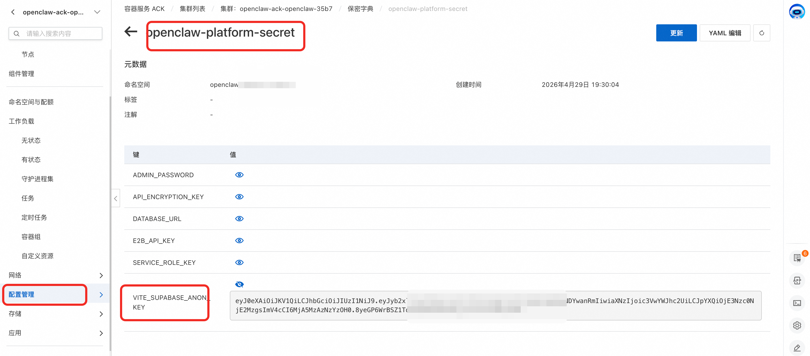

# OpenClaw Platform API 文档

> 基于当前代码分支自动生成，涵盖所有后端 REST API 端点。

## 目录

- [概述](#概述)
- [认证机制](#认证机制)
- [通用约定](#通用约定)
- [Health - 健康检查](#health---健康检查)
- [Users - 用户管理](#users---用户管理)
- [Instances - Agent 实例管理](#instances---agent-实例管理)
- [Agent Types - Agent 类型管理](#agent-types---agent-类型管理)
- [Models - AI 模型管理](#models---ai-模型管理)
- [Channels - 渠道模板管理](#channels---渠道模板管理)
- [Providers - 模型供应商管理](#providers---模型供应商管理)
- [SSO - 单点登录配置](#sso---单点登录配置)
- [Email - 邮箱认证设置](#email---邮箱认证设置)
- [SandboxSets - 沙箱集管理](#sandboxsets---沙箱集管理)
- [示例脚本](#示例脚本)

---

## 概述

OpenClaw Platform 提供 RESTful API，所有端点以 `/api` 为前缀。平台使用 Supabase Auth 进行用户认证，通过 JWT Bearer Token 鉴权。

**Base URL**: `http://<host>:<port>/api`

## 认证机制

### 获取 Token

1. 从平台获取 Supabase 配置：`GET <PLATFORM_URL>/env-config.js` → 解析 `VITE_SUPABASE_URL` 和 `VITE_SUPABASE_ANON_KEY`
2. 通过 Supabase Auth 登录：

```
POST <SUPABASE_URL>/auth/v1/token?grant_type=password
Header: apikey: <ANON_KEY>
Body: { "email": "...", "password": "..." }
→ Response: { "access_token": "<JWT>", ... }
```
anonkey获取：
可通过去集群查看secret配置VITE_SUPABASE_ANON_KEY或者去supabase控制台查看

### 使用 Token

所有需要认证的请求，在 Header 中携带：

```
Authorization: Bearer <access_token>
```

### 权限级别

| 中间件 | 说明 |
|--------|------|
| 无 | 公开端点，无需认证 |
| `requireAuth` | 需要有效的 JWT Token（任意角色） |
| `requireAdmin` | 需要有效的 JWT Token 且用户角色为 `admin` |

认证失败响应：
- **401**: Token 缺失、无效或过期
- **403**: 角色权限不足（非 admin 访问 admin 接口）

## 通用约定

### 响应格式

所有 API 统一返回 JSON，包含 `success` 字段：

```json
// 成功
{ "success": true, "data": { ... } }

// 失败
{ "success": false, "error": "错误描述" }
```

### 分页参数

支持分页的接口统一使用以下查询参数：

| 参数 | 类型 | 默认值 | 说明 |
|------|------|--------|------|
| `page` | number | 1 | 页码 |
| `pageSize` | number | 20 | 每页条数（最大 100） |

分页响应格式：

```json
{
  "success": true,
  "items": [...],
  "pagination": { "page": 1, "pageSize": 20, "total": 100, "totalPages": 5 }
}
```

---

## Health - 健康检查

### GET /api/health

健康检查端点。**无需认证。**

**响应**:
```json
{
  "status": "ok",
  "version": "1.0.0",
  "timestamp": "2026-05-08T09:00:00.000Z"
}
```

### GET /api/version

获取版本信息。**无需认证。**

**响应**:
```json
{
  "version": "1.0.0",
  "buildDate": "2026-05-01",
  "environment": "production"
}
```

---

## Users - 用户管理

### GET /api/users

分页查询用户列表。**需要 Admin 权限。**

**查询参数**:

| 参数 | 类型 | 必填 | 说明 |
|------|------|------|------|
| `page` | number | 否 | 页码，默认 1 |
| `pageSize` | number | 否 | 每页条数，默认 20，最大 100 |
| `search` | string | 否 | 按用户名或邮箱模糊搜索 |

**响应**:
```json
{
  "success": true,
  "users": [
    {
      "id": "uuid",
      "email": "user@example.com",
      "username": "testuser",
      "role": "user",
      "status": "active",
      "max_agent_instances": 5
    }
  ],
  "pagination": { "page": 1, "pageSize": 20, "total": 100, "totalPages": 5 }
}
```

### POST /api/users

创建单个用户。**需要 Admin 权限。**

**请求体**:

| 字段 | 类型 | 必填 | 说明 |
|------|------|------|------|
| `email` | string | 是 | 用户邮箱 |
| `username` | string | 是 | 用户名 |
| `password` | string | 否 | 密码，至少 6 位（OAuth/SAML 用户可自动生成） |
| `role` | string | 否 | 角色，默认 `"user"` |
| `maxInstances` | number | 否 | 最大实例数，默认 5 |
| `authProvider` | string | 否 | 认证方式，默认 `"email"`，支持 `"oauth"`, `"saml"` |

**响应**:
```json
{
  "success": true,
  "user": {
    "id": "uuid",
    "email": "user@example.com",
    "username": "testuser",
    "role": "user"
  }
}
```

### POST /api/users/batch

批量创建用户，最多支持 50000 个。**需要 Admin 权限。**

**请求体**:

| 字段 | 类型 | 必填 | 说明 |
|------|------|------|------|
| `users` | array | 是 | 用户数组，每个元素字段同 `POST /api/users` |

**响应**:
```json
{
  "success": true,
  "total": 10,
  "created": 8,
  "failed": 2,
  "results": [{ "email": "...", "username": "...", "userId": "...", "role": "...", "status": "..." }],
  "errors": [{ "email": "...", "error": "..." }]
}
```

### PUT /api/users/:userId

更新用户信息。**需要 Admin 权限。**

**路径参数**: `userId` (string)

**请求体** (所有字段可选):

| 字段 | 类型 | 说明 |
|------|------|------|
| `username` | string | 用户名 |
| `email` | string | 邮箱（会同步到 Supabase Auth） |
| `role` | string | 角色 |
| `status` | string | 状态 |
| `maxInstances` | number | 最大实例数 |

**响应**: `{ "success": true }`

### DELETE /api/users/:userId

删除用户（含 Auth 和 Profile）。**需要 Admin 权限。** 禁止删除自己，需先清理所有实例。

**路径参数**: `userId` (string)

**响应**:
```json
// 成功
{ "success": true, "message": "用户已删除" }

// 用户有实例时
{
  "success": false,
  "errorCode": "USER_HAS_INSTANCES",
  "instanceCount": 3,
  "error": "该用户下仍存在 3 个实例..."
}
```

### PUT /api/users/:userId/status

切换用户激活/禁用状态。**需要 Admin 权限。**

**路径参数**: `userId` (string)

**请求体**: `{ "status": "active" }` 或 `{ "status": "disabled" }`

**响应**: `{ "success": true }`

### PUT /api/users/:userId/password

管理员修改用户密码。**需要 Admin 权限。**

**路径参数**: `userId` (string)

**请求体**: `{ "password": "newPassword123" }` （至少 6 位）

**响应**: `{ "success": true, "message": "密码修改成功" }`

### GET /api/users/me/auth-mode

获取当前用户的认证模式。**需要登录。**

**响应**:
```json
{ "success": true, "data": { "emailAuthEnabled": true } }
```

### PUT /api/users/me/password

用户自助修改密码。**需要登录。**

**请求体**:

| 字段 | 类型 | 必填 | 说明 |
|------|------|------|------|
| `currentPassword` | string | 是 | 当前密码 |
| `newPassword` | string | 条件 | 新密码（邮箱认证模式下可选） |

**响应**:
```json
// 邮箱认证启用时
{ "success": true, "requiresEmailVerification": true, "message": "已发送密码重置邮件..." }

// 直接修改
{ "success": true, "message": "密码修改成功" }
```

---

## Instances - Agent 实例管理

### POST /api/instances

创建 Agent 实例。**需要登录。** 为当前用户创建新的 Agent 实例（E2B sandbox）。

**请求体**:

| 字段 | 类型 | 必填 | 说明 |
|------|------|------|------|
| `name` | string | 是 | 实例名称 |
| `agentTypeId` | number | 否 | Agent 类型 ID |
| `description` | string | 否 | 描述 |
| `modelId` | number | 否 | AI 模型 ID |
| `modelName` | string | 否 | AI 模型名称 |
| `configJson` | object | 否 | 自定义配置，默认 `{}` |
| `channelType` | string | 否 | 渠道类型 |
| `channelClientId` | string | 否 | 渠道 Client ID |
| `channelClientSecret` | string | 否 | 渠道 Client Secret |
| `async` | boolean | 否 | 是否异步创建，默认 `false` |

**响应**:
```json
{
  "success": true,
  "instance": {
    "id": "uuid",
    "name": "my-agent",
    "sandboxId": "default--agent-xxx",
    "status": "running",
    "createdAt": "2026-05-08T09:00:00.000Z"
  }
}
```

### GET /api/instances

列出当前用户的 Agent 实例。**需要登录。**

**查询参数**:

| 参数 | 类型 | 必填 | 说明 |
|------|------|------|------|
| `page` | number | 否 | 页码，默认 1 |
| `pageSize` | number | 否 | 每页条数，默认 20 |
| `status` | string | 否 | 按状态过滤 |
| `search` | string | 否 | 按名称模糊搜索 |

**响应**:
```json
{
  "success": true,
  "instances": [{ "id": "...", "name": "...", "status": "running", ... }],
  "pagination": { "page": 1, "pageSize": 20, "total": 5, "totalPages": 1 }
}
```

### GET /api/instances/overview

获取用户概览统计。**需要登录。**

**响应**:
```json
{
  "success": true,
  "overview": {
    "totalInstances": 3,
    "todayTokenUsage": 1500,
    "monthlyTokenUsage": 45000,
    "effectiveDailyLimit": 100000,
    "effectiveMonthlyLimit": 3000000,
    "usageUnit": "tokens",
    "limitUnit": "tokens",
    "aiGatewayEnabled": true,
    "slsEnabled": false
  }
}
```

### GET /api/instances/:instanceId

获取单个实例详情。**需要登录。**

**路径参数**: `instanceId` (string)

**响应**:
```json
{
  "success": true,
  "instance": {
    "id": "uuid",
    "name": "my-agent",
    "status": "running",
    "sandboxUrl": "https://...",
    "sandboxStatus": "running",
    "ai_models": { "id": 1, "name": "qwen", "provider": "dashscope" },
    "agent_type": { "id": 1, "code": "openclaw", "name": "OpenClaw" },
    "instance_channel_configs": [
      { "channel_type": "feishu", "client_id": "***", "client_secret": "***", "is_configured": true }
    ],
    "hostsEntries": ["10.0.0.1 api.example.com"]
  }
}
```

### DELETE /api/instances/:instanceId

删除实例并终止 sandbox。**需要登录。**

**路径参数**: `instanceId` (string)

**响应**:
```json
{ "success": true, "message": "Instance deleted successfully", "instanceId": "uuid" }
```

### POST /api/instances/:instanceId/start

启动实例。**需要登录。**

**路径参数**: `instanceId` (string)

**响应**:
```json
{ "success": true, "message": "Instance started successfully", "instanceId": "uuid", "status": "running" }
```

### POST /api/instances/:instanceId/stop

停止实例。**需要登录。**

**路径参数**: `instanceId` (string)

**响应**:
```json
{ "success": true, "message": "Instance stopped successfully", "instanceId": "uuid", "status": "stopped" }
```

### PUT /api/instances/:id

增量更新实例配置（模型和/或渠道）。**需要登录。**

**路径参数**: `id` (string)

**请求体** (所有字段可选):

| 字段 | 类型 | 说明 |
|------|------|------|
| `name` | string | 实例名称 |
| `modelName` | string | 模型名称（触发模型变更） |
| `channelType` | string | 渠道类型 |
| `channelClientId` | string | 渠道 Client ID |
| `channelClientSecret` | string | 渠道 Client Secret（`"__unchanged__"` 表示保持原值） |

**响应**:
```json
{
  "success": true,
  "instance": { "..." },
  "channelConfig": { "..." }
}
```

### GET /api/instances/:id/channel-secret

获取解密后的渠道凭证。**需要登录。**

**路径参数**: `id` (string)

**响应**:
```json
{
  "success": true,
  "channelType": "feishu",
  "clientId": "cli_xxx",
  "clientSecret": "secret_xxx"
}
```

### GET /api/admin/instances

管理员查看所有用户的实例。**需要 Admin 权限。**

**查询参数**:

| 参数 | 类型 | 必填 | 说明 |
|------|------|------|------|
| `page` | number | 否 | 页码 |
| `pageSize` | number | 否 | 每页条数 |
| `status` | string | 否 | 按状态过滤 |
| `search` | string | 否 | 按名称搜索 |
| `username` | string | 否 | 按用户名过滤 |

**响应**: 同 `GET /api/instances`，额外包含 `username` 字段。

### POST /api/admin/instances

管理员代用户创建实例。**需要 Admin 权限。**

**请求体**:

| 字段 | 类型 | 必填 | 说明 |
|------|------|------|------|
| `userId` | string | 二选一 | 目标用户 ID |
| `email` | string | 二选一 | 目标用户邮箱（不存在时自动创建用户） |
| `username` | string | 否 | 自动创建用户时使用 |
| `name` | string | 是 | 实例名称 |
| `agentTypeId` | number | 否 | Agent 类型 ID |
| `description` | string | 否 | 描述 |
| `modelId` / `modelName` | number / string | 否 | AI 模型 |
| `configJson` | object | 否 | 自定义配置 |
| `channelType` | string | 否 | 渠道类型 |
| `channelClientId` / `channelClientSecret` | string | 否 | 渠道凭证 |
| `async` | boolean | 否 | 是否异步，默认 `false` |

**响应**: 同 `POST /api/instances`。

---

## Agent Types - Agent 类型管理

### GET /api/agent-types

列出 Agent 类型。**需要登录。** 管理员看到全部，普通用户只看到已启用的。

**响应**:
```json
{ "success": true, "agentTypes": [{ "id": 1, "code": "openclaw", "name": "OpenClaw", ... }] }
```

### GET /api/agent-types/:id

获取单个 Agent 类型。**需要登录。**

**响应**: `{ "success": true, "agentType": { ... } }`

### POST /api/agent-types

创建 Agent 类型。**需要 Admin 权限。**

**请求体**:

| 字段 | 类型 | 必填 | 说明 |
|------|------|------|------|
| `code` | string | 是 | 唯一编码 |
| `name` | string | 是 | 显示名称 |
| `description` | string | 否 | 描述 |
| `icon` | string | 否 | 图标 |
| `category` | string | 否 | 分类，默认 `"custom"` |
| `sandboxTemplateId` | string | 否 | 沙箱模板 ID |
| `sandboxTimeout` | number | 否 | 超时秒数，默认 300 |
| `configTemplate` | object | 否 | 配置模板，默认 `{}` |
| `configWritePath` | string | 否 | 配置写入路径 |
| `startupCommand` | string | 否 | 启动命令 |
| `modifyModelCommand` | string | 否 | 修改模型命令 |
| `modifyChannelCommand` | string | 否 | 修改渠道命令 |
| `readinessCheck` | object | 否 | 就绪检查配置，默认 `{}` |
| `supportsChannels` | boolean | 否 | 是否支持渠道，默认 `false` |
| `sandboxUser` | string | 否 | 沙箱用户 |
| `sortOrder` | number | 否 | 排序，默认 0 |
| `templateSourceId` | number | 否 | 复制渠道模板的来源 ID |

**响应**: `{ "success": true, "agentType": { ... } }`

### PUT /api/agent-types/:id

更新 Agent 类型。**需要 Admin 权限。**

**请求体**: 同 `POST`（除 `code` 外所有字段可选，额外支持 `isEnabled`）。

**响应**: `{ "success": true, "agentType": { ... } }`

### DELETE /api/agent-types/:id

删除 Agent 类型（仅限自定义类型）。**需要 Admin 权限。**

**响应**: `{ "success": true, "message": "Agent type deleted successfully" }`

### PATCH /api/agent-types/:id/toggle

切换 Agent 类型启用状态。**需要 Admin 权限。**

**响应**: `{ "success": true, "agentType": { ... } }`

### Legacy Template APIs

向后兼容的模板 API：

| 方法 | 路径 | 权限 | 说明 |
|------|------|------|------|
| GET | `/api/template/example` | Admin | 获取示例模板 |
| GET | `/api/template` | Admin | 获取 OpenClaw 模板 |
| POST | `/api/template` | Admin | 保存模板 (`{ "template": {...} }`) |
| DELETE | `/api/template` | Admin | 删除模板 |

---

## Models - AI 模型管理

### GET /api/models

列出所有 AI 模型（自动过滤被禁用 provider 的模型）。**需要登录。**

**响应**: `{ "success": true, "models": [{ "id": 1, "name": "qwen-max", "provider": "dashscope", ... }] }`

### POST /api/models

创建 AI 模型。**需要 Admin 权限。**

**请求体**:

| 字段 | 类型 | 必填 | 说明 |
|------|------|------|------|
| `name` | string | 是 | 模型名称 |
| `provider` | string | 是 | 供应商编码 |
| `modelCode` | string | 是 | 模型代码 |
| `description` | string | 否 | 描述 |
| `status` | string | 否 | 状态，默认 `"active"` |

**响应**: `{ "success": true, "model": { ... } }`

### PUT /api/models/:id

更新 AI 模型。**需要 Admin 权限。**

**请求体**: 同 `POST`，所有字段可选。

**响应**: `{ "success": true, "model": { ... } }`

### DELETE /api/models/:id

删除 AI 模型。**需要 Admin 权限。**

**响应**: `{ "success": true, "message": "Model deleted successfully" }`

### PATCH /api/models/:id/toggle

切换模型状态（active ↔ disabled）。**需要 Admin 权限。**

**响应**: `{ "success": true, "model": { ... } }`

---

## Channels - 渠道模板管理

### Channel Template CRUD

| 方法 | 路径 | 权限 | 说明 |
|------|------|------|------|
| GET | `/api/channel-templates` | Auth | 列出渠道模板（可选 `?agentTypeId=` 过滤） |
| POST | `/api/channel-templates` | Admin | 创建渠道模板 |
| PUT | `/api/channel-templates/:id` | Admin | 更新渠道模板 |
| PATCH | `/api/channel-templates/:id/toggle` | Admin | 切换启用状态 |

**POST 请求体**:

| 字段 | 类型 | 必填 | 说明 |
|------|------|------|------|
| `channelType` | string | 是 | 类型：`feishu` / `dingtalk` / `qq` / `wecom` |
| `name` | string | 是 | 模板名称 |
| `description` | string | 否 | 描述 |
| `configFields` | array | 否 | 配置字段定义 |
| `configFile` | string | 否 | 配置文件名 |
| `agentTypeId` | number | 否 | 关联的 Agent 类型 |

### Channel Config File APIs

| 方法 | 路径 | 权限 | 说明 |
|------|------|------|------|
| GET | `/api/channel-config-files` | Admin | 列出所有配置条目 |
| POST | `/api/channel-config-files` | Admin | 保存/更新配置 |
| GET | `/api/channel-config-files/:fileName` | Admin | 获取指定配置 |
| DELETE | `/api/channel-config-files/:fileName` | Admin | 删除配置 |

**POST 请求体**:

| 字段 | 类型 | 必填 | 说明 |
|------|------|------|------|
| `fileName` | string | 是 | 文件名（如 `"feishu-channel.json"`） |
| `content` | string | 是 | JSON 或 YAML 字符串 |
| `format` | string | 否 | `"json"` 或 `"yaml"`，默认 `"json"` |
| `agentTypeId` | number | 否 | 关联的 Agent 类型 |

---

## Providers - 模型供应商管理

### Provider CRUD

| 方法 | 路径 | 权限 | 说明 |
|------|------|------|------|
| GET | `/api/providers` | Auth | 列出供应商（管理员看全部，用户看启用的） |
| GET | `/api/providers/:code` | Admin | 获取供应商详情（凭据脱敏） |
| POST | `/api/providers` | Admin | 创建供应商 |
| PUT | `/api/providers/:code` | Admin | 更新供应商 |
| PATCH | `/api/providers/:code/toggle` | Admin | 切换启用状态 |
| DELETE | `/api/providers/:code` | Admin | 删除供应商（不能删除已启用的） |

**POST 请求体**:

| 字段 | 类型 | 必填 | 说明 |
|------|------|------|------|
| `name` | string | 是 | 供应商编码（字母、数字、下划线、连字符） |
| `displayName` | string | 否 | 显示名称 |
| `type` | string | 否 | 类型，默认 `"API"` |
| `apiKeyPlaceholder` | string | 否 | API Key 占位提示 |
| `domainPlaceholder` | string | 否 | Domain 占位提示 |
| `description` | string | 否 | 描述 |

### Provider Config

| 方法 | 路径 | 权限 | 说明 |
|------|------|------|------|
| GET | `/api/providers/:name/config` | Admin | 获取供应商详细配置 |
| PUT | `/api/providers/:name/config` | Admin | 更新供应商配置 |

### Provider 限流配置

| 方法 | 路径 | 权限 | 说明 |
|------|------|------|------|
| GET | `/api/providers/:name/limit-config` | Admin | 获取限流配置 |
| PUT | `/api/providers/:name/limit-config` | Admin | 更新限流配置 |

**PUT 限流请求体**:
```json
{ "budgets": [{ "timeRate": "day", "value": 100000, "unit": "tokens" }] }
```

### 当前 Provider 统计

| 方法 | 路径 | 权限 | 说明 |
|------|------|------|------|
| GET | `/api/providers/current/stats` | Admin | 获取统计信息 |
| GET | `/api/providers/current/tokens` | Admin | 按用户的 Token 用量（`?days=1` 或 `?days=30`） |
| GET | `/api/providers/current/user-limit` | Admin | 获取用户限流配置（`?userId=xxx`） |
| PUT | `/api/providers/current/user-limit` | Admin | 更新用户限流（`{ "userId": "...", "budgets": [...] }`） |

---

## SSO - 单点登录配置

| 方法 | 路径 | 权限 | 说明 |
|------|------|------|------|
| GET | `/api/sso/mode` | Admin | 获取 SSO 模式 |
| GET | `/api/sso/mode/public` | **公开** | 获取 SSO 模式（登录页使用） |
| PUT | `/api/sso/mode` | Admin | 设置 SSO 模式（`none` / `oauth` / `saml`） |
| GET | `/api/sso/auth-providers` | Admin | 获取 OAuth 和 SAML providers 列表 |
| GET | `/api/sso/info` | Admin | 获取 SP 信息（Entity ID, ACS URL） |
| GET | `/api/sso/settings` | Admin | 获取 Auth 设置（site_url, uri_allow_list） |
| PATCH | `/api/sso/settings` | Admin | 更新 Auth 设置 |
| GET | `/api/sso/providers/public` | **公开** | 公开获取 SAML providers 列表 |
| GET | `/api/sso/providers` | Admin | 获取 SAML providers 详情 |
| POST | `/api/sso/providers` | Admin | 创建 SAML provider |
| DELETE | `/api/sso/providers/:id` | Admin | 删除 SAML provider |

**POST /api/sso/providers 请求体**:

| 字段 | 类型 | 必填 | 说明 |
|------|------|------|------|
| `domain` | string | 是 | SSO 域名 |
| `metadata_url` | string | 是 | IdP Metadata URL |
| `attribute_mapping_email` | string | 否 | 邮箱属性映射 |

---

## Email - 邮箱认证设置

| 方法 | 路径 | 权限 | 说明 |
|------|------|------|------|
| GET | `/api/email/auth-settings` | Admin | 获取邮箱认证设置 |
| PUT | `/api/email/auth-settings` | Admin | 切换邮箱认证（`{ "enabled": true/false }`） |

**GET 响应**:
```json
{
  "success": true,
  "data": {
    "enabled": true,
    "smtpConfigured": true,
    "smtpHost": "smtp.example.com",
    "siteUrl": "https://platform.example.com"
  }
}
```

---

## SandboxSets - 沙箱集管理

K8s SandboxSet CRD 的 CRUD 操作。**所有端点需要 Admin 权限。**

| 方法 | 路径 | 权限 | 说明 |
|------|------|------|------|
| GET | `/api/sandboxsets` | Admin | 列出 SandboxSet（`?namespace=`） |
| GET | `/api/sandboxsets/:name` | Admin | 获取详情（`?namespace=default`） |
| POST | `/api/sandboxsets` | Admin | 创建 SandboxSet |
| PUT | `/api/sandboxsets/:name` | Admin | 更新 SandboxSet |
| DELETE | `/api/sandboxsets/:name` | Admin | 删除 SandboxSet |

**POST 请求体**:

| 字段 | 类型 | 必填 | 说明 |
|------|------|------|------|
| `name` | string | 是 | SandboxSet 名称 |
| `namespace` | string | 否 | K8s 命名空间，默认 `"default"` |
| `yaml` | string | 是 | SandboxSet YAML 定义 |

---

## 示例脚本

项目提供了一个端到端测试脚本，演示了完整的「创建用户 → 创建实例 → 轮询状态 → 清理」流程：

```bash
# 基本用法
python3 docs/api/admin-create-user-and-instance-example.py \
  --platform-url http://<host>:<port>

# 保留创建的资源（不清理）
python3 docs/api/admin-create-user-and-instance-example.py \
  --platform-url http://<host>:<port> --keep

# 仅测试用户创建，跳过实例
python3 docs/api/admin-create-user-and-instance-example.py \
  --platform-url http://<host>:<port> --skip-instance
```

详见 [`admin-create-user-and-instance-example.py`](./admin-create-user-and-instance-example.py)。
