# Agent Manager function documentation

Agent Manager is an enterprise-class AI intelligence management platform that provides complete AI intelligence creation, configuration, and management capabilities. The platform supports multiple agent types (such as OpenClaw, Hermes, etc.), and supports multi-model access and multi-channel integration to help enterprises quickly build and manage various AI agents.
> Open source project address: https://github.com/aliyun-computenest/agent-manager.git

---

## 1. Computing Nest Deployment

> This chapter describes how to deploy the Agent Manager management platform on an existing ACS cluster through the Alibaba Cloud Computing Nest (ComputeNest). The platform supports two Supabase deployment modes: **Alibaba Cloud managed Supabase** (automatically created) and **access to existing open source Supabase**.

### 1.1 Preconditions

Before deploying the Agent Manager management platform, you must deploy **OpenClaw-ACS-Sandbox Cluster Edition**. If it has not been deployed, go to the computing nest of the corresponding site to create a Sandbox cluster instance:

-Domestic Station: [Create OpenClaw-ACS-Sandbox Cluster Edition Instance](https://computenest.console.aliyun.com/service/instance/create/cn-hangzhou?type=user&ServiceId=service-56531b838b524f5a83da)
-International Station: [Create OpenClaw-ACS-Sandbox Cluster Edition Instance](https://computenest.console.aliyun.com/service/instance/create/ap-southeast-1?type=user&ServiceId=service-731298a621304868a3a4)

### 1.2 deployment steps

**Step 1: Go to the compute nest deployment page**

In the Compute Nest console, find the **Agent Manager Enterprise** service and click Create Instance to go to the parameter configuration page.

**Step 2: Fill in the deployment parameters**

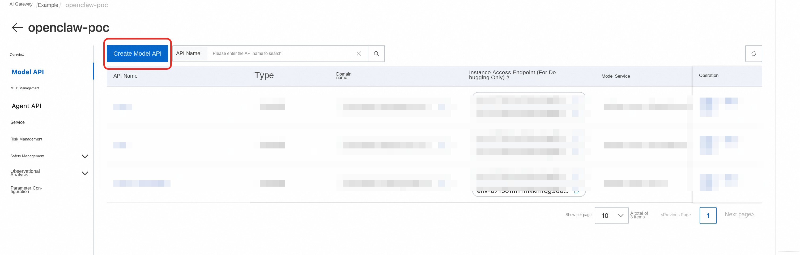

Complete each configuration as described below:

#### E2B Sandbox Configuration

| Parameter | Required | Description |
|------|------|------|
| **E2B Sandbox Service Instance** | Yes | Enter the ID of the **compute nest service instance** of the deployed OpenClaw-ACS-Sandbox cluster edition. |
| **Platform Namespace** | No | The namespace of the management platform in the K8s cluster. The default value is 'agent-platform. Generally, it does not need to be modified. |

#### Agent Access Gateway Configuration

| Parameter | Required | Default | Description |
| ------ | ------ | -------- | -------- |
| **Enable Agent Access Gateway** | No | On | After it is enabled, the newly generated Agent access link on the platform will be verified by the nginx gateway to verify the login status and instance ownership of the platform, and then forwarded to the real Agent. After closing, continue to use the old E2B direct connection address. |

When enabled, the template creates an Agent Gateway SLB. The **Agent Access Gateway** address is displayed in the output of the service instance. By default, http://<AgentGatewaySlb IP>:8080/<Instance ID>/'is used as the "Application Access Link" of the new agent/'. This switch only protects the newly generated access links on the platform and does not automatically change the real E2B upstream portal on the Sandbox cluster side. After confirming that the gateway access is available, if you need to completely prevent bypass, configure the security group, ACL, or equivalent network policy according to the public or internal network exposure method of the real portal.

#### Supabase database configuration

| Parameter | Required | Default | Description |
| ------ | ------ | -------- | -------- |
| **Supabase the zone** | Yes | - | Select the zone of the Supabase instance. It must be in the same region as the ACS cluster. |
| **Supabase instance specification** | Yes | 2C2G | Database instance specification. Select 2C2G for development and testing. 2C4G or above is recommended for production environments |
| **Supabase Storage (GB)** | No | 10 | Database Storage Size |

#### Advanced Network Configuration

| Parameter | Required | Description |
|------|------|------|
| **Supabase VSwitch CIDR block** | Yes | The CIDR block of the VSwitch (VSwitch) where the Supabase instance is located, for example, '172.20.252.0/22 '|

>⚠* * Important Reminder: The Supabase switch network segment cannot conflict with the existing switch network segment in VPC! * * Before deployment, please check the existing CIDR block of the switch under the current VPC in the [Alibaba Cloud VPC console](https://vpc.console.aliyun.com/) to ensure that the filled CIDR block does not overlap with any existing CIDR block, otherwise the deployment will fail.

**Step 3: Confirm information and create**

1. Verify that all configuration parameters are correct
2. Check **" I have read and agree to the Computing Nest Service Agreement "**
3. Click the **Create Now** button to begin the deployment

The deployment process takes about 5-10 minutes, during which the system will automatically complete the following operations:

-Create a Supabase database instance
-Initialize database table structure and administrator account
-Deploy the management platform application in the ACS cluster
-Configure ALB Ingress load balancing

### 1.2.1 Deployment with Existing Open Source Supabase

On the **Supabase Deployment Mode**('SupabaseDeploymentMode') page, select **'UseExistingOpenSource'** to access the deployed open source Supabase, instead of automatically creating an Alibaba Cloud managed instance by the compute nest. **Applicable to scenarios such as compatibility verification and migration testing.** Not recommended for production environments **.

#### Required Parameters

| Parameter | Required | Description |
|------|------|------|
| * * ExistingSupabaseUrl * * | Yes | There is already a Supabase public network URL for browsers to access, such as' http:// 8.153.101.22:8000 ',* * * Do not end with'/'|
| **ExistingSupabaseInternalUrl** | Yes | Server access URL. When deploying in the same cluster, use the K8s Service address, such as 'http:// supabase-supabase-kong.<namespace>.svc:8000 '|
| **ExistingSupabaseAnonKey** | Yes | From Supabase deployment output |
| **ExistingSupabaseServiceRoleKey** | Yes | From Supabase deployment output |
| **ExistingSupabaseDatabaseUrl** | Yes | Format: 'postgresql:// postgres:<url-encoded-password >@< host>:5432/postgres '. When deployed in the same cluster, host is usually supabase-supabase-db.<Supabase namespace>.svc' |

In this mode, you do not need to specify parameters such as **Supabase zone, instance type, storage space, and VSwitch network segment**.

>⚠️ **Responsibility boundary:** When an existing Supabase is used, the user is responsible for the availability, version upgrade, data backup, and security enhancement of the instance. The compute nest does not host the Supabase instance.

### 1.2.2 Open Source Supabase Independent Deployment

The open source Supabase deployment template ('supabase_template.yaml ') can independently deploy a set of open source Supabase to the ACS/ACK cluster. After deployment, enter the output value of the open source into the 'UseExistingOpenSource' parameter of the Manager template for access. This template is maintained independently and is not stored in the Agent Manager repository.

#### Key parameters

| Parameter | Description |
|------|------|
| **ClusterId** | Target ACS/ACK cluster ID |
| **DeploymentNamespace** | Supabase deployment namespace |
| **DashboardUsername** | Supabase Dashboard logon username |
| **DashboardPassword** | Supabase Dashboard logon password |
| **DbPassword** | PostgreSQL database password |
| **JwtSecret** | JWT Signing Key |

#### Auth configuration parameter

| Parameter | Description |
|------|------|
| **OAuthProvider** | OAuth provider ('none' / 'github' / 'google' etc.) |
| **OAuthClientId** | OAuth Client ID |
| **OAuthClientSecret** | OAuth Client Secret |
| **EnableSaml** | Whether to enable SAML SSO |
| **SamlIdpMetadataUrl** | IdP Metadata URL |
| **SamlDomain** | The email domain that triggers SSO |

#### Template output value

| Output | Description | Manager parameters |
| ------ | ------ | ------------------ |
| **SupabaseUrl** | Public address | 'ExistingSupabaseUrl' |
| **AnonKey** | anon key | 'ExistingSupabaseAnonKey' |
| **ServiceRoleKey** | service role key | 'ExistingSupabaseServiceRoleKey' |
| **InternalUrl** | Cluster intranet | |
| **DatabaseUrl** | Database connection address | |

If 'getaddrinfo ENOTFOUND supabase-supabase-db .. svc' appears in the initialization log, it means that the Supabase deployment namespace is missing from the database Service domain name. Please confirm the Supabase 'DeploymentNamespace' first, and then change the database connection string to something like:

'''text
postgresql:// postgres:<url-encoded-password>@ supabase-supabase-db.<Supabase namespace>.svc:5432/postgres
'''

Be careful not to keep empty namespaces such as '.. svc'; If the password contains special characters such as' @ ','#','%', URL encoding is required first.

#### New Cluster Deployment

If you have not created an ACK cluster, you can use the New Cluster Edition Supabase to deploy the template (''). The template automatically creates an ACK cluster and deploys the Supabase. This template is maintained independently and is not stored in the Agent Manager repository.

In addition to the above Supabase and Auth configuration parameters, you also need to fill in:

| Parameter | Description |
|------|------|
| **PayType** | Payment Type: Pay-As-You-Go (PostPaid) or Pay-As-You-Go (PrePaid) |
| **ZoneId** | Zone |
| **VpcOption** | Create or use an existing VPC |
| **WorkerInstanceType** | Worker node instance type |
| **WorkerInstanceCount** | Number of Worker nodes. Default value: 3 |
| **LoginPassword** | Node logon password |
| **AckNetworkPlugin** | Network plug-in: flannel or terway |
| **ServiceCidr** | Service CIDR segment |

The template output is consistent with the existing cluster version and can be directly used in the Manager 'UseExistingOpenSource' mode.

### 1.3 Deployment Verification

After the deployment is complete, you can obtain the access address of the management platform on the service instance details page of the computing nest console. Open the access address and see the login page of the Agent Manager, indicating that the deployment is successful.

> **Initial administrator account:** Email admin@agent.local and password admin123 '. **Please change your password immediately after logging in for the first time!**

### Troubleshooting Common 1.4 Deployment Issues

| Problem | Possible Cause | Solution |
|------|----------|----------|
| Deployment fails, indicating a CIDR block conflict | Supabase the VSwitch and the existing CIDR block overlap in the VPC | View the existing CIDR block in the VPC console and replace it with a CIDR block that does not conflict with each other. |
| Deployment timeout | The creation of the Supabase instance takes a long time. | View the deployment event log in the computing nest console, wait or retry. |
| The platform page cannot be accessed | The ALB Ingress is not ready yet | Wait for 1-2 minutes and try again, or check the status of Ingress resources in the ACS cluster |
| Database Connection Failed After Login | Supabase Instance Not Fully Ready | Wait for Supabase Instance Status to Change to Running and Retry |
| Site URL saved and returned 501 | Open source Supabase is used | Open source GoTrue does not support '/modify/settings' API, please use 'kubectl set env' to manually configure GOTRUE_SITE_URL |
| mailbox authentication switch returns 501 | open source Supabase is used | open source GoTrue does not support modification' mailer_autoconfirm ', please use' kubectl set env' to configure SMTP and' GOTRUE_MAILER_AUTOCONFIRM = false', see [4.3.3 mailbox authentication configuration](#433-mailbox authentication configuration) |

### 1.5 Service Instance Upgrade
1. Go to the supbase console to manually back up the database.
2. Create a backup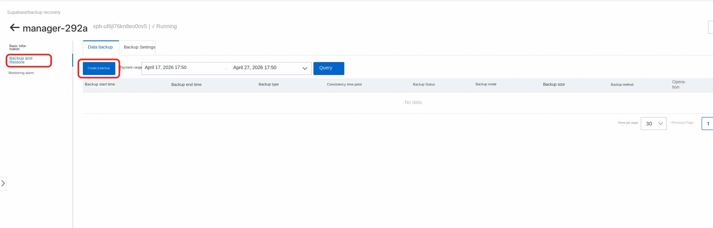
3. Return to the computing nest service instance interface and select the appropriate version to upgrade the service instance.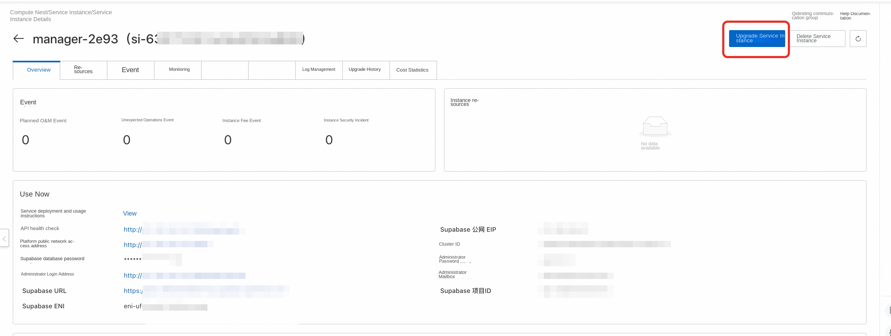
4. Verify that the service instance is upgraded successfully

#### Network Policy Considerations

The workload added by the upgrade may not be matched by the existing GlobalTrafficPolicy in the cluster, and you need to manually modify the selector of the policy. For more information, see [1.6 GlobalTrafficPolicy network policy configuration](#16-globaltrafficpolicy-network policy configuration).

### 1.6 GlobalTrafficPolicy network policy configuration

By default, the 'GlobalTrafficPolicy' resource exists in the cluster. You can use 'spec.selector.matchLabels' to select the pod and apply network isolation rules to it. **If network isolation is required for SandboxSet deployed Agent Pods, ensure that the selector of the policy matches the label of the corresponding Pod.**

The selector of the default policy may be inconsistent with the pod label actually used by the project (for example, the agent-manager-openclaw workload is added). In this case, you need to manually modify the default policy in the cluster.

>📖For the complete concept and usage of the GlobalTrafficPolicy, please refer to the official document: [Use TrafficPolicy to manage Agent network access](https://help.aliyun.com/zh/cs/user-guide/use-trafficpolicy-to-manage-agent-network-access-1)

#### Revised steps

1. Edit the GlobalTrafficPolicy resource in the cluster:

bash
kubectl edit globaltrafficpolicy openclaw-global-policy
'''

2. Modify 'spec.selector.matchLabels' to match the actual Pod label:

yaml
spec:
selector:
matchLabels:
app: agent-manager-openclaw
'''

3. Save the exit policy automatically takes effect.

#### How to configure when adding a workload

When a workload is added and network isolation is required, it is also necessary to ensure that the GlobalTrafficPolicy selector can be matched to the new pod:

-**Same Network Rule**-Modify the 'spec.selector.matchLabels' of the existing policy to match the label of the new pod
-**Different network rules**-Create a new GlobalTrafficPolicy resource and configure independent selector and rules

Please refer to [Official Documents](https://help.aliyun.com/zh/cs/user-guide/use-trafficpolicy-to-manage-agent-network-access-1) for specific configuration methods.

---

### 1.7 Agent Access Gateway Certificates and Switches

The Agent access gateway is used to protect Agent Web pages. When the user clicks the "application access link" from the platform, the browser first enters the nginx gateway, and the gateway verifies the current login status and instance ownership before acting to the real agent.

#### Default behavior

| Scene | Behavior |
|------|------|
| Keep the default parameters for new deployment or upgrade. | The agent Gateway SLB is automatically created. The access link for newly generated agents on the platform is' http://<AgentGatewaySlb IP>:8080/<instance ID>/'. |
| When deploying, disable **Enable Agent to access the gateway** | If no gateway resource is created, the platform will continue to return the old E2B directly connected IP address. |
| The gateway has been enabled but no certificate has been configured. | An HTTP/IP gateway portal is used with platform authentication, but the link is not encrypted. |
| The gateway has been enabled and a certificate has been configured. | Use the HTTPS domain name gateway entry in the format of 'https:// <domain name>/<instance ID>/'. |

#### Prevent Agent from Bypassing Gateway Access

Enabling **Agent Access Gateway** only allows the newly generated access links to go through the Nginx gateway, and does not automatically change the real E2B upstream entrance of the Sandbox cluster. Whether there is a bypass risk depends on the network exposure method of the real portal, not on whether the certificate is self-signed, nor on whether the public network DNS is open.

| Real E2B Upstream Entry | Bypass Risk | Recommended Handling |
| -------------- | ---------- | -------------- |
| Intranet ALB, intranet SLB, or portal reachable only within VPC | Public network users cannot directly connect even if 'hosts' is configured, because 'hosts' can only change the resolution and cannot open the network. The main risk comes from users with VPC, VPN, office network, or springboard access capabilities. | Restrict a security group, ALB/SLB ACL, Ingress whitelist, GlobalTrafficPolicy, NetworkPolicy, or equivalent policy to be accessible only to the Agent Gateway and the necessary platform services. |
| Public network ALB or public network SLB | has a bypass risk. Even if the E2B domain does not have a public network DNS or the upstream certificate is a self-issued certificate, the user may still directly connect to the real upstream through the public network ALB address plus 'Host'/SNI, 'hosts', or 'curl -- resolve. | Don't rely on self-signed certificates or undisclosed DNS as a security perimeter. The priority is changed to the intranet portal. If the public network portal must be reserved, please use ACL, security group, WAF/Ingress authentication or equivalent policies to allow only the egress access of the Agent Gateway. |

When it is necessary to completely prevent bypassing, it is processed in the following order:

1. Make sure that the gateway access address generated by the platform is available. Common paths such as Agent pages, WebSocket/terminals, and file uploads can be accessed through 'http://<AgentGatewaySlb IP>:8080/<instance ID>/'or custom HTTPS gateway domain name.
2. On the Sandbox cluster side, confirm the type of the real E2B upstream portal: intranet ALB/private network portal or public network ALB/public network portal. At the same time, confirm the corresponding security group, ACL, Ingress, or network policy.
3. If it is a real intranet portal, confirm that the portal cannot be reached in a common public network environment. Then, access the intranet access range and only allow Agent Gateway and necessary platform services to access it.
4. If it is a real public network entrance, do not use self-signed certificates or non-public DNS as isolation methods first; The source should be restricted through security groups, ALB/SLB ACL, WAF/Ingress authentication or equivalent policies, and only the exit access of Agent Gateway should be allowed.
5. Verify the closing effect: the "application access link" of the platform can still be opened; When directly access' https:// <port>-<sandbox_id>.<E2B_DOMAIN>/'in a common public network environment or designating' Host'/SNI through a public network ALB address to access the real upstream, it should be rejected, timed out or unable to establish a connection.

Do not block the outbound access of the Agent Gateway to the upstream of the real E2B during closing, otherwise the platform link will also return 502. If you disable **Enable Agent Access Gateway** and return to the old direct connection mode, you need to release the real E2B upstream portal simultaneously.

> Replace 'NAMESPACE' in the following command with the platform namespace. The new template defaults to openclaw-platform; if the namespace was modified at deployment, use the actual value.

#### Configure the nginx HTTPS certificate

1. Obtain the public IP of the gateway SLB and resolve the domain name to be used to this IP.

bash
NAMESPACE=openclaw-platform
GATEWAY_IP="$(kubectl -n "$NAMESPACE" get svc openclaw-agent-gateway -o jsonpath='{.status.loadBalancer.ingress[0].ip}')"
echo "$GATEWAY_IP"
'''

2. After the certificate is issued with the domain name, create or update the fixed name TLS Secret in the platform namespace.

bash
NAMESPACE=openclaw-platform
kubectl -n "$NAMESPACE" create secret tls openclaw-agent-gateway-tls \
--cert=/path/to/fullchain.pem \
--key=/path/to/tls.key \
--dry-run=client -o yaml | kubectl apply -f-
'''

3. Restart the Agent Gateway and let nginx read the certificate and enable 443 listening.

bash
kubectl -n "$NAMESPACE" rollout restart deployment/openclaw-agent-gateway
kubectl -n "$NAMESPACE" rollout status deployment/openclaw-agent-gateway --timeout=300s
'''

4. Cut the agent access link generated by the platform to the HTTPS domain name and restart the platform.

bash
GATEWAY_DOMAIN = https://agents.example.com
kubectl -n "$NAMESPACE" patch configmap openclaw-platform-config \
--type merge \
-p "{\"data\":{\"AGENT_GATEWAY_DOMAIN\":\"$GATEWAY_DOMAIN\"}}"
kubectl -n "$NAMESPACE" rollout restart deployment/openclaw-platform
kubectl -n "$NAMESPACE" rollout status deployment/openclaw-platform --timeout=300s
'''

5. Verify the gateway health check.

bash
curl -I https://agents.example.com/__agent_gateway_health
'''

Precautions:

-'openclaw-agent-gateway-tls is only used for HTTPS from the user's browser to nginx. The certificate verification from nginx to the real E2B upstream still uses the platform's built-in e2b-ca-cert '.
-The certificate domain name must be the same as the Host of the AGENT_GATEWAY_DOMAIN. After the HTTPS domain name is cut, direct access to the SLB IP will be denied by the gateway because the host does not match.
-The current template does not have an 'AgentGatewayDomain' parameter. The "AGENT_GATEWAY_DOMAIN" of manual patch belongs to operation and maintenance configuration. Subsequent ROS stack updates may be written back to the default' http://<AgentGatewaySlb IP>:8080 ', and patch needs to be re-patched as needed.

#### Troubleshoot Agent Access Gateway 502

If the instance is successfully created, but the gateway returns a 502 after clicking Application Access Link, first distinguish the two connections:

| | | | | | | | | | | | | | | | | | | | | | | | | | | | | | | | | | | | | | | | | | | | | | | | | | | | | | | | | | | | | | | | | | | | | | | | | | | | | | | | | | | | | | | | | | | | | | | | |
| ------ | ---------- | ---------- | ------ | ---------- |
| Browser → Agent Access Gateway | 'http://<AgentGatewaySlb IP>:8080/<Instance ID>/'or' https://agents.example.com/<Instance ID>/'| The openclaw-agent-gateway-tls is read only when an HTTPS domain name gateway is used | When an HTTP/IP gateway is used, a certificate is not required for this section. |
| Agent access gateway → real E2B upstream | 'https:// <port>-<sandbox_id>.<E2B_DOMAIN>/'| Always use e2b-ca-cert to verify the real E2B upstream certificate | Even if the browser to the gateway is HTTP/IP, this section is still HTTPS. |

Therefore, after the **Enable Agent Access Gateway** is disabled, the instance can be accessed. This only indicates that the old E2B directly connected portal is available. It cannot prove that the e2b-ca-cert is correct, because the old direct connection entry bypasses the certificate verification of nginx to E2B upstream.

The success of creating an instance does not alone prove that the e2b-ca-cert is correct. The platform backend calls the E2B API when creating a Sandbox. The gateway accesses the Web upstream of each Sandbox when opening an instance. The two links may use different hostnames, certificate chains, and TLS validation implementations.

A typical certificate chain problem log is as follows:

'''text
upstream SSL certificate verify error: (2:unable to get issuer certificate) while SSL handshaking to upstream
'''

This type of log indicates that nginx has obtained the real E2B upstream address and started the TLS handshake, but cannot verify the upstream certificate chain with the current e2b-ca-cert. It is different from the Sandbox unready problem. The more common logs that Sandbox not ready are 'connect() failed', 'connection refused', 'timed out', or 'host not found '.

A CA chain that can validate a true E2B upstream certificate should be placed in the e2b-ca-cert instead of the following:

| What should not be put in | Why is there a problem |
| ---------------- | ---------------- |
| 'openclaw-agent-gateway-tls' | This is the external certificate from the browser to Nginx. It has nothing to do with the trust chain from Nginx to the upstream of E2B. |
| leaf certificate of 'CA:FALSE' | leaf certificate only proves a specific domain name and cannot be used as a CA to issue and verify Sandbox other upstream certificates. |
| The old sandbox-manager-tls certificate | After the E2B side-change certificate or domain name, the old certificate cannot verify the current upstream. |
| Contains only the server certificate and does not contain the file that issues the CA. | Nginx cannot find the issuer and returns 'unable to get issuer certificate '. |

If E2B upstream uses a public CA certificate, browser direct connection may be normal, because the browser and operating system have a built-in public CA trust library. However, nginx currently only checks the upstream according to the e2b-ca-cert configuration. At this point, it is necessary for the e2b-ca-cert to contain the CA chain that can verify the public certificate.

Do these steps to identify the problem. The 'NAMESPACE' in the following command is the platform namespace, and the new template is openclaw-platform by default '.

1. Review the 502 reason in the gateway log.

bash
NAMESPACE=openclaw-platform
kubectl -n "$NAMESPACE" logs deployment/openclaw-agent-gateway --since=10m | \
grep -E 'upstream|certificate|502|connect\(\)|timed out|host not found'
'''

2. View the "e2b-ca-cert" actually mounted on the gateway '.

bash
kubectl -n "$NAMESPACE" exec deployment/openclaw-agent-gateway -- \
sh -c 'ls -l /etc/openclaw-agent-gateway/e2b-ca && \
openssl x509 -in /etc/openclaw-agent-gateway/e2b-ca/ca-fullchain.pem \
-noout -fingerprint -sha256 -subject -issuer -dates -ext basicConstraints'
'''

If 'CA:FALSE' appears in the output, the current file is more like a leaf certificate and is not suitable for the upstream trust CA of nginx.

3. Compare the E2B source certificate with the platform built-in certificate.

bash
kubectl -n sandbox-system get secret sandbox-manager-tls \
-o jsonpath='{.data.tls\.crt}' | base64 -d > /tmp/sandbox-manager-tls.crt

kubectl -n "$NAMESPACE" get secret e2b-ca-cert \
-o jsonpath='{.data.ca-fullchain\.pem}' | base64 -d > /tmp/platform-e2b-ca.pem

openssl x509 -in /tmp/sandbox-manager-tls.crt \
-noout -fingerprint -sha256 -subject -issuer -dates -ext basicConstraints
openssl x509 -in /tmp/platform-e2b-ca.pem \
-noout -fingerprint -sha256 -subject -issuer -dates -ext basicConstraints
'''

4. Verify the real E2B upstream directly from the gateway pod.

First get the sandbox_id, Agent Web port, and E2B_DOMAIN from the instance details or platform API '. Then execute:

bash
UPSTREAM_HOST = "<port>-<sandbox_id>.<E2B_DOMAIN>"

kubectl -n "$NAMESPACE" exec deployment/openclaw-agent-gateway -- \
openssl s_client \
-connect "$UPSTREAM_HOST:443 "\
-servername "$UPSTREAM_HOST "\
-CAfile /etc/openclaw-agent-gateway/e2b-ca/ca-fullchain.pem \
-verify_return_error
'''

If this command fails and 'curl -k' is used to access the same upstream, the service itself is reachable, and the problem focuses on the nginx certificate trust chain.

When it is fixed, update the e2b-ca-cert to the correct CA chain and restart the gateway. Do not continue to copy 'CA:FALSE' leaf certificates without validation.

If the 'tls.crt' of sandbox-system/sandbox-manager-tls confirms that the CA chain upstream of E2B can be verified, it can be synchronized from this secret:

bash
NAMESPACE=openclaw-platform
CERT="$(kubectl -n sandbox-system get secret sandbox-manager-tls -o jsonpath='{.data.tls\.crt}')"

kubectl -n "$NAMESPACE" patch secret e2b-ca-cert \
-p "{\"data\":{\"ca-fullchain.pem\":\"$CERT\"}}"

kubectl -n "$NAMESPACE" rollout restart deployment/openclaw-agent-gateway
kubectl -n "$NAMESPACE" rollout status deployment/openclaw-agent-gateway --timeout=300s
'''

If sandbox-manager-tls.tls.crt is the leaf certificate of CA:FALSE', use the CA chain file that actually issues the E2B upstream certificate instead:

bash
NAMESPACE=openclaw-platform
CA_FILE=/path/to/e2b-upstream-ca-chain.pem

kubectl -n "$NAMESPACE" create secret generic e2b-ca-cert \
--from-file=ca-fullchain.pem="$CA_FILE "\
--dry-run=client -o yaml | kubectl apply -f-

kubectl -n "$NAMESPACE" rollout restart deployment/openclaw-agent-gateway
kubectl -n "$NAMESPACE" rollout status deployment/openclaw-agent-gateway --timeout=300s
'''

If the E2B upstream actually uses a public CA certificate, do not continue to copy the old private leaf certificate. A CA chain that can validate the public certificate should be used as the ca-fullchain.pem '.

#### Adjust nginx gateway template parameters

The nginx configuration of the agent access gateway is generated by the 'openresty.conf.template' in the service version. When the gateway pod starts, the start-openresty.sh renders placeholders such as '__DNS_RESOLVER__', '__PLATFORM_API__', '__PLATFORM_LOGIN_URL__', '__TLS_LISTEN__', and '__TLS_CERTIFICATE__' into the final '/usr/local/openresty/nginx/conf/nginx.conf'.

Common tunable parameters:

| Configure | Default | Action | When to adjust |
| ------ | -------- | ------ | -------------- |
| 'worker_processes '| 'auto' | The number of nginx workers. By default, this parameter is automatically set along with the container CPU. | Generally, no adjustment is required. When a fixed number of workers is required, it can be changed to a specific number. |
| 'worker_connections '| '4096' | The number of simultaneous connections that each worker can process. Concurrent HTTP/WebSocket connections are affected. | You can continue to increase the number of concurrent accesses or long connections. At the same time, make sure that the Pod CPU, memory, and system connection limits are sufficient. |
| 'client_max_body_size' | '1024m' | The maximum body allowed for a single request, which affects file uploads or large requests. | when nginx returns 413 for uploading large files, it will be increased. If you want to limit the upload size, it will be reduced. |
| 'client_body_buffer_size '| '1024k' | The buffer size of the request body in memory. | When large requests frequently drop temporary files or upload performance is poor, it can be adjusted larger; When memory is tight, it can be adjusted smaller. |
| large_client_header_buffers '| '4 1024k' | Large request header buffer, affecting long cookies, Authorization, or callback URLs. | When the 400 and 'Request Header Or Cookie Too Large' appear, the value can be adjusted to be larger. Normally, it is not recommended to continue to zoom in. |
| 'limit_req_zone agent_gateway_auth '| '5r/s' | Limit the frequency of calls to'/__agent_gateway_auth 'by the same client. | When a large number of users open the Agent from the platform at the same time, you can increase the value appropriately and evaluate the load of the Manager internal authentication interface simultaneously. |
| 'limit_req_zone agent_gateway_health '| '10r/s' | Limit the frequency of health check interfaces. | Adjustable when external probes or SLB health checks are more frequent. |
| 'proxy_request_buffering' | 'off' | Proxy requests are not completely cached first, which is convenient for streaming requests and long connection scenarios. | usually do not change; It is only turned on when nginx is explicitly expected to cache the complete request body first. |
| 'proxy_read_timeout' / 'proxy_send_timeout' | '3600s' | The read/write timeout between nginx and the real agent upstream. The | Agent page remains large when there are long-running, SSE, or WebSocket scenarios; reduce it when you want to release unresponsive connections faster. |
| proxy_buffer_size ' / ' proxy_buffers ' / ' proxy_busy_buffers_size '| '1024k' / '8 1024k' / '1024k' | Upstream response header and response content buffer. | When the response header is large, the page content is injected or the agent response has buffer-related errors, it can be adjusted large; When the memory pressure is high, it can be adjusted small. |

Precautions:

-You are not recommended to modify '/usr/local/openresty/nginx/conf/nginx.conf' directly into the pod. The pod will be lost after the pod is restarted, and subsequent service instance upgrades may also overwrite temporary changes.
-The default resource request for the gateway Deployment is '1C / 1Gi' and the upper resource limit is '2C / 2Gi '. Increasing the buffer, number of connections, or request body limit will increase the memory usage. After adjustment, we recommend that you observe the CPU, memory, restart times, and nginx error logs of the openclaw-agent-gateway pod.

#### Manually turn the gateway on or off

We recommend that you use the ROS stack parameter **to enable Agent Access Gateway** to control the long-term status:

| Operation | Parameter values | Result |
|------|------|------|
| Enable | 'true' | Create SLB and K8s resources Gateway the Agent. By default, the platform writes to 'http://<AgentGatewaySlb IP>:8080 '. |
| Disable | 'false' | The platform AGENT_GATEWAY_DOMAIN is empty, and the newly generated Agent access link returns to the old E2B direct link. |

If a gateway has been deployed, you can temporarily manually switch whether the platform uses a gateway. This method does not create or delete gateway resources, but only affects the subsequent Agent access links generated by the platform.

To manually turn on the HTTP/IP gateway:

bash
NAMESPACE=openclaw-platform
GATEWAY_IP="$(kubectl -n "$NAMESPACE" get svc openclaw-agent-gateway -o jsonpath='{.status.loadBalancer.ingress[0].ip}')"
kubectl -n "$NAMESPACE" patch configmap openclaw-platform-config \
--type merge \
-p "{\"data\":{\"AGENT_GATEWAY_DOMAIN\":\"http://$GATEWAY_IP:8080\"}}"
kubectl -n "$NAMESPACE" rollout restart deployment/openclaw-platform
'''

Manually turn on the HTTPS domain name gateway:

bash
NAMESPACE=openclaw-platform
GATEWAY_DOMAIN = https://agents.example.com
kubectl -n "$NAMESPACE" patch configmap openclaw-platform-config \
--type merge \
-p "{\"data\":{\"AGENT_GATEWAY_DOMAIN\":\"$GATEWAY_DOMAIN\"}}"
kubectl -n "$NAMESPACE" rollout restart deployment/openclaw-platform
'''

Manually close the gateway portal:

bash
NAMESPACE=openclaw-platform
kubectl -n "$NAMESPACE" patch configmap openclaw-platform-config \
--type merge \
-p '{"data":{"AGENT_GATEWAY_DOMAIN":""}}'
kubectl -n "$NAMESPACE" rollout restart deployment/openclaw-platform
'''

After the manual shutdown, the platform will return to the old E2B direct address. If the real E2B upstream portal has been connected through the security group or ACL, the old portal needs to be released simultaneously, otherwise the old direct connection address cannot be accessed.

---

## 2. Platform Overview

### 2.1 Home Page

Visit the platform homepage, you will see the welcome page of the Agent Manager:

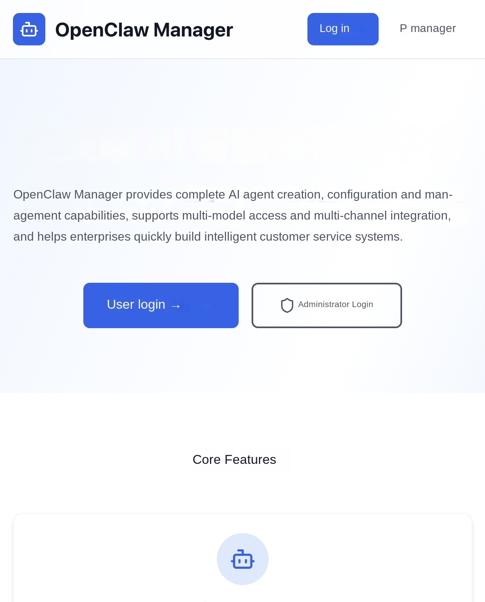

The homepage is divided into three areas:

**Top navigation bar:** Contains the platform Logo, "Login" button (normal user OAuth/SSO login) and "Administrator" button (email password login). Logged-in users will see the User Center and Management Center (Administrator) portals.

**Hero area:** Shows the platform slogan "Enterprise AI Agent Management Platform" and two main entry buttons:
-**User Login**-Jump to the user login page (OAuth/SSO/email password)
-**Administrator Login**-Jump to the administrator email password login page

**Core function introduction:** Three function cards show the core capabilities of the platform:
-Smart Body Management-Create, configure, and manage multiple types of AI smart bodies (such as OpenClaw, Hermes, etc.) to support multi-instance deployment.
-**Multiple models**-Supports large models of mainstream AI such as Qwen and DeepSeek
-**User Management**-Fine-grained user instance quota management and token quota management

### 2.2 Roles and Permissions

The platform has two roles:

| Role | Permission Scope |
|------|----------|
| **administrator (admin)** | can access all the functions of the management background: dashboard, user management, agent configuration, sandbox configuration, model configuration, instance management (all users) |
| **Common user** | You can only access the User Center: View, create, and manage your own Agent instances, configure models and channels |

---

## 3. Login System

The platform provides two login portals, respectively for administrators and ordinary users.

### 3.1 administrator login

The administrator uses the mailbox password to log in, and the entrance is separated from the ordinary user.

**Operation steps:**

1. Click the **" Administrator "** button in the upper right corner of the homepage, or directly visit '/admin/login'
2. Enter the administrator mailbox and password
3. Click the **Login** button

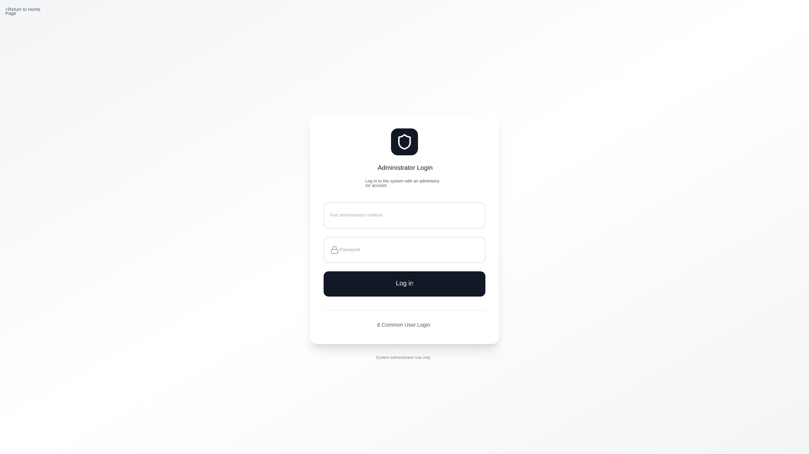

After successful login, it will automatically jump to the management background dashboard. If a non-administrator account is entered, it will be redirected to the user center.

> **Initial administrator account:** During the first deployment, the system automatically creates an administrator account through the database migration script. The default mailbox is usually admin@agent.local and the password is 'admin123 '. **Please change your password immediately after logging in for the first time!**

#### Reset when administrator password is forgotten

If you forget the administrator password and cannot log in through the platform page, you can use the Supabase 'service_role key' to call the Auth Admin API to reset the password. service_role key has high permissions to bypass row-level permission control. Please use it only in trusted terminals. Do not write documents, work orders, chat records, or front-end code.

**Prerequisites:**

-Supabase access address has been obtained, such as 'https://spb-xxx.supabase.opentrust.net'
-got Supabase 'service_role key '. When using open source Supabase deployment, you can obtain the value from the 'ServiceRoleKey' in the Supabase deployment output. When using the computing nest hosting Supabase, you can find the corresponding value from the service instance output or deployment parameters.
-'jq' installed locally'
-Confirmed administrator mailbox to be reset. The default is usually admin@agent.local, replace with the actual value if you are using admin@openclaw.local or other mailboxes in your environment.

**Step 1: List the user and find the administrator ID**

bash
SUPABASE_URL = "https://spb-xxx.supabase.opentrust.net"
SERVICE_ROLE_KEY = "<your SERVICE_ROLE_KEY>"
ADMIN_EMAIL = "admin@agent.local"

USER_ID = "$(
curl -sS \
-H "apikey: ${SERVICE_ROLE_KEY} "\
-H "Authorization: Bearer ${SERVICE_ROLE_KEY} "\
"${SUPABASE_URL}/auth/v1/admin/users "\
| jq -r --arg email "$ADMIN_EMAIL" '.users[] | select(.email == $email) | .id'
)"

echo "$USER_ID"

if [ -z "$USER_ID" ] || [ "$USER_ID" = "null" ]; then
echo "Administrator user not found, please check ADMIN_EMAIL"
exit 1
fi
'''

If the output is empty, please confirm whether the ADMIN_EMAIL is the actual administrator mailbox, or view the user mailbox list first:

bash
curl -sS \
-H "apikey: ${SERVICE_ROLE_KEY} "\
-H "Authorization: Bearer ${SERVICE_ROLE_KEY} "\
"${SUPABASE_URL}/auth/v1/admin/users "\
| jq -r '.users[].email'
'''

**Step 2: Reset Password with Administrator ID**

bash
NEW_PASSWORD = "<your new password>"

curl -sS -X PUT \
-H "apikey: ${SERVICE_ROLE_KEY} "\
-H "Authorization: Bearer ${SERVICE_ROLE_KEY} "\
-H "Content-Type: application/json"
-d "$(jq -nc --arg password "$NEW_PASSWORD" '{password: $password}') "\
"${SUPABASE_URL}/auth/v1/admin/users/${USER_ID}"
'''

After the reset is complete, use the ADMIN_EMAIL and NEW_PASSWORD to revisit the/admin/login' login to the admin background. After confirming that the login is successful, it is recommended to clear the sensitive variables in the current terminal:

bash
unset SERVICE_ROLE_KEY NEW_PASSWORD USER_ID
'''

At the bottom of the page, a link is provided to quickly switch to the user login portal.

### 3.2 User Login

Common users can log on to the following three ways: **Email password logon**, **OAuth third-party logon**, and **SAML SSO enterprise logon**.

**Operation steps:**

1. Click the **Login** button or the **User Login** button on the homepage to go to '/login'
2. Select the login method as required:
-**OAuth Login**-Click the corresponding OAuth provider button (for example, "Alibaba Cloud Login" and "GitHub Login")
-**SAML SSO Login**-Click the **" Enterprise SSO Login "** button to log in through the enterprise identity authentication system
-**Login with Email Password**-In the "Login with Account Password" area at the bottom of the page, enter the email address and password assigned by the administrator, and click **" Login "**

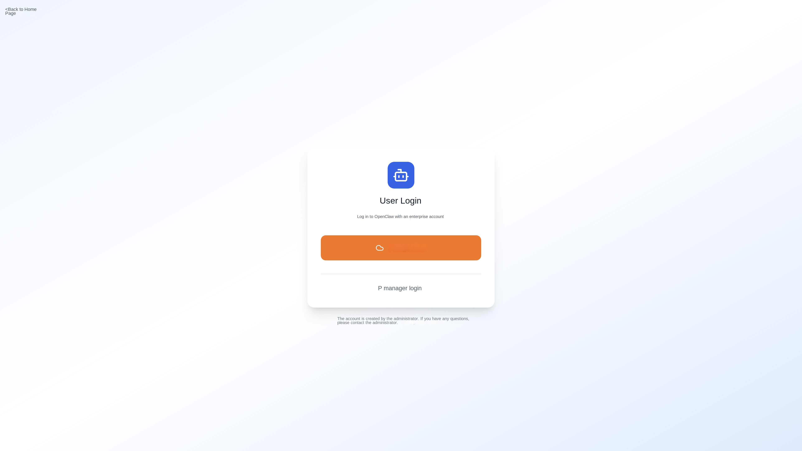

The layout of the login page from top to bottom is: OAuth button area → SSO button area → separator line ("or login with account password") → mailbox password input form.

> **Mailbox password login instructions:** The user's mailbox and password are created by the administrator in User Management. When the administrator adds a user, select the "mailbox password" authentication method and set the initial password, the user can use the mailbox and password to log in. For details, see [4.2 User Management → Add User](#42-User Management).

After successful logon, the instance list in the User Center is automatically redeployed. The **Administrator Login** link is also available at the bottom of the page.

---

## 4. Administrator function

After logging in, the administrator enters the management background. The navigation bar on the left includes the following function modules.

The admin backend uses the classic layout of the content area on the right side of the left navigation bar:

-**Left navigation bar**-List all management function menus, collapsible (click top'X ' / '☰'icon toggle)
-**Top Title Bar**-Displays the current page title and current login user name
-**Bottom sidebar**-Display user information and logout button

The left navigation bar contains the following menu items:

| Menu | Path | Description |
|------|------|------|
| Dashboard | '/admin/dashboard' | Overview of platform operation data |
| User Management | '/admin/users' | User List, Add, Bulk Import |
|_Single Sign-On | '/admin/sso-config' | OAuth / SAML SSO configuration (option one) |
| * Mailbox authentication | '/admin/email-auth' | Logon configuration of mailbox password |
| Model configuration | '/admin/models' | Manage AI models and providers (AI gateway/standard API) |
| Instance List | '/admin/instances' | Agent instances of all users |
| **Agent configuration** | '/admin/agent-types' | **Core functions**:Agent type management (configuration templates, startup commands, channels, and skills) |
| **Sandbox configuration** | '/admin/sandboxsets' | **Core function**: view and manage SandboxSet resources in the cluster |

### 4.1 Dashboard

**Path:** '/admin/dashboard'

The dashboard is the home page of the management background and provides a global overview of the platform operation data. The page is divided into three areas from top to bottom.

#### Basic Statistics Card (Top)

The core indicator cards are arranged horizontally at the top of the page, and each card contains icons, values, and labels:

| Indicator | Icon | Description |
|------|------|------|
| **Total users** |👥| Total number of registered platform users |
| **Agent instance** |📦| Total number of instances created by all users |
| **Available Models** |🧠| Number of AI models currently enabled |

After the AI gateway and SLS logs are enabled, three additional cards are displayed:

| Indicator | Icon | Description |
|------|------|------|
| **Active users today** |📊| Number of users with API calls today |
| **Number of requests today** |🔄| Total API Calls Today |
| **Token usage today** |🔑| Total token consumption of all users today (formatted display, such as 1.2M) |

#### Recent Agent Instance (Middle)

A white card showing the 5 most recently created instances in tabular form:

| Column | Description |
|------|------|
| Name | Instance name |
| User | User mailbox |
| Agent Configuration | The agent types (such as OpenClaw and Hermes) associated with the instance, as shown by indigo color labels. |
| Status | Green "Running" or gray "Stopped" badge |
| Model | AI model name used |
| Creation time | Creation time in Chinese format |

#### Today's User Token Consumption Ranking (Bottom)

When the AI gateway and SLS log are enabled, the Token Consumption Ranking List (Top 10) is displayed:

| Column | Description |
|------|------|
| User | User mailbox |
| Total tokens | Total number of input and output tokens |
| Enter a token | Number of tokens sent by the user |
| Output Token | Number of AI replies |
| Number of requests | Number of API calls |

If the AI gateway and SLS have not been configured, this area displays gray prompt text.

#### AI Gateway Console Entry

If a AI gateway has been configured, the **AI Gateway Console** blue button appears in the upper right corner of the dashboard. You can go to the Alibaba Cloud APIG console to view more detailed gateway statistics.

### 4.2 User Management

**Path:** '/admin/users'

The user management page is used to manage all users of the platform and supports operations such as adding, batch importing, editing, and disabling.

#### User List

The top left side of the page is a search box (you can search by user name or mailbox), and the right side is **" add users "** and **" batch import "** two operation buttons.

The user list is displayed in a table format with the following columns:

| Column name | Description |
|------|------|
| **Users** | Displays the user name and email address |
| **Role** | Administrator/Common User |
| **Status** | Enable/Disable |
| **Consumer ID** | AI the gateway Consumer ID (displayed only when the AI gateway is enabled. You can click to go to the Alibaba Cloud console) |
| **Maximum Instance Limit** | Maximum number of instances a user can create |
| **Token Used** | The number of tokens used by the user today (displayed only when AI Gateway is enabled) |
| **Actions** | Edit/Reset Password/Enable/Disable |

Pagination is supported at the bottom of the table, with 10 records per page.

#### Add User

Click the **Add User** button in the upper right corner and fill in the following information in the pop-up window:

| Field | Required | Description |
|------|------|------|
| **User name** | Yes | Display name of the user |
| **Email** | Depending on the situation, the email login method is required, and the OAuth/SAML method is optional (if left blank, a placeholder email will be automatically generated) |
| **Authentication Method** | - | Select 'Email Password', 'OAuth Single Sign-on', or 'SAML Single Sign-on' |
| **Password** | Depending on the situation | Only the mailbox login method requires (at least 6 digits),OAuth/SAML users do not need a password |
| **Role** | - | Common User/Administrator |
| **Maximum number of instances** | - | Default 5 |

> **Typical scenario: Create account and password for user login**
>
> 1. On the User Management page, click Add User**
> 2. Fill in the user name and email, choose **" Email Password "** as the authentication method, and set the initial password
> 3. after the creation is completed, inform the user of the mailbox and password
> 4. The user can log in by entering the email and password in the "account password login" area at the bottom of the '/login' page
> 5. After logging in, users can create and manage their own Agent instances in the user center.

#### Batch import users

Click the **" Batch Import "** button in the upper right corner to support two methods:

1. **Upload CSV/JSON file**-Select local file upload
2. **Paste data directly**-Paste data in CSV or JSON format in the text box

**CSV format example:**

'''csv
email,password,username,role,maxInstances,authProvider
user1@example.com,password123,User1,user,5,email
user2@example.com,,User2,user,5,oauth
user3@example.com,,User3,user,5,saml
'''

> Click **Download CSV Template** to obtain a standard template file. The system is also automatically compatible with the CSV format (with fields such as 'userExternalId') exported by Alibaba Cloud IDaaS, and is automatically recognized as a SAML user.

Each batch supports up to 50,000 users. Success and failure statistics are displayed when the import is complete.

#### Edit User

Click the **Edit** icon on the right side of the user row to modify the following user information:

-User Name
-Mailbox
-Role (Administrator/General User)
-Status (enabled/disabled)
-Maximum number of instances

### 4.3 Single Sign-On Configuration

**Path:** '/admin/sso-config'

The single sign-on configuration page consolidates OAuth and SAML SSO configurations in a unified interface. **OAuth and SAML SSO are mutually exclusive configurations (one of two)**, and the administrator can enable one of them through the toggle button at the top.

#### Page Composition

-**Top Switch Area**-Displays the currently enabled SSO mode (OAuth/SAML/Not Enabled), which can be switched
-**OAuth tab**-View and manage OAuth login providers
-**SAML SSO tab**-Configure enterprise SAML 2.0 SSO
-**Security Settings**-You can turn off automatic user registration with one click to prevent unauthorized users from automatically creating accounts when they log on for the first time through SSO.

#### Turn off automatic user registration

For security reasons, it is recommended to turn off automatic user registration after user creation or batch import in the production environment. When turned off, OAuth or SAML SSO login for the first time does not automatically create new users; only users that have been created by an administrator or imported in bulk can login. Existing users are not affected.

**Operation steps:**

1. Enter * * management background → user management → single sign-on * *
2. Find the **User Auto Registration** switch in the **Security Settings** area of the page
3. Click **Close Automatic Registration** and confirm as prompted on the page
4. To allow new users to join by themselves, turn the switch back on.

> Suggestion: In the enterprise production environment, you can batch import users who are allowed to log in in User Management, and then turn off automatic registration.

#### 4.3.1 OAuth Configuration

#### Supported OAuth Providers

The platform supports Supabase OAuth providers that have been enabled in Auth and have been adapted to display on the login page, including:

| Provider | Description |
| -------- | ------ |
| **Alibaba Cloud (AlibabaCloud)** | Use an Alibaba Cloud RAM account to log on |
| **Feishu (Feishu)** | Login with Feishu Enterprise Account |
| **DingTalk (DingTalk)** | Log in with a DingTalk enterprise account |
| **GitHub** | Log in with a GitHub account |
| **Google** | Sign in with your Google account |
| **Azure AD** | Sign in with Microsoft Azure AD |
| **GitLab** | Login with a GitLab account |
| **Apple** | Sign in with your Apple ID |
| **Discord / Slack / Twitter / ...** | 20 OAuth providers supported by other Supabase are available |

#### How to configure OAuth (take Alibaba Cloud as an example)

OAuth needs to be configured on both the **Alibaba Cloud console** and the **Supabase console**.

**Step 1: Create an OAuth application on Alibaba Cloud**

1. Log on to the [Alibaba Cloud RAM Console](https://ram.console.aliyun.com/) and go to **OAuth Application Management**
2. Click **Create OAuth Application**
3. Fill in the application information:
-**Application Name**: User-defined name, such as 'Agent Manager'
-**Application Type**: Select **WebApp**
-**Callback address (Redirect URI)**:**Here is the key**, fill in the Supabase callback address:
'''
https:// <your Supabase project URL>/auth/v1/callback
'''
For example: 'https://abc123.supabase.co/auth/v1/callback'
4. After the creation is complete, record **AppId** (that is, Client ID)
5. On the Application Details page, create a **AppSecret** (Client Secret). **Save it now. The Secret is displayed only once**
6. In the created application, **Add OAuth Scope**, and add **aliuid** and **profile**

> **Format description of callback address:** Enter 'https:// <your Supabase project URL>/auth/v1/callback' uniformly for callback addresses of all OAuth providers '. Supabase will automatically handle callback routes for different providers, so you don't need to set different callback addresses for different providers.

**Step 2: Enable Alibaba Cloud OAuth in the Supabase console**

1. Log in to the **Supabase console** (the address is configured in the VITE_SUPABASE_URL of '.env')
2. Enter **Authentication → Providers**
3. Find **AlibabaCloud** in the provider list and click Expand
4. Turn on the **Enable** switch
5. Fill in the **Client ID (AppId)** and **Client Secret (AppSecret)** obtained in the first step
6. Click **Save** to save
7. Modify the Site URL, find **URL Configuration**, and change the Site URL to the access address of the Agent Manager.

**Step 3: Verify in Agent Manager**

1. Enter Agent Manager **Management Background → User Management → Single Sign-On → OAuth Tab**
2. Click the **Refresh** button in the upper right corner
3. Confirm that Alibaba Cloud is displayed in **Enabled** status

After the configuration is complete, the **Alibaba Cloud Login** button appears on the user login page ('/login'):

After clicking the button, the user will jump to the Aliyun OAuth authorization page. After using the Aliyun RAM account to complete authorization, the user will automatically return to the Agent Manager and complete login.

#### Configure other OAuth providers

The configuration process of other OAuth providers is exactly the same, but the first step is to create an application on the corresponding platform:

| provider | address for creating application | callback address to be filled in |
| -------- | ------------- | ------------- |
| **Flying Book** | [Flying Book Open Platform](https://open.feishu.cn/) → Developer Backstage → Create Enterprise Self-built Application under Customer Enterprise | 'https://<Supabase URL>/auth/v1/callback' |
| **DingTalk** | [DingTalk Open Platform](https://open.dingtalk.com/) → Application Development → Create Internal Application | 'https://<Supabase URL>/auth/v1/callback' |
| **GitHub** | [GitHub Developer Settings](https://github.com/settings/developers) → New OAuth App | 'https://<Supabase URL>/auth/v1/callback' |
| **Google** | [Google Cloud Console](https://console.cloud.google.com/) → APIs & Services → Credentials | 'https://<Supabase URL>/auth/v1/callback' |
| **Azure AD** | [Azure Portal](https://portal.azure.com/) → App registrations | 'https://<Supabase URL>/auth/v1/callback' |
| **GitLab** | [GitLab Applications](https://gitlab.com/-/profile/applications) | 'https://<Supabase URL>/auth/v1/callback' |

Regardless of the provider, **callback address always fills in the Supabase callback URL**, which is uniform.

#### Flying Book OAuth Application Configuration

1. The flying book administrator of the customer enterprise or the developer who has been granted the application creation permission logs into the developer background of [Flying Book Open Platform](https://open.feishu.cn/) to create or enter the self-built application under the customer enterprise.
2. Record the **App ID** and **App Secret** on the **Credentials and Basic Information** page of the application.
3. Add the redirect URL in the **Security Settings** of the app:
'''
https://<Supabase URL>/auth/v1/callback
'''
4. Apply for and enable the following permissions in **Permissions Management**:

| Permissions | Scope | Purpose |
| ------ | ------- | ------ |
| Obtain basic user information | 'contact:user.base:readonly' | Obtain basic information such as user name and avatar after logging in |
| Obtain user mailbox information | 'contact:user.email:readonly' | Obtain user mailbox after logon |
| Obtain employment information of a user | 'contact:user.employee:readonly' | Obtain employment information of an employee after logging in |
| | Obtain the enterprise mailbox field | 'directory:employee.base.enterprise_email:read' | Read the enterprise_email enterprise mailbox after logon to avoid displaying only the ou_xxx@feishu.user placeholder mailbox |

5. Publish applications or complete administrator authorization according to the requirements of the flying book open platform.
6. Go back to the Supabase **Authentication → Providers**, enable **Feishu**, and fill in the App ID and App Secret.
7. Return to Agent Manager * * Management Background → User Management → Single Sign-on → OAuth Tab Page * *, click * * Refresh * *, and confirm that the flying book is displayed as enabled.

> Enterprise self-built applications should be created under the customer's own flying book enterprise. The flying book management background is mainly used to grant developers application creation/management permissions, configure application available scope, and maintain enterprise mailbox domain names and employee enterprise mailboxes. The App ID, App Secret, callback address and API permissions of OAuth application are configured in the background of developers on the flying book open platform.
>
> if the flying book user does not configure the enterprise mailbox, or the application does not open the' contact:user.employee:readonly' and' directory:employee.base.enterprise_email:read', the platform cannot get' enterprise_email, the login data may still show the placeholder mailbox generated by flying book. It is suggested to use OAuth to log in after filling up the enterprise mailbox for employees in the background of book management.

#### DingTalk OAuth application configuration

1. Log in to [DingTalk Open Platform](https://open.dingtalk.com/) to create or access internal applications.
2. On the **Credentials and Basic Information** page of the application, record the **Client ID** and **Client Secret**.
3. Add the redirect URL in the app's login or callback address configuration:
'''
https://<Supabase URL>/auth/v1/callback
'''
4. Apply for and enable the following permissions in **Permissions Management**:

| Permissions | Scope | Purpose |
| ------ | ------- | ------ |
| Address Book Personal Information Read Permission | 'Contact. User.Read' | Obtain the address book personal information of the current DingTalk user after logging in |

5. Publish applications or complete administrator authorization according to the requirements of the DingTalk open platform.
6. Return to the Supabase **Authentication → Providers**, enable **DingTalk**, and enter the Client ID and Client Secret.
7. Return to the Agent Manager **Management Backstage → User Management → Single Sign-On → OAuth Tab**, click **Refresh**, and confirm that the DingTalk is displayed as Enabled.

#### OAuth configuration page function

-**Enabled Providers**-Displays all enabled OAuth providers and their status as cards
-**" Supabase Console "button**-The page provides a shortcut link to jump directly to the Providers configuration page of the Supabase console.
-**Refresh button**-Manually pull the latest provider enablement status from the Supabase

#### 4.3.2 SAML SSO Configuration

On the Single Sign-On page, switch to the **SAML tab** to configure enterprise SAML 2.0 single sign-on. After the configuration is complete, the Enterprise SSO Login button appears automatically on the user login page ('/login').

>⚠️ **Note:** Alibaba Cloud managed Supabase must confirm that the instance version supports SAML SSO. If the open source Supabase deployment template is used for deployment, the template will automatically complete SAML private key generation, Kong route patch and SSO Provider registration without manual operation.

This section uses **Alibaba Cloud IDaaS** as an example to describe the complete configuration process. Other IdPs (such as Azure AD, Okta, and so on) process similarly.

#### SAML Configuration Page Composition

The SAML SSO configuration area contains the following sections:

1. **SP Information (Configured to IdP)**-The information of the Supabase as the SP(Service Provider) must be copied to the IdP
2. **Callback Address Configuration**-Set the Site URL to be used after SSO login is completed.
3. **Configured SSO**-View and manage added SAML SSO configurations
4. **Add SAML SSO**-Add SSO configuration entry

#### Complete configuration process (take Alibaba Cloud IDaaS as an example)

**Step 1: Obtain SP information in Agent Manager**

Go to the **management background → user management → single sign-on → SAML tab**, and record the following two values in the **" SP information (configured to IdP) "** area (click the copy button next to it):

| Field | Description | Example |
|------|------|------|
| **Entity ID (Issuer)** | SP Entity ID | 'https://abc123.supabase.co/auth/v1/sso/saml/metadata' |
| **ACS URL (Callback)** | Assertion consumer address | 'https://abc123.supabase.co/auth/v1/sso/saml/acs' |

**Step 2: Create a SAML application in the Alibaba Cloud IDaaS console**

1. Log on to [Alibaba Cloud IDaaS Console](https://yundun.console.aliyun.com/?p=idaas)
2. Enter the corresponding IDaaS instance, click **Application** → **Add Application** → Select **SAML 2.0** Type
3. Fill in the application basic information (name, etc.)

**Step 3: Configure the SP information of the IDaaS SAML application**

In the SAML configuration of the IDaaS application:

1. **SP Entity ID**-Enter the Entity ID obtained in the first step
2. **SP ACS URL**-Fill in the ACS URL obtained in the first step
3. **NameID Format**-Select 'emailAddress'
4. **NameID Expression**-Fill in 'user.email' (Note: write 'user.email' directly, **do not** write '${user.email}')

**Step 4: Add Attribute Declaration**

In the **Attribute Declaration** configuration of the IDaaS application, add the following:

| Property name | Expression |
|--------|--------|
| 'email' | 'user.email' |

**Step 5: Get the IDaaS Metadata URL**

After you save the IDaaS application configuration, copy the **SAML Metadata URL** of the application in the following format:

'''
https://<instance>.aliyunidaas.com/api/v2/<app_id>/saml2/meta
'''

**Step 6: Add SSO configuration in Agent Manager**

Return to the single sign-on SAML tab of the Agent Manager:

1. Click the **Add SAML SSO** button in the upper right corner
2. Fill in the pop-up window:

| Field | Required | Description | Example |
|------|------|------|------|
| **SSO domain name** | The domain name of the user's mailbox. SSO is triggered when the user logs on | 'example.com '|
| **IdP Metadata URL** | Yes | IDaaS Metadata URL obtained in Step 5 | 'https://xxx.aliyunidaas.com/api/v2/xxx/saml2/meta' |
| **Mailbox attribute name** | No | The SAML response contains the attribute name of the mailbox. Default is 'email' | 'email' |

3. Click **Save Configuration**

**Step 7: Set callback address**

Site URL determines the address that redirects to the Agent Manager after successful SSO login. It must be set to the Manager public network access address (for example, https://your-app.example.com or http://<Manager-IP>:8080).

-**Alibaba Cloud managed Supabase:** In the Callback Address Configuration area, set **Site URL** to the Manager address and click **Save**.
-**Open source Supabase:** The interface is not available (API returns 501). You need to manually set the GoTrue environment variable through 'kubectl:

bash
kubectl -n <supabase-namespace> set env deployment/supabase-supabase-auth \
GOTRUE_SITE_URL="http://<Manager-IP>:8080 "\
GOTRUE_URI_ALLOW_LIST="http://<Manager-IP>:8080 /"
kubectl -n <supabase-namespace> rollout restart deployment/supabase-supabase-auth
'''

> **Important:** If Site URL is not set, SSO will jump to the default page of the Supabase instead of your application after successful login.
>
>⚠The value set by open source Supabase through 'kubectl set env' may be overwritten during Helm upgrade. It is recommended to modify Helm values synchronously to persist the configuration.

**Step 8: Authorize users in IDaaS**

Go back to the Alibaba Cloud IDaaS console and authorize users or user groups that need to log on using SSO for the SAML application.

**Step 9: Validation**

Open the user login page ('/login') and you should see the **" Enterprise SSO Login (your-domain.com) "** button. Click to jump to the IDaaS login page, and automatically return to the Agent Manager after the user logs in successfully using the enterprise account.

> If both OAuth and SAML SSO are configured, the user login page displays both the OAuth button and the SSO button, separated by an "or.

#### Manage Configured SSO

You can view all added SAML SSO configurations in the Configured SSO table, including the domain name, IdP Entity ID, and creation time. Click the Delete button on the right to remove the configuration (a second confirmation is required).

>📖For a complete Supabase Auth configuration reference (including manual configuration commands such as OAuth, SAML, and site URL), see [Supabase Auth Manual Configuration Guide](../design/1.0.3/supabase-auth-manual-config.md).

#### 4.3.3 Mailbox Authentication Configuration

**Path:** '/admin/email-auth'

The mailbox authentication feature relies on the SMTP mail service Supabase GoTrue. After opening, the user needs to modify the password through the mailbox verification link instead of directly modifying it.

The page displays the current SMTP service status (whether it is configured, SMTP server address, and site address), and provides the mailbox authentication switch. **Switch is not available when SMTP is not configured.**

-**Alibaba Cloud Managed Supabase:** If the managed instance is configured with SMTP, you can switch the mailbox authentication directly on the page.
-**Open source Supabase:** The interface switch is not available (the API returns 501) and needs to be manually configured through 'kubectl:

bash
kubectl -n <supabase-namespace> set env deployment/supabase-supabase-auth \
GOTRUE_SMTP_HOST = "smtp.example.com" \
GOTRUE_SMTP_PORT = "465" \
GOTRUE_SMTP_USER = "noreply@example.com" \
GOTRUE_SMTP_PASS = "<smtp-password>" \
GOTRUE_SMTP_SENDER_NAME="Agent Manager "\
GOTRUE_SMTP_ADMIN_EMAIL = "noreply@example.com" \
GOTRUE_MAILER_AUTOCONFIRM="false"

kubectl -n <supabase-namespace> rollout restart deployment/supabase-supabase-auth
'''

After the configuration is completed, the interface will automatically detect that SMTP has been configured and mailbox authentication has been enabled, and the password modification function will go through the mail verification process.

>⚠The value set by open source Supabase through 'kubectl set env' may be overwritten during Helm upgrade. It is recommended to modify Helm values synchronously to persist the configuration.

### 4.4 Agent Configuration

**Path:** '/admin/agent-types'

Agent configuration is the core function of the platform, which defines what kinds of AI intelligences the platform can create. Each agent type has an independent configuration template (JSON/YAML), startup command, sandbox template, channel configuration, and skill configuration, realizing **type isolation**.

#### 4.4.1 Built-in Agent Type

The system has two built-in Agent types by default, and a corresponding SandboxSet sandbox template is created in the cluster during installation (see [4.5 sandbox configuration](#45-sandbox configuration)):

| Type | Code | Configuration Format | Association SandboxSet | Description |
| ------ | ------ | ---------- | ---------------- | ------------ | ------ |
| **OpenClaw** | 'openclaw' | JSON | 'agent-manager-openclaw | AI intelligence based on OpenClaw framework, built-in Gateway, multi-channel integration |
| **Hermes** | 'hermes' | YAML | 'hermes' | agent-manager-hermes | A AI agent based on the Hermes framework with rich personality presets and multi-platform toolsets.

The list page uses a card layout, and each card displays the name, code, description, label (sandbox ID, support channel, configuration path), and activation status. The left colored border distinguishes between enabled (green)/disabled (gray). Supports enabling/disabling switching, editing (details page), and deleting (only custom types).

#### 4.4.2 Agent Configuration Details Page

**Path:** '/admin/agent-types/:id'

Click Edit on the agent card to go to the details page. The details page contains **four tabs**: Basic Configuration/Configuration Template/Channel Configuration/Skill Configuration.

##### Basic Configuration Tab

Edit the basic running parameters of the Agent type:

| Field | Description |
|------|------|
| **Name/Description** | Display information of the agent type |
| **Sandbox Template ID** | Select a SandboxSet from the drop-down list and click View or Modify to jump to the corresponding SandboxSet details page. |
| **Sandbox Timeout** | Instance idle timeout (seconds) |
| **Configuration Write Path** | The absolute path of the configuration file in the sandbox (OpenClaw:'/home/node/.openclaw/openclaw.json';Hermes:'/opt/data/config.yaml') |
| **Sandbox user** | The user who executes the startup command |
| **Start command** | The shell script to be executed after the configuration is written. The script can be written heredoc multiple lines. |
| **Ready check** | JSON configuration, HTTP/TCP detection is supported. After the instance is started, the system determines whether to enter Running. |
| **Channel Supported** | The switch controls whether to display "Select Message Channel" when creating an instance. |
| **Enabled Status** | Enable/disable switching. Only enabled Agent types are displayed when you create an instance. |

>⚠️ **Built-in type:** OpenClaw / Hermes is the default supported agent type. The sandbox templates required by these two types have been created in the cluster by default, and the relevant configurations are also fully configured and can be used out of the box.

##### Configure Templates Tab

Configuration templates are the basis for generating instance configuration files when users create instances. OpenClaw uses **JSON** format and Hermes uses **YAML** format to support uploading, editing, downloading, and copying.

The system replaces the **placeholder** (in the format of '${XXX}') in the template with the actual value at runtime before writing it to the sandbox. Common placeholders:

| Placeholder | Source | Description |
|--------|------|------|
| '${MODEL_NAME}' | Select when user creates an instance | Model code, such as 'qwen-max' |
| '${MODEL_PROVIDER}' | User selected when creating an instance | Provider ID, such as 'bailian' |
| '${DASHSCOPE_API_KEY}' | Refined Provider Configuration | Refined API Key |
| '${AI_GATEWAY_DOMAIN}' / '${CONSUMER_API_KEY}' | Alibaba Cloud AI Gateway | Gateway domain name/exclusive consumer key |
| '${LITELLM_PROXY_URL}' / '${LITELLM_API_KEY}' | LiteLLM gateway | Proxy address/user-specific key |
| '${GATEWAY_TOKEN}' etc. | Instance-specific | System-generated |

>⚠When adding a provider, pay attention to: **The 'apiKeyPlaceholder' / 'domainPlaceholder' filled in when adding a Provider in" Model Configuration "must be exactly the same as the placeholder** name used in the template and startup command **, otherwise the model call will fail.

**OpenClaw Configuration Template Example (Compact)**:

json
{
"agents": {
"defaults": {
"model": { "primary": "${MODEL_PROVIDER}/${MODEL_NAME}"}
"workspace": "/home/node/.openclaw/workspace"
}
},
"models ": {
"mode": "merge ",
"providers ": {
"bailian ": {
"baseUrl": "https://dashscope.aliyuncs.com/compatible-mode/v1 ",
"apiKey": "${DASHSCOPE_API_KEY} ",
"api": "openai-completions ",
"models": []
},
"api_gateway": {
"baseUrl": "http://${AI_GATEWAY_DOMAIN}/v1 ",
"apiKey": "${CONSUMER_API_KEY} ",
"api": "openai-completions ",
"models": []
}
}
},
"gateway ": {
"port": 18789
"auth": { "mode": "token", "token": "${GATEWAY_TOKEN}"}
}
}
'''

**Hermes Configuration Template Example (Compact)**:

yaml
model:
default: ${MODEL_NAME}
provider: alibaba
base_url: https://dashscope.aliyuncs.com/compatible-mode/v1
# Configuration of Alibaba Cloud AI Gateway (Switch on Demand)
# provider: custom
# base_url: http://${AI_GATEWAY_DOMAIN}/v1
# api_key: ${CONSUMER_API_KEY}
# Configuration of LiteLLM gateway (switch on demand)
# provider: custom
# base_url: ${LITELLM_PROXY_URL}
# api_key: ${LITELLM_API_KEY}

terminal: { backend: local, timeout: 180, lifetime_seconds: 300}
browser: { inactivity_timeout: 120}
compression: { enabled: true, threshold: 0.5, target_ratio: 0.2}
memory: { memory_enabled: true, memory_char_limit: 2200}
agent:
max_turns: 60
personalities:
helpful: You are a helpful, friendly AI assistant.
concise: You are a concise assistant. Keep responses brief and to the point.
technical: You are a technical expert. Provide detailed, accurate technical information.
teacher: You are a patient teacher. Explain concepts clearly with examples.
platform_toolsets:
cli: [hermes-cli]
telegram: [hermes-telegram]
discord: [hermes-discord]
slack: [hermes-slack]
code_execution: { timeout: 300, max_tool_calls: 50}
'''
>⚠* * * When switching model providers: * * When the model provider of the AI gateway class is enabled in "Model Configuration", for example, when the Alibaba Cloud AI Gateway or LiteLLM is enabled, you must switch to the corresponding configuration in the template, otherwise the model call will fail.

> Hermes templates have built-in rich 'personalities' (such as 'kawaii', 'pirate', 'shakespeare', etc.) and multi-platform toolsets (Telegram, Discord, WhatsApp, Slack, Signal, HomeAssistant, etc.) that can be tailored on demand.

##### Start Command Example

**OpenClaw** (Restart supervisor management services after configuration writing):

bash
chown node:node /home/node/.openclaw/openclaw.json && \
supervisorctl restart openclaw
'''

**Hermes** (add write environment variable file and start):

bash
cat > /opt/data/.env << 'EOF'
DASHSCOPE_API_KEY =${ DASHSCOPE_ API_KEY}
CONSUMER_API_KEY =${ CONSUMER_ API_KEY}
LITELLM_API_KEY =${ LITELLM_ API_KEY}
End of File
supervisorctl restart hermes
'''

##### Channel Configuration Tab

The IM message channel template isolated by agent type supports flying books, DingTalk, QQ, and enterprise WeChat. Each channel template contains: channel type, name, description, configuration fields such as '${CHANNEL_CLIENT_ID}'/'${CHANNEL_CLIENT_SECRET}', enabled status. After enabling, the user can select this channel when creating the corresponding agent type instance.

>⚠️ **Prerequisites:** To use the channel feature, you need to be based on an image that contains the channel plugin. The default image does not contain the channel plug-in, and the Docker image needs to be rebuilt.

##### Skill Configuration Tab

Set the SkillHub registry address associated with the Agent type. Default is 'https://clawhub.ai/',Agent实例会连接到SkillHub查找和调用可用的技能 。

#### 4.4.3 Sandbox Mirror Specification

The built-in OpenClaw and Hermes Agent types use Docker images customized for the platform **. Semantically, each sandbox is packaged with unified process management, configuration file layout, and health detection ports. The corresponding Dockerfile and SandboxSet source files are located in the project 'agent-docker/' directory:

'''
agent-docker/
├── openclaw/
│ ├── Dockerfile# Based on the official openclaw image, supplement the supervisor channel plug-in
│ ├── supervisord.conf # openclaw process daemon configuration
│-SandboxSet.yaml# Built-in SandboxSet CRD
└── hermes/
├── Dockerfile# Based on the official hermes-agent image, supplementary supervisor
├── supervisord.conf # hermes dashboard dual-process configuration
SandboxSet.yaml# Built-in SandboxSet CRD
'''

##### Image build logic

Both Dockerfile follow the same **four-step build pattern** to ensure that the image can be taken over by the platform:

| Procedure | Description | Specification Requirements |
| ------ | ------ | ------ | ------ |
| **1. Select official base image** | OpenClaw with '<tag>';Hermes with '<tag>' | Must be based on official/own agent runtime image, not from 'scratch' or minimalist |
| **2. Install supervisor and tini** | 'apt install -y supervisor tini' | The platform uses 'supervisord -n' as PID = 1 to manage multiple processes, which cannot be omitted |
| **3. Append process configuration** | 'cat supervisord.conf >> /etc/supervisor/supervisord.conf' | Register the Agent startup command as a supervisor program instead of 'ENTRYPOINT' |
| **4. Define entry** | 'ENTRYPOINT ["supervisord", "-n"]'| Fixed supervisor foreground operation, platform hot reload via 'supervisorctl restart <program>' |

The OpenClaw image is additionally pre-installed with **channel plug-ins** such as Feishu/DingTalk/Enterprise Micro/QQ through 'npm pack'. The Hermes image additionally starts a 'hermes dashboard' listener process.

##### supervisord.conf Specification

'''ini
[program:openclaw]
command=openclaw gateway run --allow-unconfigured
user = node# is the same as the "sandbox user" configured by the Agent.
environment=HOME="/home/node",OPENCLAW_NO_RESPAWN="1"
redirect_stderr=true
stdout_logfile =/proc/1/fd/1# Redirect logs to the container standard output for the platform to collect
stdout_logfile_maxbytes = 0
autorestart=true
startretries=-1
'''

Key Specifications:

-**'user'** must be consistent with the Sandbox User field on the Agent configuration page. Otherwise, 'configWritePath' will fail to start when writing files due to permission problems.
-**Log Redirection** must be written to '/proc/1/fd/1' (container standard output) to facilitate K8s collection and SLS log service aggregation.
-**'autorestart = true'** **'startreries =-1 '** This ensures that the Agent process can be automatically pulled up after a crash. This ensures that the Agent process is ready to be checked for fault recovery.
-**'stopasgroup = true' 'killasgroup = true'** Ensure that child processes can be cleaned up when the sandbox is recycled.

##### Steps to Access Your Own Agent

If you need to access your own Agent framework (such as Dify, AutoGen, and self-developed Agent), see the official Dockerfile to build your own image. **You must comply with the following specifications**:

1. **Based on the Agent runtime image**-'FROM <your-agent-runtime >:< tag>', all dependencies of the Agent are pre-installed.
2. **Installation supervisor** - 'apt install -y supervisor tini' to ensure that the image has multi-process management capabilities.
3. **Write supervisord.conf**-Define '[program:<your-agent>]' according to the specification in the above section, and the user/log path/restart policy are completely aligned with the built-in image.
4. **The ENTRYPOINT is fixed as'supervisord-n'**-so that the platform can restart <program>'hot reload the new configuration through the'supervisorctl in the startup command.
5. **Expose Health Check Port**-Enable an HTTP or TCP listening port for the ready check configuration of the Agent.
6. **Enter SandboxSet.yaml**-For more information, see 'agent-docker/*/SandboxSet.yaml'. Modify fields such as 'metadata.name', 'image', 'ports', 'resources', and 'volumeMounts.
7. **Upload Image and SandboxSet**-Push the image to a Registry accessible to the cluster (such as ACR), and then paste YAML in Sandbox Configuration→New Sandbox Configurations.
8. **In Agent Configuration**-When creating an agent type, select the SandboxSet created in the previous step, and enter the **Configuration Write Path**, **Sandbox User**, and **Startup Command**.

>💡**Recommended practice:** Directly copy the 'agent-docker/openclaw' or 'agent-docker/hermes' directory as the starting point, rename it to your own agent name and change 'FROM' or 'command' to quickly adapt.

#### 4.4.4 New Custom Agent Type

When the two built-in frameworks cannot meet the requirements, the administrator can click **" New Agent Configuration "** in the upper right corner to create a custom type. Two ways are supported:

**Method 1: Copy from template (recommended)**

Select an existing agent type (such as OpenClaw) in the Template Source field, and the system will automatically copy its configuration template, startup command, and channel configuration as the starting point for the new type, and modify it as needed.

**Method 2: Fully Custom**

Select no template source and fill in all fields from blank:

| Field | Required | Description |
|------|------|------|
| **Code** | Yes | Unique identifier of the agent type (in English), such as 'my-agent' |
| **Name** | Yes | The display name of the agent type |
| **Sandbox Template ID** | Yes | Select from the SandboxSet drop-down (must be created in Sandbox Configuration) |
| **Configure write path** | No | The write path of the configuration file in the sandbox |
| **Start command** | No | Container start command |
| **Sandbox User** | No | Sandbox runtime user (e. g. 'node', 'root') |
| **Support channel** | No | Support multi-channel integration |
| **Readiness check** | No | Readiness check policies in JSON format (HTTP/port listening, etc.) |

After creating, enter the details page and complete the template content in the "Configuration Template" tab.

---

### 4.5 sandbox configuration

**Path:** '/admin/sandboxsets'

> Sandbox configuration is the basis of the Agent running environment. Platform manages sandbox templates by using **SandboxSet** (Kubernetes CRD custom resources in the cluster). Each SandboxSet defines a set of container images, resource specifications, number of copies, and other information for the agent type to reference.

#### 4.5.1 Built-in SandboxSet

By default, two SandboxSet are pre-created in the cluster deployed through the computing nest, corresponding to the two built-in Agent types:

| SandboxSet Name | Associated Agent Type | Description |
| ----------------- | -------------------------- | ------ |
| 'agent-manager-openclaw' | OpenClaw | OpenClaw runtime image (Node.js supervisord) |
| 'agent-manager-hermes' | Hermes | Hermes runtime environment image (Python supervisord) |

>💡**Naming convention:** The SandboxSet is automatically associated with the agent type through the name pattern 'agent-manager-<code>. When you add an agent configuration, the Sandbox Template ID selection list displays all SandboxSet under the current namespace.

#### 4.5.2 List Page

The list page displays all the SandboxSet installed in the current cluster in a table format:

| Column name | Description |
|------|------|
| **Name** | SandboxSet resource name |
| **Namespace** | The K8s namespace (default) |
| **Image** | Container image address |
| **Number of replicas** | Number of replicas of the Sandbox pod in operation |
| **Associated Agent Type** | The agent type automatically identified by the naming convention |
| **Updated** | Last edited |
| **Actions** | View/Delete |

The search box at the top supports searching by **name** or **namespace**. The **New Sandbox Configuration** button is displayed in the upper right corner.

#### 4.5.3 View/Modify SandboxSet

**Path:** '/admin/sandboxsets/:name'

Click the View or Modify link next to the sandbox template ID in the list row or Agent configuration details page to go to the details page. The details page provides the **YAML editor** that completely SandboxSet the CRD. You can modify the image, number of replicas, environment variables, storage volumes, and other configurations online.

Operation buttons:

-**Save**-Push the modified YAML to the cluster, equivalent to 'kubectl apply'
-**Copy**-Copies the current YAML to the clipboard
-**Delete**-Delete the SandboxSet from the cluster. (A second confirmation is required. A warning is issued if the agent type is still referenced.)

>⚠️ **Modification Impact:** After the modification is SandboxSet, the running instance must be **restarted** before the new configuration is applied. Before deleting the instance, make sure that no agent type references this template. Otherwise, the agent type cannot create an instance.

#### 4.5.4 New SandboxSet

Click the **" New Sandbox Configuration "** button in the upper right corner of the list page to enter '/admin/sandboxsets/new' and fill in:

| Field | Required | Description |
|------|------|------|
| **Name** | Yes | We recommend that you use the 'agent-manager-<code>'naming convention to SandboxSet the resource name to associate it with the agent type. |
| **Namespace** | No | Default 'default' |
| **YAML** | is a complete SandboxSet CRD YAML, which can be modified after the built-in agent-manager-openclaw/agent-manager-hermes template is copied. |

After saving, the system will send the CRD to the cluster 'apply'. After successful creation, you can select it from the "sandbox template ID" drop-down of "agent configuration.

#### 4.5.5 Deploying a Sandbox in a Custom namespace

By default the SandboxSet is deployed at the 'default' namespace. **If you want to deploy the sandbox to other namespace (such as business isolation and multi-tenant scenarios)**, you can modify the SandboxSet YAML by referring to the following template and submit it through 'kubectl apply -f <file>.yaml:

yaml
apiVersion: agents.kruise.io/v1alpha1
kind: SandboxSet
metadata:
name: agent-manager-openclaw
namespace: default # ← Change to target namespace, such as agent-platform
spec:
persistentContents:
-filesystem
replicas: 1
runtimes:
-name: agent-runtime
template:
metadata:
labels:
app: agent-manager-openclaw
alibabacloud.com/acs: "true"
annotations:
image.alibabacloud.com/enable-image-cache: "true"
network.alibabacloud.com/network-policy-mode: "traffic-policy"
network.alibabacloud.com/enable-network-policy-agent: "true"
${sg-xxx} # ← Replace with the security group ID of the target VPC
-${vsw-a },${vsw-B },${vsw-c}# Replace with the VSwitch ID of the destination zone
spec:
automountServiceAccountToken: false
enableServiceLinks: false
hostNetwork: false
hostPID: false
hostIPC: false
shareProcessNamespace: false
hostname: openclaw
containers:
-name: agent-manager-openclaw
# image will be dynamically overwritten at creation time
image: compute-nest-registry.cn-hangzhou.cr.aliyuncs.com/computenest/agent-manager-openclaw-test:v0.0.2
securityContext:
readOnlyRootFilesystem: false
runAsUser: 0
runAsGroup: 0
command: ["supervisord", "-n"]
sports:
-name: gateway
containerPort: 18789
protocol: TCP
-name: runtime
containerPort: 49983
protocol: TCP
env:
-name: OPENCLAW_CONFIG_DIR
value: /home/node/.openclaw/openclaw.json
# Explicitly null the environment variables injected by the Kubernetes to prevent the SDK from mistakenly thinking that the pod is running.
-name: KUBERNETES_SERVICE_PORT_HTTPS
value: ""
-name: KUBERNETES_SERVICE_PORT
value: ""
-name: KUBERNETES_PORT_443_TCP
value: ""
-name: KUBERNETES_PORT_443_TCP_PROTO
value: ""
-name: KUBERNETES_PORT_443_TCP_ADDR
value: ""
-name: KUBERNETES_SERVICE_HOST
value: ""
-name: KUBERNETES_PORT
value: ""
-name: KUBERNETES_PORT_443_TCP_PORT
value: ""
resources:
requests:
cpu: 2
memory: 4Gi
limits:
cpu: 2
memory: 4Gi
startupProbe:
exec:
command:
-node
--e
-"require('http').get('http://127.0.0.1:18789/healthz', r => process.exit(r.statusCode < 400 ? 0 : 1)).on('error', () => process.exit(1))"
initialDelaySeconds: 1
periodSeconds: 2
failureThreshold: 150
'''

**checklist of key modification points:**

| Field | Description |
|------|------|
| 'metadata.namespace' | Change the target namespace to 'kubectl create namespace <name>'in advance |
| '. | Replace with the security group ID of the target VPC (ensure that the security group passes through container ports '18789' and '49983') |
| 'Replace with a list of VSwitch IDs in the target zone, separated by commas |
| 'containers[].image' | The sandbox is actually dynamically overwritten by the platform when creating the sandbox, and the placeholder can be reserved in YAML. |
| 'resources.requests/limits' | Adjust CPU/memory quotas based on the actual load of the Agent |
| 'startupProbe' | The container-level startup probe. If you want to customize the health check port/path, you need to modify it synchronously. |

>⚠️ **Cross-namespace considerations:**
> 1. **Platform must have the RBAC permission to access the namespace**: Confirm that the ServiceAccount used by the Agent Manager backend has been bound to the Role/ClusterRole that can access the 'sandboxsets' and 'pods' resources in the target namespace.
> 2. **Network reachability**: The switch CIDR block of the target namespace must communicate with the network where the Agent Manager platform is located.
> 3. **Apply to Agent Configuration**: In Agent Configuration→Basic Configurations, enter the sandbox template ID as the newly SandboxSet 'metadata.name' (in this example, agent-manager-openclaw) so that the platform can be associated with this template.

---

### 4.6 Model Configuration

**Path:** '/admin/models'

The Model Configuration page is divided into **Model Provider area** in the upper half and **Model Management area** in the lower half. The administrator needs to complete the provider configuration and enable before adding specific models.

#### 4.6.1 Provider Classification

The platform divides providers into two broad categories:

| Category | Description | Default support |
| ------ | ------ | ------ | ------ |
| **AI Gateway** | Called through the gateway unified proxy model, supports **Consumer management** (assigns an independent credential to each user), token statistics, and throttling | **Alibaba Cloud AI Gateway** · **LiteLLM** |
| **Standard API** | Directly call the model vendor API and use the global API Key configured by the administrator | **Alibaba Cloud Refinement** |

>⚠️ **Global Constraints:** Platform-wide **Only one provider is allowed to be enabled at the same time**. Enabling one automatically disables other providers. The default providers are displayed as cards, and enabled provider cards are highlighted and show the Enabled status.

#### 4.6.2 Configure Alibaba Cloud Bailian (Standard API)

This is the simplest configuration method. You can call models such as Qwen directly through the Bailian API Key, which is suitable for quick verification or lightweight use.

**Operation steps:**

1. Click on the "Refined" provider card
2. In the **API Key** input box, enter the Refined API Key (obtained from the [Alibaba Cloud Refined Console](https://bailian.console.aliyun.com/)). The page displays the configuration placeholder prompt: '${DASHSCOPE_API_KEY}'. The API Key filled in will be used to replace this placeholder in the template

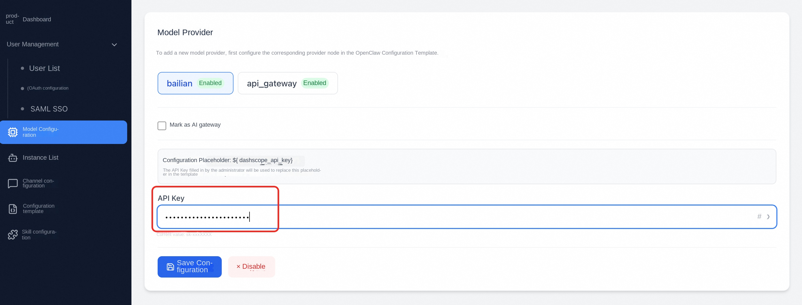

3. Click **Save Configuration** to save the API Key
4. Click the **Enable** button to enable the provider

#### 4.6.3 Configure AI Gateway

When a AI gateway provider creates an instance, **automatically assigns an independent consumer (Consumer) and access credential** to each user, facilitating budget control and auditing. Two AI gateways are built into the platform:

##### Alibaba Cloud AI Gateway

The AI Gateway capability of calling Alibaba Cloud API Gateway provides consumer management, token throttling, and SLS log analysis. For detailed configuration steps, see [4.7 Alibaba Cloud AI Gateway](#47-Alibaba Cloud-AI-Gateway).

##### LiteLLM Gateway

[LiteLLM](https://www.litellm.ai/) is an open source Proxy Server that supports hundreds of models (OpenAI / Anthropic / Azure / Qwen/DeepSeek...) Output with a unified OpenAI compatible interface, built-in User / Key separation management, budget control and switching strategy.

**Operation steps:**

1. Click the "LiteLLM Gateway" provider card to enter the configuration panel
2. Fill in the core parameters:

| Configuration Item | Required | Description |
|--------|------|------|
| **Proxy URL** | Yes | Address of the LiteLLM proxy service, such as 'https://litellm.example.com' |
| **Master Key** | is | the LiteLLM administrator key ('sk-...') used to automatically create users and access credentials. Encrypt storage on save |
| **API Key Placeholder** | Yes | The default '${LITELLM_API_KEY}' must match the placeholder **in the template/startup command**. **|
| **Domain name placeholder** | Yes | The default '${LITELLM_PROXY_URL}' must match the placeholder **in the template/startup command**. **|
| **Budget per user** | No | max_budget, maximum cumulative cost per user Key (USD) |
| **Budget Cycle** | No | 'budget_duration, such as '30d', '7d' |

3. Click "Save Gateway Configuration" → "Enable 」. Other providers are automatically disabled when enabled.

>💡**How it works:** When a user creates an instance, the platform calls the LiteLLM '/user/new''/key/generate' to create an exclusive key for the user, substitutes the key and proxy URL into the '${LITELLM_API_KEY}' / '${LITELLM_PROXY_URL}' placeholder and writes the key and proxy URL to the sandbox.

#### 4.6.4 New Provider

If the default provider cannot meet the requirements (such as directly connected to OpenAI, DeepSeek, or self-built vLLM), click the **Add Provider** button at the top of the list and fill in:

| Field | Description |
|------|------|
| **Name/ID** | Display name and internal ID of the provider |
| **Type** | 'API' (standard), 'AlibabaCloudAIGateway', 'LiteLLM' |
| **API Key / Base URL** | For standard APIs, enter the key and base address. |
| **apiKeyPlaceholder** | will be replaced with the placeholder name of the actual API Key in the template, such as '${DEEPSEEK_API_KEY}' |
| **domainPlaceholder** | Placeholder name to be replaced with the base address in the template (if required) |

>⚠️ **Placeholder matching is the key to adding new providers! The system performs substitution in templates and startup commands by placeholder name. Please confirm before adding a provider:
> 1. The corresponding provider node (JSON template) or comment example (YAML template) has been added in "agent configuration→Configuration Template.
> 2. Placeholders used in the template (such as '${DEEPSEEK_API_KEY}') are exactly the same as the 'apiKeyPlaceholder' **name in the provider configuration.
> 3. If the agent needs to use the key in the startup command (such as '.env' file), add the same placeholder synchronously.

#### 4.6.5 Add Model

In the Model Management area, click the Add Model button:

| Field | Required | Description | Example |
|------|------|------|------|
| **Model name** | Yes | The display name of the model | 'Max' |
| **Provider** | Yes | Select from the Enabled Provider drop-down list | 'bailian' / 'litellm' / 'api_gateway |
| **Model Code** | Yes | The identification code of the model | 'qwen-max', 'deepseek-chat' |
| **Description** | No | Function description of the model | - |

Newly added models are enabled by default, and can be enabled/disabled via the switch button on the card. When you create an instance, you can only select models in the **Enabled** status. Search is available at the top of the page to search by model name or provider.

#### Edit/Delete Model

-**Edit**-Click the Edit button at the bottom of the card to modify the model name, provider, model code, and description.
-**Delete**-Click the delete icon and confirm to permanently delete the model

### 4.7 Alibaba Cloud AI Gateway

**Path:** '/admin/gateway'

The AI gateway is a unified proxy layer for AI invocation. In this system, the AI gateway is configured as a special model provider node, which supports advanced capabilities such as voucher allocation, token statistics, and flow restriction through the Alibaba Cloud AI gateway unified proxy AI model calls.

> For more usage of AI Gateway, please refer to Alibaba Cloud documentation: https://help.aliyun.com/zh/api-gateway/ai-gateway/product-overview/what-is-an-ai-gateway

#### 4.7.1 Prerequisites: Create an Alibaba Cloud AI Gateway

Before configuring a AI gateway in the management platform, you need to create and configure a AI gateway in the Alibaba Cloud console.

**Step 1: Create a AI Gateway instance**

1. Access the Alibaba Cloud AI Gateway console: https://apig.console.aliyun.com'
2. Create a AI gateway instance in the corresponding region. The recommended configuration is as follows:

| Configuration Item | Recommended Value | Description |
| -------- | --------------- | ------ |
| Deployment mode | Serverless | No O & M required in POC stage |
| Billing mode | Pay-As-You-Go | Low cost in test phase |
| Region | Same region as business resources | Such as cn-hangzhou and cn-shanghai |
| Network type | Private network (Intranet) must be enabled | Ensure that Sandbox pods can be accessed through the VPC intranet, and public network can be enabled on demand |
| VPC | Select the same VPC as the ACS cluster | View the VPC ID in the ACS console |
| Log Service | Use Log Service | Provides log analysis and dashboards for troubleshooting |

**Step 2: Configure the backend AI service**

1. In the created AI gateway, create the **Model API**

2. Scene templates can be selected to quickly create OpenAI compatible routes for seamless access to OpenClaw

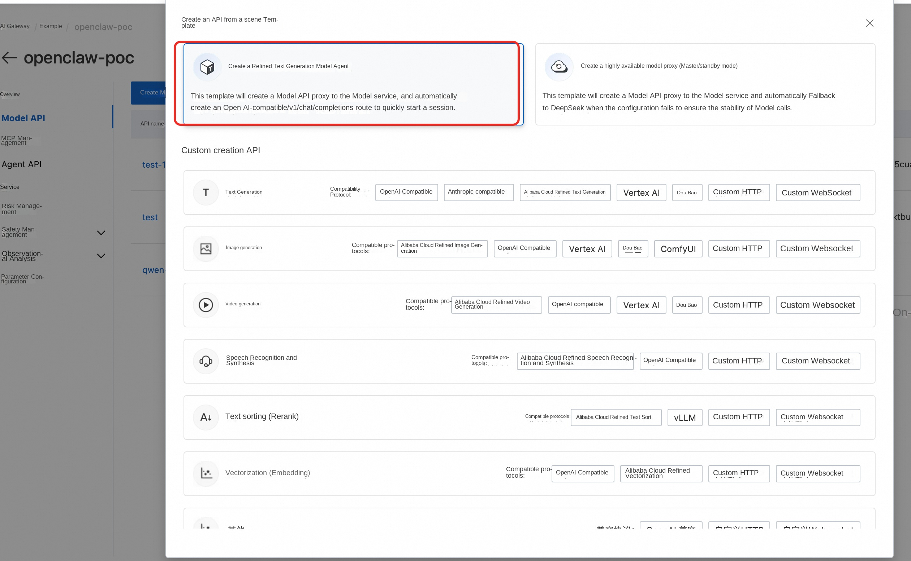

3. Set API Name and Refined API Key

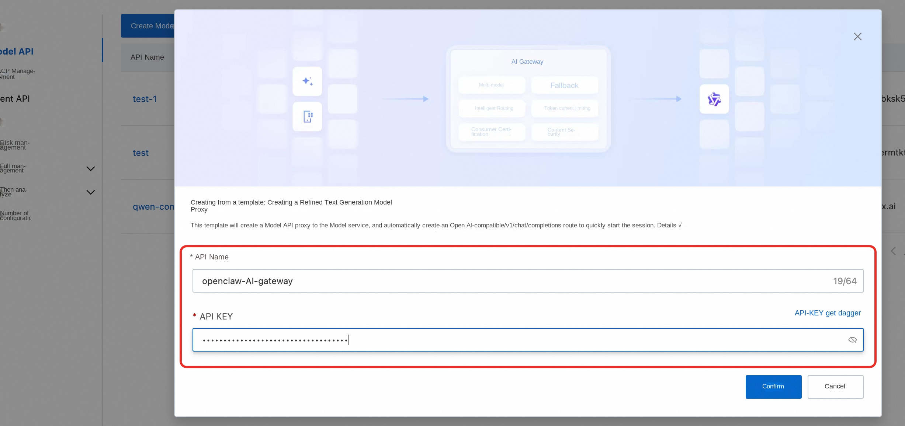

4. After the creation is successful, turn on the "Enable Authentication" switch in the Model API "Consumer Authentication" and select the "API Key" authentication method

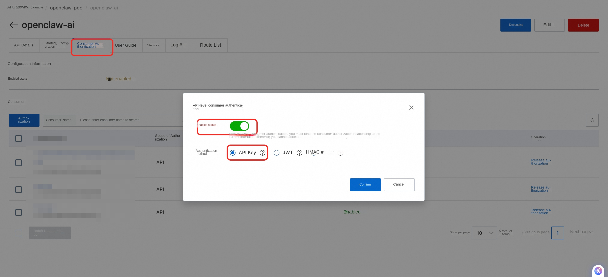

5. Configure the domain name of the API (optional)
After the API is successfully created, the default access domain name is provided. In production use, you need to transfer the business domain name to the access domain name through DNS service CNAME. Direct access through the access domain name has a daily access limit of 1000 times, the default access domain name can be used for testing, do not directly use the production.
You can use this access domain name for testing during the initial verification phase, and then bind the domain name later.

add a domain name in the AI gateway console
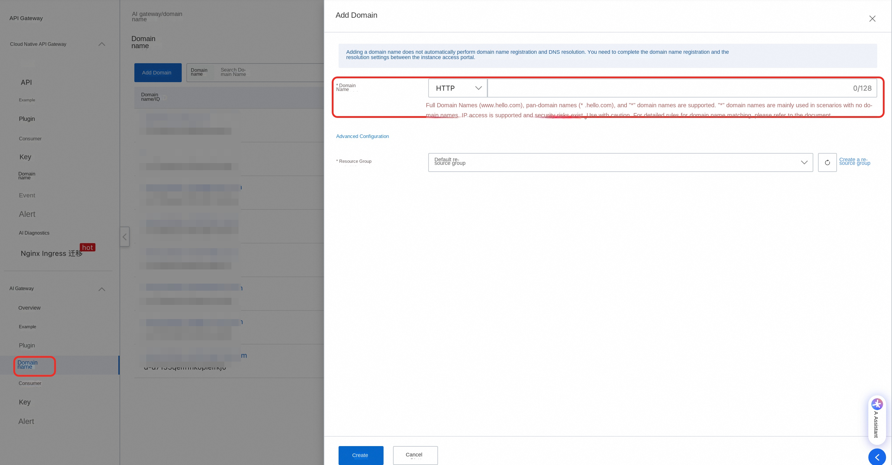

Configure the domain name of the API

Configure the DNS resolution of the domain name and transfer the business domain name to the access domain name through the DNS service CNAME.

#### 4.7.2 Configuring the AI Gateway in the Management Platform

After the AI gateway on the Alibaba Cloud side is created, return to the management platform for associated configuration.

**Operation steps:**

1. Go to the Model Configuration page and select the model provider that you want to mark as a AI gateway (e. g. api_gateway)
2. Check the **Mark as AI Gateway** checkbox and click **Enable Gateway**. The dedicated configuration panel of AI gateway will be expanded.

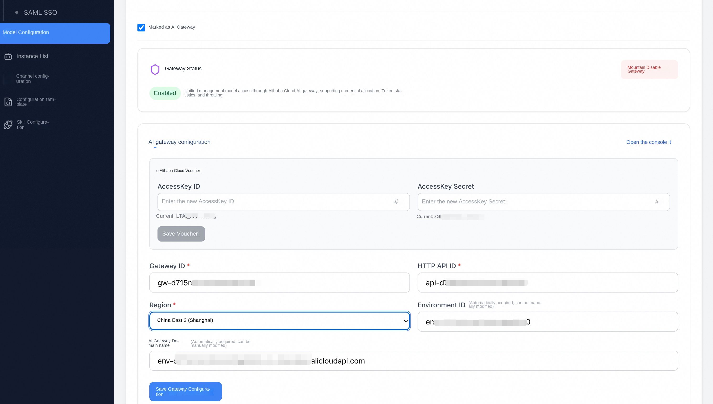

3. Configure **Alibaba Cloud Credentials**:
-**AccessKey ID**: the AccessKey ID of the Alibaba Cloud account
-**AccessKey Secret**: the AccessKey secret of the Alibaba Cloud account.
-Click **Save Certificate**

> The credentials saved here are used to obtain and modify the configuration of the AI gateway. The following RAM policies are required for this credential:
> 1. **AliyunAPIGFullAccess**: Permissions to manage Cloud Native API Gateway
> 2. **AliyunLogReadOnlyAccess**: Read-only access to Log Service

4. Configure **Gateway Parameters**:

| Configuration Item | Required | Description |
| -------- | --------------------------------------------------------------------------------------------------------------------------------------------------- |
| **Gateway ID** | Yes | The ID of the AI gateway instance, such as gw-xxx |
| **HTTP API ID** | Yes | The ID of the Model API, such as' api-xxx '|
| **Region** | Yes | The region where the AI gateway is located |
| **Environment ID** | - | Fill in the Gateway ID and HTTP API ID and save them. The system automatically obtains them or manually modifies them. Used to identify the publishing environment of the AI gateway |
| **AI Gateway Domain Name** | - | After you enter the Gateway ID and HTTP API ID, the system automatically obtains the first domain name. You can also modify it manually. The domain name is the actual request address of the OpenClaw instance to call the AI gateway, which can be viewed in the Model API Usage Guide of the AI gateway console. We recommend that you use a custom domain name in the production environment. For the configuration steps, see "Configuring Backend AI Services".

5. Click **Save Gateway Configuration**

> The "Open Console" link is provided in the configuration panel, and you can jump to the Alibaba Cloud AI Gateway console with one click.

#### 4.7.3 Effect of AI Gateway Enabled

When the AI gateway is enabled, the system has the following capabilities:

-**Automatic Credential Assignment**-When a user creates an Agent instance, the system automatically creates a consumer in the AI Gateway and assigns access credentials to the user.
-**Token Statistics**-The system automatically collects token consumption data of each user through Alibaba Cloud Log Service (SLS)
-**Token Limits**-You can restrict the use of tokens at the global or individual level (see 4.8.1 Token Statistics for details).

### 4.8 Token Statistics and Current Limiting

After the AI gateway is enabled, the system can view the user's token consumption and configure the flow limit policy to control the usage.

#### 4.8.1 Token Statistics

Administrators can view token consumption data in the following locations:

-**User Management Page**-The "Token Consumption Today" and "Token Consumption Last 30 Days" columns in the user list directly display the consumption of each user
-**Administrator Dashboard**-Displays the number of active users today, the number of requests, the total token consumption, and the consumer token consumption ranking (Top 10)

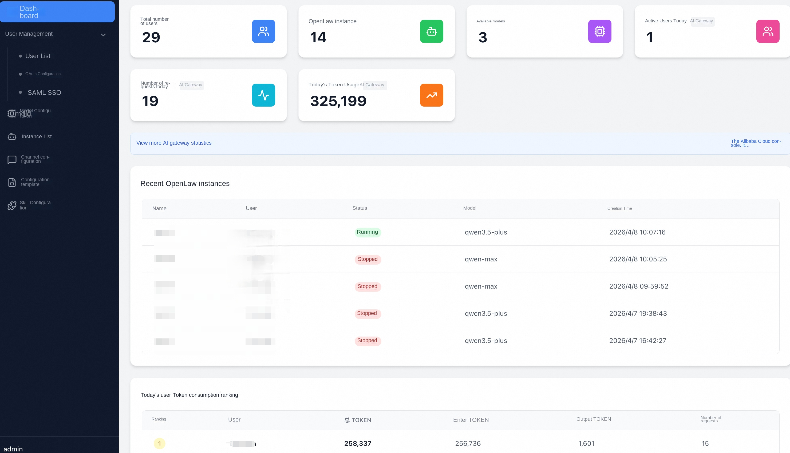

> Token statistics are provided by Alibaba Cloud SLS Log Service and are available only when the AI gateway is enabled. If the user is not associated with a consumer (the Consumer ID column is displayed as "-"), the token consumption of the user cannot be counted.

#### 4.8.2 Global Current Limit Configuration

The global throttling policy takes effect for all users and is set in the AI gateway configuration panel.

**Operating Steps:**

1. Go to the Model Configuration page and select the provider that has been marked as a AI gateway
2. Find the "Token Limiting Policy" area at the bottom of the AI gateway configuration panel
3. Set current limiting parameters:
-**Daily Token Limit per User**: The unit is tokens/day. Leave this blank or enter 0 to indicate no limit.
-**Upper Token Limit Per User Per 30 Days**: The unit is tokens/30 days. Leave this blank or enter 0 to indicate no limit.
-Two policies can take effect at the same time

4. Click **Save Current Limiting Configuration**
5. After saving, the page will display the current effective current limit status, such as: "Daily 1,000,000 tokens 40,000,000 tokens every 30 days 」

#### 4.8.3 Individual Current Limit Configuration

In addition to global throttling, administrators can set independent throttling policies for individual users. **Individual throttling policies take precedence over global policies.**

**Operating Steps:**

1. Enter the User Management page
2. Find the target user in the user list and click the **" Token Limit "** button in the operation column (this button will only be displayed for users associated with the Consumer ID)
3. In the pop-up "User Token Limit" dialog box:
-The page will display the global flow restriction policy as a reference (for example, "Daily: 1,000,000 tokens Every 30 days: 40,000,000 tokens")
-Fill in the personal current limit value of the user:
-**Daily Token Limit (Individual)**: unit is tokens/day
-**Maximum Token Per 30 Days (Individual)**: unit is tokens/30 days
-Leave blank or enter 0 to indicate that no personal limit is set, and the user will inherit the global limit policy.
-After setting personal restrictions, the user is subject to personal restrictions
4. Click **Save Current Limiting Configuration**
5. The top of the dialog box will show the user's "current effective token limit" in real time, and indicate the source of each limit ("personal" or "global")

> **Example:** If a user's global daily limit is 1,000,000 tokens and the administrator sets the personal daily limit to 2,000,000 tokens, the effective daily limit for the user is 2,000,000 tokens (personal), and the 30-day limit is still 40,000,000 tokens globally.

### 4.9 instance list (administrator view)

**Path:** '/admin/instances'

Administrators can view and manage Agent instances created by **All Users**.

#### List function

-**Search**-Search by instance name
-**User Filtering**-Filters instances by user name (only for administrators)
-**Paging** -10 records per page, support page turning

#### Table column description

| Column name | Description |
|------|------|
| **ID** | Sandbox ID |
| **Name** | Instance name and description |
| **User** | The user of the instance (column unique to the administrator) |
| **Agent Configuration** | The agent type associated with the instance, displayed in indigo color. |
| **Status** | Running/Stopped/Starting/Stopping |
| **Model** | AI model used |
| **Creation time** | Instance creation time |
| **Actions** | View Details/Start/Stop/Delete/View Pod |

#### Administrator-specific actions

-**View Pod**-If the ACS cluster ID is configured, you can directly go to the Alibaba Cloud Container Service console to view the pod details of the instance.
-**View Details**-On the Instance Details page, you can view additional information such as instance users.

---

### 4.10 Group Management (Shared Agent Instance)

**Path:** '/admin/groups'

> Groups are used to **share Agent instances** among multiple users. After the platform administrator creates a group and adds users to the group, members in the group can jointly access, start, stop, and edit the same batch of Agent instances, which is suitable for team collaboration scenarios.

#### 4.10.1 Grouping Function Overview

-**Shared Attribution**: When creating an instance, you can select Private or a group. The instances belonging to the group are accessed by all members of the group. The quota is deducted from the group entity and does not occupy the creator's personal quota.
-**Three-level role model**: Each group member has a role that determines its permissions in the group:

| Roles | Permissions |
|------|------|
| **owner** | Manage members (add/remove/adjust roles), modify the group name, and delete any shared instances under the group. |
| **admin (administrator)** | Manage members (add/remove/adjust admin and member), delete any shared instance under the group |
| **member (ordinary member)** | View, start, stop, and edit the configuration of a group shared instance. You can only delete a shared instance created by yourself. |

-**Restriction**: After the instance is created, **the group to which the instance belongs cannot be changed**. If you need to modify the instance, delete it and create it again.

#### 4.10.2 Create Group (Administrator Action)

Only platform administrators can create groups.

**Operating Steps:**

1. Go to **management background → group management**, click **" new group "** button in the upper right corner
2. Fill in the pop-up window:

| Field | Required | Description |
|------|------|------|
| **Group name** | is | 1-100 characters, unique in-platform case insensitive |
| **Maximum number of instances** | No | The default value is 5.0 indicates that creating shared instances in this group is prohibited. |

3. Click **Create**. The system automatically sets the current administrator as the **owner** of the group, and assigns model provider credentials to the group body (if the AI gateway is enabled).

> If the credential allocation fails, the group will still be created successfully, but the API Key status in the group details will be displayed as 'missing'. You can try again after the credential is restored.

#### 4.10.3 Add/Remove Group Members

group owner, group admin, and platform administrator can manage group members.

**Add members:**

1. On the **Group Management** page, click the target group to go to the details page and switch to the **Members** tab.
2. Click **Add Members** to fill in:

| Field | Required | Description |
|------|------|------|
| **User Mailbox** | Yes | Must be a registered and enabled user mailbox |
| **Role** | No | Default 'member'; optional 'admin';'owner' can only be set by platform administrators (for owner transfer) |

3. Click **Save**. If the user was ever moved out of the group, membership is automatically restored and roles are updated.

**Remove members:**

1. Find the target member in the group member list, click the **Remove** button on the right, and the member status changes to 'removed' after the second confirmation'
2. After removal, the member can no longer access any shared instances under the group (including the shared instances previously created in the group).
3. * * owner cannot be removed directly * *: to remove owner, the platform administrator must first set the role of another member to 'owner' through the add member interface (automatically demote the old owner to admin in the same transaction), and then remove the original owner

> Member removal only cuts off the backend access permission. **Group credentials injected into the running sandbox are not automatically revoked.**. If there are security compliance requirements, please delete/rebuild the shared instance or manually rotate the provider certificate processing.

#### 4.10.4 Grouping Limit Configuration

Group principals (principal) support the following three types of limits, independent of individual user limits:

| Limit Type | Configuration Location | Description |
|----------|----------|------|
| **Maximum number of instances** | Create a group pop-up window/group details Edit | Maximum number of shared instances under a group; only the platform administrator can modify |
| **Token Limit** | After the AI gateway is enabled, configure the token based on the group body in "Token Limit". | The token consumed by the group shared instance is included in the group body. You can set the daily/30-day limit independently. |
| **Budget Limit** | When the LiteLLM Gateway is enabled, the group subject has a max_budget in the LiteLLM as an independent user. | Controls the maximum cumulative charge for the group. |

> The token and fee of the shared instance are always included in the **group entity**, and are not repeatedly included in the creator's personal quota.

#### 4.10.5 Delete Grouping

Only platform administrators can delete groups, and the following preconditions must be met:

| Preconditions | When not satisfied |
|----------|----------|
| There are no shared instances in the group. | Prompt to delete all shared instances first. |
| There are no non-owner members in the active state | Prompt to remove all non-owner members first |
| The provider voucher of the group subject has been revoked (or the provider does not require a voucher) | Prompt to revoke the voucher first |

If the above conditions are met, click **" Delete Group "** on the group details page and confirm.

#### 4.10.6 Using Shared Grouping on User Side

After the normal user who is added to the group logs in:

1. View the groups you have joined, current roles, and group quota usage on the **User Center → My Groups** page
2. In the "Home" option on the **Create Instance** page, you can select "Private" or a group added by yourself
3. Existing shared instances will appear in the instance list of group members at the same time, and can be started, stopped and configured normally. Delete permissions are determined according to the role model in 4.10.1 above.

>⚠️ **Important note:** After the instance is created, **the attribution group cannot be changed**, nor can it be switched between private and shared. Please confirm the attribution before creating.

---

## 5. User Functions

Ordinary users enter the user center after logging in. The user center also uses the layout of the content area on the right side of the left navigation bar. The navigation bar contains two menu items: **Instance List** and **Profile**.

The user name, role (common user), and logout button are displayed at the bottom of the left navigation bar.

> **Note:** If you do not log in and access '/user/instances' directly, the page displays 404. Please complete the login through the login page first.
>
>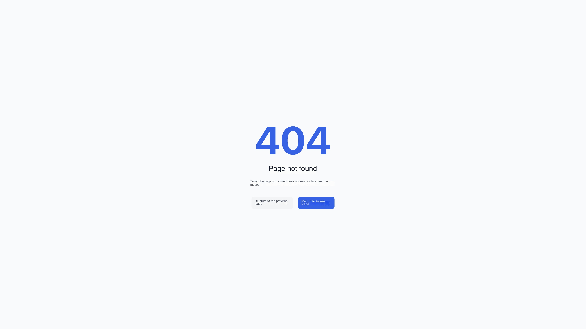

### 5.1 instance list

**Path:** '/user/instances'

The main page of the user, which displays all Agent instances created by the current user.

#### List function

-**Search**-In the upper-left corner search box, search by instance name
-**Create**-The **Create Instance** button in the upper right corner creates a new instance
-**Paging** -10 records per page, page navigation at the bottom

#### Table Column Description

| Column name | Description |
|------|------|
| **ID** | Sandbox ID |
| **Name** | Instance name |
| **Agent Configuration** | The agent type associated with the instance |
| **Status** | Running/Stopped |
| **Model** | AI model used |
| **Created** | Created |
| **Operation** | View Details/Start Stop/Delete |

#### Operation button description (from left to right)

| Icon | Action | Description |
|------|------|------|
|👁Eyes | View details | Go to the instance details page to view and modify configurations |
|▶/⏹Play/Stop | Start/Stop | Green is start, orange is stop; the rotation load icon will be displayed during operation |
|🗑Delete | Delete | Red, permanently delete the instance and associated Sandbox, confirm |

### 5.2 to create an Agent instance

**Path:** '/user/instances/create'

The Create page has the Back to List link at the top and the body is a form card.

#### Operation steps

1. On the Instance List page, click the blue **" Create Instance "** button in the upper right corner.
2. Fill in the following information:

| Field | Required | Description |
|------|------|------|
| **Select Agent Configuration** | Yes | Display all enabled Agent types (such as OpenClaw and Hermes) in card form. Click to select one. Display name, description and category label for each card (built-in/custom) |
| **Instance Name** | Yes | A meaningful name for the instance, such as "Customer Service Assistant", "Sales Robot" |
| **Select AI Model** | Yes | Drop-down selection box to select one from the list of available models configured by the administrator (displays the "Model Name-Provider" format) |
| **Select Message Channel** | No | Drop-down selection box to dynamically load available channels based on the selected agent type. Default value: Do not configure temporarily. |

3. If the message channel is selected, the form will open a "channel configuration" area, you need to fill in the corresponding Client ID and Client Secret
4. Click the **" Create Instance "** button in the lower right corner to submit (the "Create" button will display the loading animation)

On creation, the system automatically completes the following:

-Create a sandbox environment based on the selected Agent type
-Generate instance configuration based on agent configuration template and selected model
-if AI gateway is enabled, automatically create a AI gateway consumer for that user and assign access credentials
-Start the Agent service

Wait for the instance status to change to Running. After the instance is created, the instance details page is automatically redirected.

#### Use Tips

At the bottom of the page is a blue tip card with the following suggestions:
-Create multiple instances for different usage scenarios
-Select Agent configuration and appropriate AI model
-After creation, you can modify the configuration at any time on the details page.

### 5.3 instance details and configuration

**Path:** '/user/instances/:id'

The instance details page contains basic information, model configuration, channel configuration, and access and terminal entries of the running instance. At the top of the page, there is a Back to List link on the left and action buttons on the right.

#### Top operation button

There are two buttons in the upper right corner of the page:

| Button | Description |
|------|------|
| **Start/Stop** | Blue (start) or orange (stop) buttons to control the running state of the instance |
| **Save Configuration** | Blue button that becomes clickable when model or channel configuration is modified |

#### Basic Information Card

The core information of the instance is displayed in a two-column grid:

| Field | Description |
|------|------|
| **ID** | Sandbox unique identifier (in the format of 'namespace -- podname') |
| **Name** | Instance name |
| **Status** | Green "Running" or gray "Stopped" badge |
| **Creation Time** | Instance creation time (Chinese format) |
| **Last Active** | The last active time of the instance. If not, None is displayed. |
| **Attributed User** | The user name of the instance is displayed only in the administrator view. |
| **Application access link** | The access URL after the instance is running. The blue clickable link opens in a new window. |
| **/etc/hosts configuration** | In the development mode, the code blocks with green characters on the black background need to be added to the local hosts file. |
| **View Container** | Only the administrator view is displayed. Go to the Alibaba Cloud console to view the pod. |

#### Open the application interface and terminal

After the instance enters Running, the details page displays the application access link. Click the link or **" open in new window "** to open the Agent interface on a separate page. If the current Agent supports terminal login, the terminal will also be opened on the new access page to avoid refreshing or blocking the embedded area of the details page.

**Operating Steps:**

1. Open the instance details page and confirm that the instance status is Running 」
2. Find the **Application Access Link** in the Basic Information Card
3. Click the link or **" Open in new window "**
4. Use the Agent interface or terminal in a new page

#### Batch upload files

On the instance access page that supports file upload, you can upload multiple files at a time to transfer local data, scripts, or configuration files to the instance running environment.

**Operating Steps:**

1. On the instance details page, click **Application Access Link** or **Open in New Window** to enter the instance access page.
2. Click the **Upload File** entry on the page
3. Select one or more files in the system file selector, or drag and drop multiple files to the upload area
4. Wait for the upload completion prompt before closing the page

> The time taken to upload large files or a large number of files is affected by the network and instance environment. Please wait for the page to confirm the completion of the upload before continuing the operation.

#### Model Configuration Card

Used to modify the AI model used by the instance:

1. Select a new model in the Select AI Model drop-down menu (displays the Model Name (Provider) format)
2. After modification, an orange prompt text will appear below: "Modified, click Save Configuration Effective"
3. Click the Save Configuration button at the top of the page to save your changes

#### Channel Configuration Card

Used to modify the message channel of the instance:

1. Select the channel type (such as Feishu, DingTalk) in the "Select Channel" drop-down menu, and select "Not Configuring" to clear the channel
2. Select the channel and expand the configuration area, including Client ID (text input) and Client Secret (password input)
3. The placeholder of the Client Secret input box is "Leave blank and remain unchanged",* * only need to be filled in when changing the password**
4. After modification, an orange prompt text will appear below. Click the **" Save Configuration "** button to save

### 5.4 Pause and Restart an Instance

When an Agent instance is not needed, it can be paused to free up computing resources. **After the instance is suspended, the data and memory are retained.**

#### Pause Instance

1. Locate the target instance on the Instance List page
2. Click the Stop button (orange) in the Actions bar
3. The instance status will change to "Stopped" and display "Stopped" when finished 」

#### Restart the instance

A suspended instance can be restarted at any time. After recovery, the configuration, data, and historical memory of the instance remain intact.

1. On the Instance List page, locate a target instance with a status of Stopped
2. Click the Start button (green) in the Actions bar
3. The instance status will change to "Starting" and display "Running" when finished 」

### Overview of Token Usage on the 5.5 User Side

If AI Gateway is enabled, a token usage overview card is displayed at the top of the user instance list page, including:

| Indicator | Description |
|------|------|
| **Number of Instances** | Number of Instances owned by the current user |
| **Token usage today** | The number of tokens used today and the daily limit progress bar |
| **Token usage in recent 30 days** | Token usage in recent 30 days and 30-day limit progress bar |

The progress bar changes color according to usage: green (<70%), amber (70%-90%), red (≥ 90%).

---

## 6. FAQ

### Q1: Is there no login method available on the user login page?

**A:** The user logon page always supports **email password logon** (bottom of the page) without additional configuration. If OAuth or SSO login is also required, the administrator needs to complete the configuration on the "User Management → Single Sign-on" page:
-**Configure OAuth**: On the Authentication → Providers page of the Supabase console, enable an OAuth provider (such as Alibaba Cloud), create an OAuth application on the corresponding platform, and set the callback address to 'https://<Supabase URL>/auth/v1/callback '. For details, see [4.3.1 OAuth configuration](#431-oauth-configuration).
-**or Configure SAML SSO**: Add enterprise SSO configuration on the SAML tab page of Single Sign-On. For details, see [4.3.2 SAML SSO Configuration](#432-saml-sso-Configuration).
-**Note:** OAuth and SAML SSO are mutually exclusive configurations (one of two options).

For mailbox password login, the administrator must first create an account for the user in User Management (select the mailbox password authentication method) before the user can log in with the mailbox and password.

### Q2: What if the instance creation fails?

**A:** Please check the following:
1. Whether the user has reached the maximum number of instances (default 5), you can contact the administrator to adjust in user management.
2. Whether the backend API service and E2B service are connected normally
3. Whether at least one AI model has been added and enabled in the Model layout
4. Whether at least one Agent type is enabled in the Agent Configuration
5. Determine whether the write configuration in the sandboxset is correct. For non-root users, please ensure that the write path is the correct configuration.

### Q3: Token usage statistics are not displayed?

**A:** Token usage statistics depends on AI Gateway and SLS. The administrator must correctly configure and enable the gateway on the AI Gateway page, and the Aliyun AccessKey must have the read permission of SLS. When the AI gateway is not enabled, token-related metric columns are not displayed in dashboards and user management.

### Q4: How do I access a running instance?

**A:** After the instance is started, the Application Access Link is displayed on the instance details page 」. Clicking the link or Open in New Window opens the Agent's interface; if the current Agent supports terminal login, the terminal opens in a new access page. The instance access page that supports file upload can also select multiple file uploads at once. If it is a development environment, the details page may display the '/etc/hosts' configuration, which needs to be added to the local hosts file before it can be accessed normally.

### Q5: What AI models are supported?

**A:** The platform itself does not limit the model type. Administrators can freely add model providers and models on the Model Configuration page. Common models include:
-Qwen Series (Tongyi Qianxuan)
-DeepSeek series
-Other models compatible with OpenAI API format

### Q6: Where can I get the Client ID and Client Secret in the channel configuration?

**A:** According to different channel types, go to the corresponding platform to create a robot application and obtain the following information:
-**Flying Book**-[Flying Book Open Platform](https://open.feishu.cn/)
-**DingTalk**-[DingTalk Open Platform](https://open.dingtalk.com/)
-**Enterprise WeChat**-[Enterprise WeChat Management Background](https://work.weixin.qq.com/)
-**QQ**-[QQ Open Platform](https://q.qq.com/)

### Q7: Supabase page did SAML SSO jump to after logging in instead of the application?

**A:** Go to **Management Background → User Management → Single Sign-On → SAML Tab**, set the Site URL to your application address (such as https://your-app.example.com) in the "Callback Address Configuration" area, save it and try again.

### Q8: OAuth login button does not appear?

**A:** The OAuth provider needs to be enabled in the **Supabase Console** instead of the Agent Manager. Please:
1. Log in to the Supabase console → Authentication → Providers
2. Find the corresponding provider (such as AlibabaCloud) and turn on the Enable switch
3. Enter the Client ID / Client Secret of the corresponding platform
4. After saving, return to the Agent Manager "single sign-on → OAuth tab" Click "refresh" to confirm the status
5. Visit the user login page ('/login') again, and the corresponding login button should have appeared

### Q9: How to fill in the Alibaba Cloud OAuth callback address?

**A:** When you create an OAuth application in the RAM console, enter the callback address (Redirect URI):

'''
https://<Your Supabase project URL>/auth/v1/callback
'''

For example 'https://abc123.supabase.co/auth/v1/callback '. Supabase automatically handles the callback logic for all OAuth providers, all of which use the same callback address.

### Q10: Can I configure multiple login methods at the same time?

**A:** OAuth and SAML SSO are mutually exclusive configurations (one of two options). The administrator selects one of them on the Single Sign-On configuration page. The mailbox password login is always available, alongside OAuth/SAML. You can enable multiple OAuth providers (such as Alibaba Cloud GitHub Google) at the same time, but you cannot enable OAuth and SAML SSO at the same time.

### Q11: What agent types does the platform support?

**A:** Platform provides two built-in Agent types: **OpenClaw**(JSON configuration) and **Hermes**(YAML configuration). The sandbox templates agent-manager-openclaw and agent-manager-hermes are automatically created in the cluster during deployment. In addition, the administrator can also add new types in "Agent Configuration" through "Copy from Template" or "Custom Create", and create corresponding SandboxSet in "Sandbox Configuration" to support any Agent framework compatible with E2B sandbox.

### Q12: Model call failed after adding model provider?

**A:** The probability is that the placeholder does not match. The 'apiKeyPlaceholder' / 'domainPlaceholder' entered when adding a provider must be the same as the placeholder name **used in the Agent configuration template and startup command**. Otherwise, the template variable replacement will skip this provider. See [4.6.4 New Provider](#464-New Provider).

### Q13: Does the new configuration not take effect after modifying the SandboxSet?

**A:** The running instance uses the sandbox environment before modification. After editing and saving the SandboxSet YAML in the sandbox configuration, click Stop on the instance corresponding to the instance list and then Start to apply the new configuration.

### Q14: What should I do if I want to deploy the sandbox to a non-'default' namespace?

**A:** Refer to the SandboxSet YAML template provided by [4.5.5 Deploy Sandbox in Custom namespace](#455-Deploy Sandbox in Custom-namespace):
1. Change 'metadata.namespace' to the target namespace (you need to namespace 'kubectl create <name>'in advance)
2. Replace 'security-group-ids' and 'vswitch-ids' with the resource ID of the target VPC/Availability Zone
3. 'kubectl apply -f <file>.yaml' Commit to cluster
4. In "Agent Configuration→Basic Configuration", fill in "sandbox template ID" as the newly SandboxSet 'metadata.name'

Note The Agent Manager backend ServiceAccount requires RBAC permissions for the target namespace.

### Q15: The instance is created successfully, but the 502 is returned when the instance is opened through the agent access gateway?

**A:** Look at the openclaw-agent-gateway log first. If the log contains:

'''text
upstream SSL certificate verify error: (2:unable to get issuer certificate)
'''

This is usually not a Sandbox creation failure or a browser-to-nginx certificate issue. It indicates that when the nginx proxy to the real E2B upstream, the e2b-ca-cert cannot be used to verify the upstream certificate chain.

Even if **Enable Agent Access Gateway** is disabled and the old E2B directly connected address is available, the e2b-ca-cert cannot be proved to be correct. The old direct connection address bypasses the upstream certificate verification of nginx.

Please refer to the "Troubleshooting Agent Access Gateway 502" section in [1.7 Agent Access Gateway Certificates and Switches](#17-agent-Access Gateway Certificates and Switches) to confirm that the "e2b-ca-cert" is not the leaf certificate of "CA:FALSE", the old certificate, or the wrong public/private CA chain.

### Q16: Forgot administrator password how to do?

**A:** If you cannot enter the background through the administrator login page, you can use the Supabase service_role key to call the Auth Admin API to modify the administrator user password. Find the administrator user ID from '/auth/v1/admin/users', and then call '/auth/v1/admin/users/<USER_ID>' to update the 'password' field. See [3.1 Administrator Login](#31-Administrator Login) in the "Reset when you forget the administrator password" section.

---

> document version: v2.3 | update date: 2026-06-04
