# OpenClaw Manager 功能文档

> **OpenClaw Manager** 是一个企业级 AI 智能体管理平台，提供完整的 AI 智能体创建、配置和管理能力，支持多模型接入、多渠道集成，助力企业快速构建智能客服系统。

---

## 1. 计算巢部署

> 本章介绍如何通过阿里云计算巢（ComputeNest）在已有 ACS 集群上部署 OpenClaw 管理平台（含 Supabase 后端数据库）。


### 1.1 前置条件

部署 OpenClaw Manager 管理平台前，需要先完成 **OpenClaw-ACS-Sandbox 集群版** 的部署。如果尚未部署，请先前往计算巢创建 Sandbox 集群版实例：

👉 [创建 OpenClaw-ACS-Sandbox 集群版实例](https://computenest.console.aliyun.com/service/instance/create/cn-hangzhou?type=user&ServiceId=service-56531b838b524f5a83da)

### 1.2 部署步骤

**第一步：进入计算巢部署页面**

在计算巢控制台中找到 **Openclaw-Manager 企业版** 服务，点击创建实例，进入参数配置页面。

**第二步：填写部署参数**

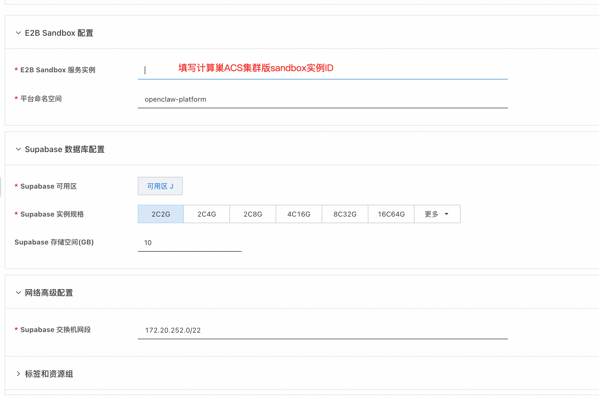

按照以下说明填写各项配置：

#### E2B Sandbox 配置

| 参数 | 必填 | 说明 |
|------|------|------|
| **E2B Sandbox 服务实例** | 是 | 填写已部署的 OpenClaw-ACS-Sandbox 集群版的**计算巢服务实例 ID** |
| **平台命名空间** | 否 | 管理平台在 K8s 集群中的命名空间，默认 `openclaw-platform`，一般无需修改 |

#### Supabase 数据库配置

| 参数 | 必填 | 默认值 | 说明 |
|------|------|--------|------|
| **Supabase 可用区** | 是 | — | 选择 Supabase 实例的可用区，需与 ACS 集群在同一地域 |
| **Supabase 实例规格** | 是 | 2C2G | 数据库实例规格，开发测试选 2C2G 即可，生产环境建议 2C4G 及以上 |
| **Supabase 存储空间(GB)** | 否 | 10 | 数据库存储空间大小 |

#### 网络高级配置

| 参数 | 必填 | 说明 |
|------|------|------|
| **Supabase 交换机网段** | 是 | Supabase 实例所在的交换机（VSwitch）CIDR 网段，如 `172.20.252.0/22` |

> ⚠️ **重要提醒：Supabase 交换机网段不能与 VPC 内已有的交换机网段冲突！** 部署前请先在 [阿里云 VPC 控制台](https://vpc.console.aliyun.com/) 查看当前 VPC 下已有的交换机网段，确保填写的网段不与任何已有网段重叠，否则会导致部署失败。

**第三步：确认信息并创建**

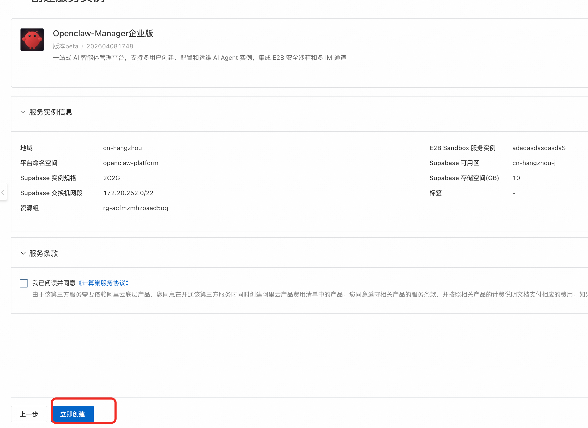

1. 核对所有配置参数是否正确
2. 勾选 **「我已阅读并同意《计算巢服务协议》」**
3. 点击 **「立即创建」** 按钮开始部署

部署过程约需 5-10 分钟，期间系统将自动完成以下操作：

- 创建 Supabase 数据库实例
- 初始化数据库表结构和管理员账号
- 在 ACS 集群中部署管理平台应用
- 配置 ALB Ingress 负载均衡

### 1.3 部署验证

部署完成后，在计算巢控制台的服务实例详情页中可以获取管理平台的访问地址。打开访问地址，看到 OpenClaw Manager 的登录页面即表示部署成功。

> **初始管理员账号：** 邮箱 `admin@openclaw.local`，密码 `admin123`。**请首次登录后立即修改密码！**

### 1.4 常见部署问题排查

| 问题 | 可能原因 | 解决方案 |
|------|----------|----------|
| 部署失败，提示网段冲突 | Supabase 交换机网段与 VPC 内已有网段重叠 | 在 VPC 控制台查看已有网段，更换一个不冲突的 CIDR 网段重新部署 |
| 部署超时 | Supabase 实例创建耗时较长 | 在计算巢控制台查看部署事件日志，等待或重试 |
| 平台页面无法访问 | ALB Ingress 尚未就绪 | 等待 1-2 分钟后重试，或检查 ACS 集群中 Ingress 资源状态 |
| 登录后提示数据库连接失败 | Supabase 实例未完全就绪 | 等待 Supabase 实例状态变为「运行中」后重试 |

---

## 2. 平台概览

### 2.1 首页

访问平台首页，你将看到 OpenClaw Manager 的欢迎页面：

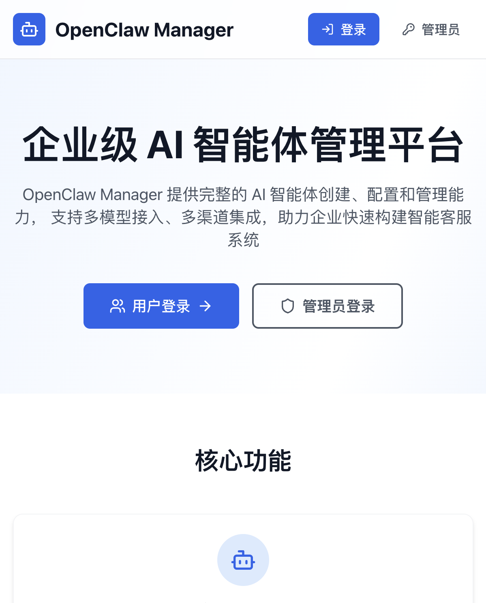

首页分为三个区域：

**顶部导航栏：** 包含平台 Logo、「登录」按钮（普通用户 OAuth/SSO 登录）和「管理员」按钮（邮箱密码登录）。

**Hero 区域：** 展示平台标语和两个主要入口按钮：
- **「用户登录」** — 跳转到用户登录页（OAuth / SSO）
- **「管理员登录」** — 跳转到管理员邮箱密码登录页

**核心功能介绍：** 三张功能卡片展示平台的核心能力：
- **智能体管理** — 创建、配置和管理 AI 智能体，支持多实例部署
- **多模型支持** — 支持 Qwen、DeepSeek 等多个主流 AI 大模型
- **用户管理** — 精细化用户实例配额管理，Token 配额管理

### 2.2 角色与权限

平台有两种角色：

| 角色 | 权限范围 |
|------|----------|
| **管理员 (admin)** | 可访问管理后台所有功能：仪表盘、用户管理、模型配置、AI 网关、实例管理（所有用户）、渠道配置、模板配置、技能配置 |
| **普通用户 (user)** | 仅可访问用户中心：查看/创建/管理自己的 OpenClaw 实例，配置模型和渠道 |

---

## 3. 登录系统

平台提供两种登录入口，分别面向管理员和普通用户。

### 3.1 管理员登录

管理员使用邮箱 + 密码方式登录，入口与普通用户分离。

**操作步骤：**

1. 在首页点击右上角的 **「管理员」** 按钮，或直接访问 `/admin/login`
2. 输入管理员邮箱和密码
3. 点击 **「登录」** 按钮

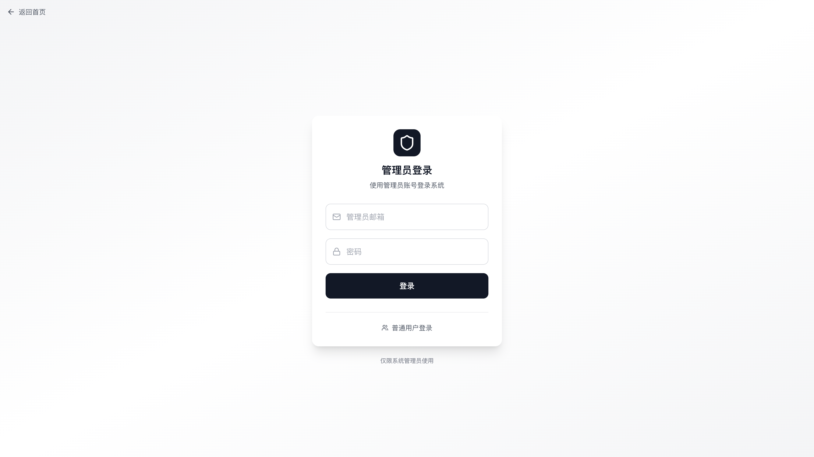

登录成功后将自动跳转到管理后台仪表盘。如果输入了非管理员账号，会被重定向到用户中心。

> **初始管理员账号：** 首次部署时，系统会通过数据库迁移脚本自动创建管理员账号。默认邮箱通常为 `admin@openclaw.local`，密码为 `admin123`。**请首次登录后立即修改密码！**

页面底部还提供了 **「普通用户登录」** 链接，可快速切换到用户登录入口。

### 3.2 用户登录

普通用户通过 OAuth 或 SAML SSO 方式登录，不支持邮箱密码直接登录。

**操作步骤：**

1. 在首页点击 **「登录」** 按钮或 **「用户登录」** 按钮，跳转到 `/login`
2. 根据管理员配置的登录方式进行登录：
   - **OAuth 登录** — 点击对应的 OAuth 提供商按钮（如下图中的「阿里云登录」）
   - **SAML SSO 登录** — 点击 **「企业 SSO 登录」** 按钮，通过企业身份认证系统登录

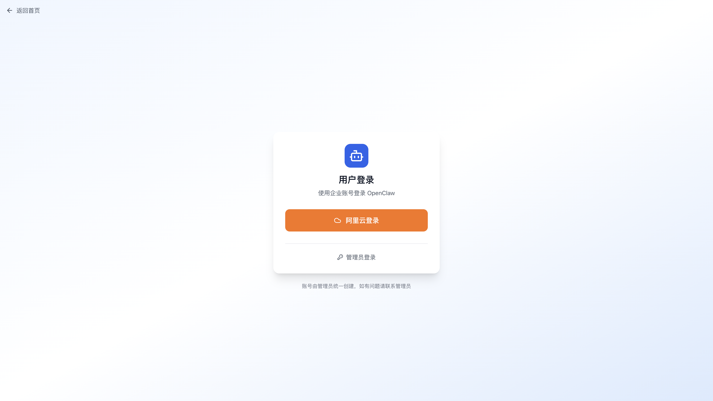

上图展示了一个已配置阿里云 OAuth 的登录页面。点击 **「阿里云登录」** 按钮后，将跳转到阿里云的 OAuth 授权页面，用户使用阿里云账号（RAM 用户）完成授权后自动回到 OpenClaw Manager。

> **注意：** 如果页面显示"暂未配置登录方式"，说明管理员尚未在 Supabase 侧配置 OAuth 或在管理后台配置 SAML SSO。请参考 [4.3 OAuth 配置](#43-oauth-配置) 和 [4.4 SAML SSO 配置](#44-saml-sso-配置) 完成配置。

登录成功后将自动跳转到用户中心的实例列表。页面底部还提供了 **「管理员登录」** 链接。

---

## 4. 管理员功能

管理员登录后进入管理后台，左侧为导航栏，包含以下功能模块。

管理后台采用左侧导航栏 + 右侧内容区的经典布局：

- **左侧导航栏** — 列出所有管理功能菜单，可折叠（点击顶部 `X` / `☰` 图标切换）
- **顶部标题栏** — 显示当前页面标题和当前登录用户名
- **侧边栏底部** — 显示用户信息和退出登录按钮

左侧导航栏包含以下菜单项：

| 菜单 | 路径 | 说明 |
|------|------|------|
| 仪表盘 | `/admin/dashboard` | 平台运营数据概览 |
| 用户管理 | `/admin/users` | 用户列表、添加、批量导入 |
| ↳ OAuth 配置 | `/admin/oauth-config` | 查看 OAuth 登录提供商 |
| ↳ SAML SSO | `/admin/saml-config` | 配置企业 SAML 单点登录 |
| 模型配置 | `/admin/models` | 管理 AI 模型 |
| AI 网关 | `/admin/gateway` | 配置阿里云 API 网关 |
| 实例列表 | `/admin/instances` | 所有用户的 OpenClaw 实例 |
| 渠道配置 | `/admin/channels` | IM 消息渠道模板管理 |
| 配置模板 | `/admin/template` | OpenClaw JSON 模板 |
| 技能配置 | `/admin/skills` | SkillHub 注册中心 |

### 4.1 仪表盘

**路径：** `/admin/dashboard`

仪表盘是管理后台的首页，提供平台运营数据的全局概览。页面从上到下分为三个区域。

#### 基础统计卡片（顶部）

页面顶部横向排列核心指标卡片，每个卡片包含图标、数值和标签：

| 指标 | 图标 | 说明 |
|------|------|------|
| **总用户数** | 👥 | 平台注册用户总数 |
| **OpenClaw 实例** | 📦 | 所有用户创建的实例总数 |
| **可用模型** | 🧠 | 当前已启用的 AI 模型数量 |

当启用 AI 网关和 SLS 日志后，还会额外展示三张卡片：

| 指标 | 图标 | 说明 |
|------|------|------|
| **今日活跃用户** | 📊 | 今日有 API 调用的用户数 |
| **今日请求数** | 🔄 | 今日 API 调用总次数 |
| **今日 Token 用量** | 🔑 | 今日所有用户的 Token 消耗总量（格式化显示，如 1.2M） |

#### 最近的 OpenClaw 实例（中部）

白色卡片，以表格形式展示最近创建的 5 个实例：

| 列 | 说明 |
|------|------|
| 名称 | 实例名称 |
| 用户 | 所属用户邮箱 |
| 状态 | 绿色「运行中」或灰色「已停止」徽章 |
| 模型 | 使用的 AI 模型名称 |
| 创建时间 | 中文格式的创建时间 |

#### 今日用户 Token 消耗排行（底部）

当启用 AI 网关和 SLS 日志后，显示今日 Token 消耗排行榜（Top 10）：

| 列 | 说明 |
|------|------|
| 用户 | 用户邮箱 |
| 总 Token | 输入 + 输出的总 Token 数 |
| 输入 Token | 用户发送的 Token 数 |
| 输出 Token | AI 回复的 Token 数 |
| 请求数 | API 调用次数 |

如果尚未配置 AI 网关和 SLS，此区域会显示灰色提示文字。

#### AI 网关控制台入口

如果已配置 AI 网关，仪表盘右上角会显示 **「AI Gateway 控制台」** 蓝色按钮，可直接跳转到阿里云 APIG 控制台查看更详细的网关统计数据。

### 4.2 用户管理

**路径：** `/admin/users`

用户管理页面用于管理平台的所有用户，支持单个添加、批量导入、编辑和禁用等操作。

#### 用户列表

页面顶部左侧为搜索框（可按用户名或邮箱搜索），右侧为 **「添加用户」** 和 **「批量导入」** 两个操作按钮。

用户列表以表格形式展示，包含以下列：

| 列名 | 说明 |
|------|------|
| **用户** | 显示用户名和邮箱 |
| **角色** | 管理员 / 普通用户 |
| **状态** | 启用 / 禁用 |
| **Consumer ID** | AI 网关 Consumer ID（仅启用 AI 网关后显示，可点击跳转到阿里云控制台） |
| **实例上限** | 用户可创建的最大实例数 |
| **已用 Token** | 用户今日已使用的 Token 数（仅启用 AI 网关后显示） |
| **操作** | 编辑 / 重置密码 / 启用禁用 |

表格底部支持分页，每页 10 条记录。

#### 添加用户

点击右上角 **「添加用户」** 按钮，在弹窗中填写以下信息：

| 字段 | 必填 | 说明 |
|------|------|------|
| **用户名** | 是 | 用户的显示名称 |
| **邮箱** | 视情况 | 邮箱登录方式必填，OAuth/SAML 方式可选（留空会自动生成占位邮箱） |
| **认证方式** | — | 选择 `邮箱密码`、`OAuth 单点登录` 或 `SAML 单点登录` |
| **密码** | 视情况 | 仅邮箱登录方式需要（至少 6 位），OAuth/SAML 用户无需密码 |
| **角色** | — | 普通用户 / 管理员 |
| **实例数量上限** | — | 默认 5 |

#### 批量导入用户

点击右上角 **「批量导入」** 按钮，支持两种方式：

1. **上传 CSV/JSON 文件** — 选择本地文件上传
2. **直接粘贴数据** — 在文本框中粘贴 CSV 或 JSON 格式的数据

**CSV 格式示例：**

```csv
email,password,username,role,maxInstances,authProvider
user1@example.com,password123,User1,user,5,email
user2@example.com,,User2,user,5,oauth
user3@example.com,,User3,user,5,saml
```

> 点击 **「下载 CSV 模板」** 可获取标准模板文件。系统还自动兼容阿里云 IDaaS 导出的 CSV 格式（带 `userExternalId` 等字段），会自动识别为 SAML 用户。

每批最多支持 50,000 个用户。导入完成后会显示成功和失败的统计信息。

#### 编辑用户

点击用户行右侧的 **编辑** 图标，可修改用户的以下信息：

- 用户名
- 邮箱
- 角色（管理员/普通用户）
- 状态（启用/禁用）
- 实例数量上限

### 4.3 OAuth 配置

**路径：** `/admin/oauth-config`

OAuth 配置页面用于查看当前 Supabase 实例已启用的第三方 OAuth 登录方式。

> **核心概念：** OAuth 提供商的启用需要在 **Supabase 控制台** 中完成，OpenClaw Manager 的 OAuth 配置页面为只读展示。只要是 Supabase 支持的 OAuth 提供商，都可以用于 OpenClaw Manager 的用户登录。

#### 支持的 OAuth 提供商

平台支持所有 Supabase 内置的 OAuth 提供商，包括但不限于：

| 提供商 | 说明 |
|--------|------|
| **阿里云 (AlibabaCloud)** | 使用阿里云 RAM 账号登录 |
| **GitHub** | 使用 GitHub 账号登录 |
| **Google** | 使用 Google 账号登录 |
| **Azure AD** | 使用 Microsoft Azure AD 登录 |
| **GitLab** | 使用 GitLab 账号登录 |
| **Apple** | 使用 Apple ID 登录 |
| **Discord / Slack / Twitter / ...** | 其他 Supabase 支持的 20+ 种 OAuth 提供商均可使用 |

#### 如何配置 OAuth（以阿里云为例）

配置 OAuth 需要同时在 **阿里云控制台** 和 **Supabase 控制台** 两侧操作。

**第一步：在阿里云创建 OAuth 应用**

1. 登录 [阿里云 RAM 控制台](https://ram.console.aliyun.com/)，进入 **OAuth 应用管理**
2. 点击 **创建 OAuth 应用**
3. 填写应用信息：
   - **应用名称**：自定义名称，如 `OpenClaw Manager`
   - **应用类型**：选择 **WebApp**
   - **回调地址（Redirect URI）**：**这里是关键**，填写 Supabase 的回调地址：
     ```
     https://<你的Supabase项目URL>/auth/v1/callback
     ```
     例如：`https://abc123.supabase.co/auth/v1/callback`
4. 创建完成后，记录 **AppId**（即 Client ID）
5. 在应用详情页创建 **AppSecret**（即 Client Secret），**请立即保存，Secret 只显示一次**

> **回调地址的格式说明：** 所有 OAuth 提供商的回调地址都统一填写 `https://<你的Supabase项目URL>/auth/v1/callback`。Supabase 会自动处理不同提供商的回调路由，你不需要针对不同提供商设置不同的回调地址。

**第二步：在 Supabase 控制台启用阿里云 OAuth**

1. 登录 **Supabase 控制台**（地址在 `.env` 的 `VITE_SUPABASE_URL` 中配置）
2. 进入 **Authentication → Providers**
3. 在提供商列表中找到 **AlibabaCloud**，点击展开
4. 开启 **Enable** 开关
5. 填入第一步获得的 **Client ID (AppId)** 和 **Client Secret (AppSecret)**
6. 点击 **Save** 保存

**第三步：在 OpenClaw Manager 中验证**

1. 进入 OpenClaw Manager **管理后台 → 用户管理 → OAuth 配置**
2. 点击右上角 **「刷新」** 按钮
3. 确认阿里云已显示为 **「已启用」** 状态

配置完成后，用户登录页面（`/login`）将自动出现 **「阿里云登录」** 按钮：


用户点击按钮后会跳转到阿里云 OAuth 授权页面，使用阿里云 RAM 账号完成授权后自动回到 OpenClaw Manager 并完成登录。

#### 配置其他 OAuth 提供商

其他 OAuth 提供商的配置流程完全一致，只是第一步在对应平台创建应用：

| 提供商 | 创建应用的地址 | 要填的回调地址 |
|--------|-------------|-------------|
| **GitHub** | [GitHub Developer Settings](https://github.com/settings/developers) → New OAuth App | `https://<Supabase URL>/auth/v1/callback` |
| **Google** | [Google Cloud Console](https://console.cloud.google.com/) → APIs & Services → Credentials | `https://<Supabase URL>/auth/v1/callback` |
| **Azure AD** | [Azure Portal](https://portal.azure.com/) → App registrations | `https://<Supabase URL>/auth/v1/callback` |
| **GitLab** | [GitLab Applications](https://gitlab.com/-/profile/applications) | `https://<Supabase URL>/auth/v1/callback` |

无论哪个提供商，**回调地址始终填 Supabase 的 callback URL**，这一点是统一的。

#### OAuth 配置页面功能

- **已启用的提供商** — 以卡片形式展示所有已启用的 OAuth 提供商及其状态
- **「Supabase 控制台」按钮** — 页面右上角提供快捷链接，可直接跳转到 Supabase 控制台的 Providers 配置页面
- **「刷新」按钮** — 手动从 Supabase 拉取最新的提供商启用状态
- **配置步骤说明** — 页面底部展示了完整的 5 步配置指引

### 4.4 SAML SSO 配置

**路径：** `/admin/saml-config`

SAML SSO 配置页面用于配置企业 SAML 2.0 单点登录。配置完成后，用户登录页面（`/login`）会自动出现 **「企业 SSO 登录」** 按钮。

本节以**阿里云 IDaaS** 为例，说明完整的配置流程。其他 IdP（如 Azure AD、Okta 等）流程类似。

#### 页面组成

SAML SSO 配置页面包含以下几个区域：

1. **SP 信息（配置到 IdP）** — 展示 Supabase 作为 SP（Service Provider）的信息，需要复制到 IdP 侧
2. **回调地址配置** — 设置 SSO 登录完成后跳转回应用的 Site URL
3. **已配置的 SSO** — 查看和管理已添加的 SAML SSO 配置
4. **添加 SAML SSO** — 新增 SSO 配置的入口

#### 完整配置流程（以阿里云 IDaaS 为例）

**第一步：在 OpenClaw Manager 中获取 SP 信息**

进入 **管理后台 → 用户管理 → SAML SSO** 页面，在 **「SP 信息（配置到 IdP）」** 区域，记录以下两个值（可点击旁边的复制按钮）：

| 字段 | 说明 | 示例 |
|------|------|------|
| **Entity ID (Issuer)** | SP 实体标识 | `https://abc123.supabase.co/sso/saml/metadata` |
| **ACS URL (Callback)** | 断言消费服务地址 | `https://abc123.supabase.co/sso/saml/acs` |

**第二步：在阿里云 IDaaS 控制台创建 SAML 应用**

1. 登录 [阿里云 IDaaS 控制台](https://yundun.console.aliyun.com/?p=idaas)
2. 进入对应的 IDaaS 实例，点击 **应用** → **添加应用** → 选择 **SAML 2.0** 类型
3. 填写应用基本信息（名称等）

**第三步：配置 IDaaS SAML 应用的 SP 信息**

在 IDaaS 应用的 SAML 配置中：

1. **SP Entity ID** — 填写第一步获取的 Entity ID
2. **SP ACS URL** — 填写第一步获取的 ACS URL
3. **NameID 格式** — 选择 `emailAddress`
4. **NameID 表达式** — 填写 `user.email`（注意：直接写 `user.email`，**不要**写成 `${user.email}`）

**第四步：添加属性声明**

在 IDaaS 应用的 **属性声明** 配置中，添加一条：

| 属性名 | 表达式 |
|--------|--------|
| `email` | `user.email` |

**第五步：获取 IDaaS Metadata URL**

保存 IDaaS 应用配置后，复制该应用的 **SAML Metadata URL**，格式通常为：

```
https://<instance>.aliyunidaas.com/api/v2/<app_id>/saml2/meta
```

**第六步：在 OpenClaw Manager 中添加 SSO 配置**

回到 OpenClaw Manager 的 SAML SSO 页面：

1. 点击右上角 **「添加 SAML SSO」** 按钮
2. 在弹窗中填写：

| 字段 | 必填 | 说明 | 示例 |
|------|------|------|------|
| **SSO 域名** | 是 | 用户邮箱的域名，该域名的用户登录时会触发 SSO | `example.com` |
| **IdP Metadata URL** | 是 | 第五步获取的 IDaaS Metadata URL | `https://xxx.aliyunidaas.com/api/v2/xxx/saml2/meta` |
| **邮箱属性名称** | 否 | SAML 响应中包含邮箱的属性名，默认 `email` | `email` |

3. 点击 **「保存配置」**

**第七步：设置回调地址**

在 **「回调地址配置」** 区域，将 **Site URL** 设置为你的 OpenClaw Manager 应用地址（如 `https://your-app.example.com`），然后点击 **「保存」**。

> **重要：** 如果不设置 Site URL，SSO 登录成功后会跳转到 Supabase 默认页面，而不是你的应用。

**第八步：在 IDaaS 中授权用户**

回到阿里云 IDaaS 控制台，为 SAML 应用授权需要使用 SSO 登录的用户或用户组。

**第九步：验证**

打开用户登录页面（`/login`），应该能看到 **「企业 SSO 登录 (your-domain.com)」** 按钮。点击后应跳转到 IDaaS 登录页面，用户使用企业账号登录成功后自动回到 OpenClaw Manager。

> 如果同时配置了 OAuth 和 SAML SSO，用户登录页面会同时显示 OAuth 按钮和 SSO 按钮，中间用「或」分隔。

#### 管理已配置的 SSO

在 **「已配置的 SSO」** 表格中可以查看所有已添加的 SAML SSO 配置，包括域名、IdP Entity ID 和创建时间。点击右侧的删除按钮可以移除配置（需二次确认）。

### 4.5 模型配置

**路径：** `/admin/models`

模型配置是系统运行的基础，管理员需要先完成模型提供商的配置和启用，再添加具体的 AI 模型供用户使用。模型配置页面分为上半部分的「模型提供商」区域和下半部分的「模型管理」区域。

#### 4.5.1 模型提供商

模型提供商对应 OpenClaw 配置模板中 `models.providers` 下的各个节点。系统默认包含两个提供商：

| 提供商标识 | 说明 |
|-----------|------|
| **bailian** | 阿里云百炼平台，直接通过百炼 API 调用模型 |
| **api_gateway** | 阿里云 AI 网关，通过 AI 网关统一代理模型调用 |

如需添加新的模型提供商（如 OpenAI、DeepSeek 等），需先在「配置模板」页面中的 OpenClaw 配置模板 JSON 文件里添加对应的 provider 节点（详见 [4.10 配置模板](#410-配置模板)）。

#### 4.5.2 配置模型提供商

> 如果需要添加系统默认未包含的提供商，请先参考 [4.10 配置模板](#410-配置模板) 完成配置模板管理后，再回到此步骤。

在「模型配置」页面上半部分的「模型提供商」区域，所有从配置模板中解析出的提供商以标签页形式展示（如 `bailian`、`api_gateway`）。

**操作步骤：**

1. 点击目标提供商标签，进入该提供商的配置面板
2. 在 **API Key** 输入框中填写该提供商的 API Key。页面会显示配置占位符提示（如 `${DASHSCOPE_API_KEY}`），管理员填写的 API Key 将用于替换模板中的此占位符

   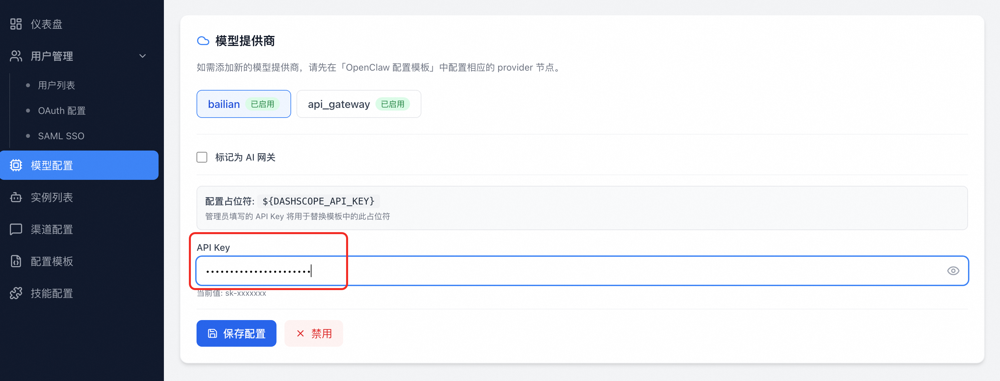

3. 点击 **「保存配置」** 保存 API Key
4. 点击 **「启用」** 按钮启用该提供商。**只有启用后，才可以创建该提供商下的模型**

> **注意：** 管理员需要正确配置提供商的 API Key，用户才能正常使用该提供商下的模型。

#### 4.5.3 添加模型

配置好模型提供商并启用后，可在「模型管理」区域添加具体的模型。

**操作步骤：**

1. 在「模型配置」页面下方的「模型管理」区域，点击 **「添加模型」** 按钮
2. 在弹出的对话框中填写：

| 字段 | 必填 | 说明 | 示例 |
|------|------|------|------|
| **模型名称** | 是 | 模型的显示名称 | `通义千问 Max` |
| **提供商** | 是 | 从已启用的提供商下拉列表中选择 | `bailian` 或 `api_gateway` |
| **模型代码** | 是 | 模型的标识代码 | `qwen-max`、`qwen3.5-plus` |
| **描述** | 否 | 模型的功能描述 | — |

3. 点击确认添加模型
4. 新添加的模型默认为启用状态，可通过模型卡片上的开关按钮进行启用/禁用切换

> 用户创建实例时，只能选择状态为「已启用」的模型。

页面顶部提供搜索功能，可按模型名称或提供商搜索。

#### 编辑/删除模型

- **编辑** — 点击卡片底部的「编辑」按钮，可修改模型的名称、提供商、模型代码和描述
- **删除** — 点击删除图标，确认后永久删除模型

### 4.6 AI 网关

**路径：** `/admin/gateway`

AI 网关是 AI 调用的统一代理层。在本系统中，AI 网关被配置为一个特殊的模型提供商节点，通过阿里云 AI 网关统一代理 AI 模型的调用，支持凭证分配、Token 统计与限流等高级能力。

> AI 网关的更多用法请参考阿里云文档：https://help.aliyun.com/zh/api-gateway/ai-gateway/product-overview/what-is-an-ai-gateway

#### 4.6.1 前置条件：创建阿里云 AI 网关

在管理平台中配置 AI 网关之前，需要先在阿里云控制台完成 AI 网关的创建和基础配置。

**步骤一：创建 AI 网关实例**

1. 访问阿里云 AI 网关控制台：`https://apig.console.aliyun.com`
2. 创建相应地域的 AI 网关实例，推荐配置如下：

| 配置项 | 推荐值 | 说明 |
|--------|--------|------|
| 部署模式 | Serverless | POC 阶段无需运维 |
| 计费模式 | 按量付费 | 测试阶段成本低 |
| 地域 | 与业务资源同地域 | 如 cn-hangzhou、cn-shanghai |
| 网络类型 | 私网（Intranet）必须打开 | 确保 Sandbox Pod 能通过 VPC 内网访问，公网可按需打开 |
| VPC | 选择与 ACS 集群相同的 VPC | 在 ACS 控制台查看 VPC ID |

**步骤二：配置后端 AI 服务**

1. 在创建的 AI 网关中，创建 **Model API**

   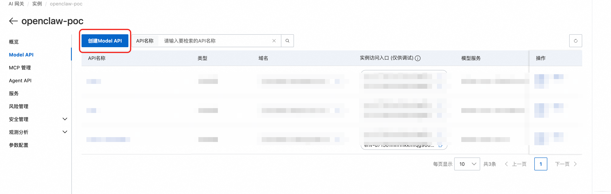

2. 可选择场景模板快速创建 OpenAI 兼容的路由，以无缝接入 OpenClaw

   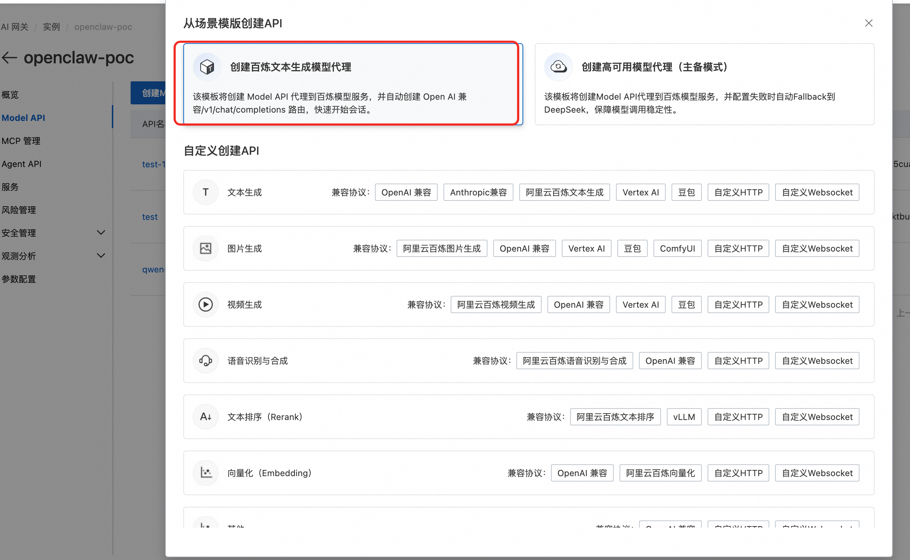

3. 设置 API 名称和百炼的 API Key

   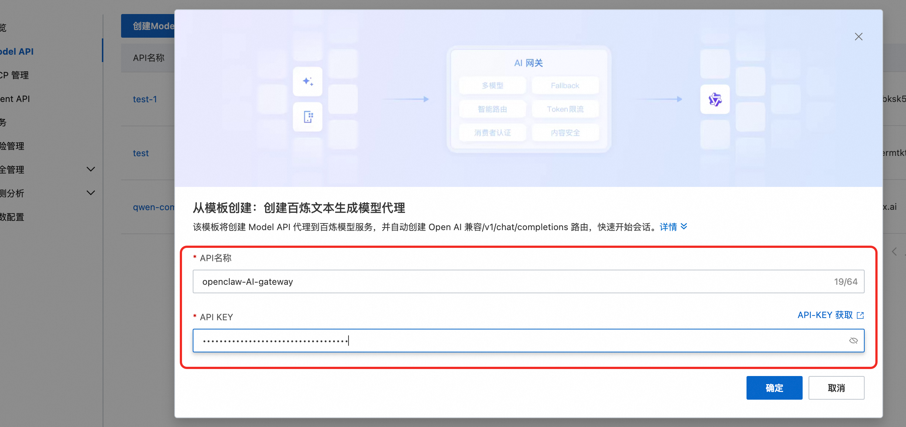

4. 创建成功后，在 Model API「消费者认证」中打开「开启认证」开关，并选择「API Key」认证方式

   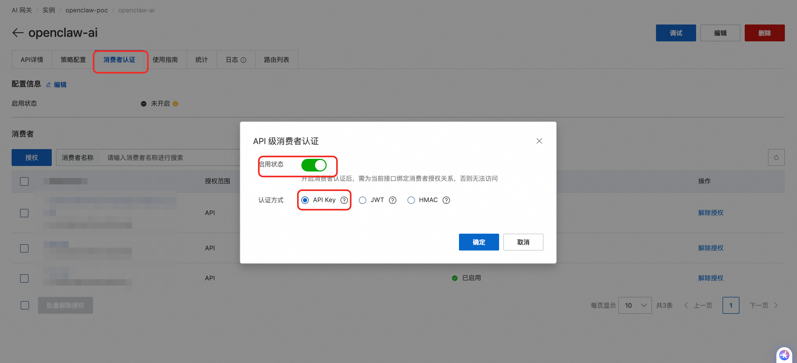

#### 4.6.2 在管理平台中配置 AI 网关

完成阿里云侧的 AI 网关创建后，回到本管理平台进行关联配置。

**操作步骤：**

1. 进入「模型配置」页面，选择要标记为 AI 网关的模型提供商（如 `api_gateway`）
2. 勾选 **「标记为 AI 网关」** 复选框，点击 **「启用网关」**，页面将展开 AI 网关专属配置面板

   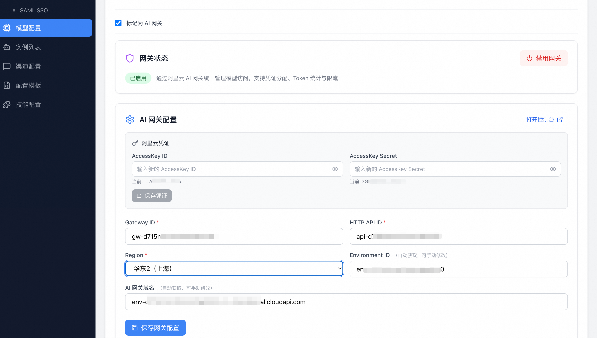

3. 配置 **阿里云凭证**：
   - **AccessKey ID**：阿里云账号的 AccessKey ID
   - **AccessKey Secret**：阿里云账号的 AccessKey Secret
   - 点击 **「保存凭证」**

   > 此处保存的凭证用于获取并修改 AI 网关的相关配置，此凭证需要的 RAM 权限策略如下：
   > 1. **AliyunAPIGFullAccess**：管理云原生 API 网关的权限
   > 2. **AliyunLogReadOnlyAccess**：只读访问日志服务（Log）的权限

4. 配置 **网关参数**：

| 配置项 | 必填 | 说明 |
|--------|------|------|
| **Gateway ID** | 是 | AI 网关实例 ID，形如 `gw-xxx` |
| **HTTP API ID** | 是 | Model API 的 ID，形如 `api-xxx` |
| **Region** | 是 | AI 网关所在地域 |
| **Environment ID** | — | 填写 Gateway ID 和 HTTP API ID 后保存，系统会自动获取，也可手动修改。用于标识 AI 网关的发布环境 |
| **AI 网关域名** | — | 填写 Gateway ID 和 HTTP API ID 后保存，系统会自动获取，也可手动修改。该域名是 OpenClaw 实例调用模型时的实际请求地址，可在 AI 网关控制台的 Model API「使用指南」中查看（如有多个域名，推荐使用私网域名） |

5. 点击 **「保存网关配置」**

> 配置面板中提供了「打开控制台」链接，可一键跳转至阿里云 AI 网关控制台。

#### 4.6.3 AI 网关启用后的效果

启用 AI 网关后，系统将具备以下能力：

- **凭证自动分配** — 用户创建 OpenClaw 实例时，系统自动为该用户在 AI 网关中创建消费者并分配访问凭证，无需管理员手动操作
- **Token 统计** — 系统通过阿里云 SLS（日志服务）自动采集每个用户的 Token 消耗数据
- **Token 限流** — 可对用户进行全局或个人级别的 Token 使用限制（详见 4.7.1 Token 统计）

### 4.7 Token 统计与限流

启用 AI 网关后，系统支持查看用户的 Token 消耗情况，并可配置限流策略控制用量。

#### 4.7.1 Token 统计

管理员可在以下位置查看 Token 消耗数据：

- **用户管理页面** — 用户列表中的「今日 Token 消耗」和「近30日 Token 消耗」列，直接展示每个用户的消耗量
- **管理员仪表盘** — 显示今日活跃用户数、请求次数、总 Token 消耗量，以及消费者 Token 消耗排行榜（Top 10）

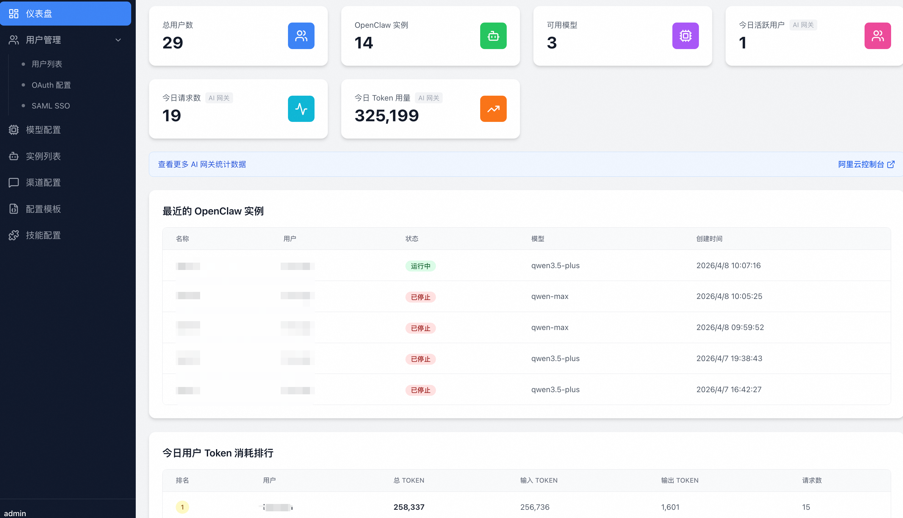

> Token 统计数据由阿里云 SLS 日志服务提供，仅在启用 AI 网关后可用。如用户尚未关联消费者（Consumer ID 列显示为「-」），则无法统计该用户的 Token 消耗。

#### 4.7.2 全局限流配置

全局限流策略对所有用户生效，在 AI 网关配置面板中设置。

**操作步骤：**

1. 进入「模型配置」页面，选择已标记为 AI 网关的提供商
2. 在 AI 网关配置面板底部找到「Token 限流策略」区域
3. 设置限流参数：
   - **每用户每日 Token 上限**：单位为 tokens/天，留空或输入 0 表示不限制
   - **每用户每30天 Token 上限**：单位为 tokens/30天，留空或输入 0 表示不限制
   - 两个策略可同时生效

   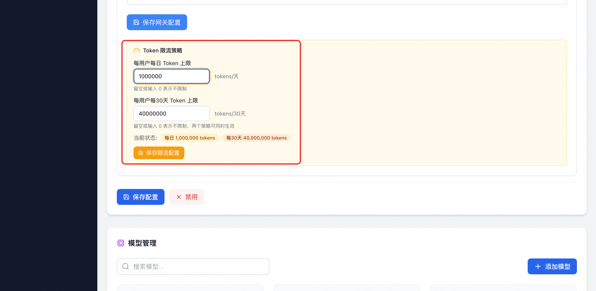

4. 点击 **「保存限流配置」**
5. 保存后，页面会显示当前生效的限流状态，如：「每日 1,000,000 tokens 每30天 40,000,000 tokens」

#### 4.7.3 个人限流配置

除全局限流外，管理员可为个别用户设置独立的限流策略。**个人限流策略优先于全局策略生效。**

**操作步骤：**

1. 进入「用户管理」页面
2. 在用户列表中找到目标用户，点击操作列的 **「Token 限流」** 按钮（仅关联了 Consumer ID 的用户才会显示此按钮）
3. 在弹出的「用户 Token 限流」对话框中：
   - 页面会展示全局限流策略作为参考（如「每日：1,000,000 tokens 每30天：40,000,000 tokens」）
   - 填写该用户的个人限流值：
     - **每日 Token 上限（个人）**：单位为 tokens/天
     - **每30天 Token 上限（个人）**：单位为 tokens/30天
   - 留空或输入 0 表示不设个人限制，该用户将继承全局限流策略
   - 设置个人限制后，该用户以个人限制为准
4. 点击 **「保存限流配置」**
5. 对话框顶部会实时展示该用户「当前生效的 Token 上限」，并标注每项限额来源（「个人」或「全局」）

   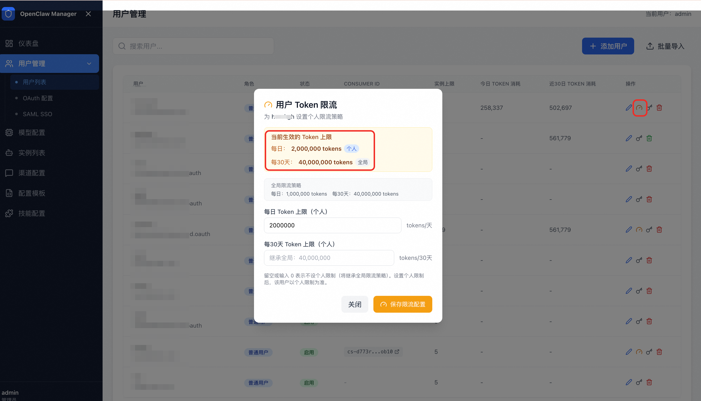

> **示例：** 某用户全局每日限额为 1,000,000 tokens，管理员为其设置个人每日限额为 2,000,000 tokens，则该用户的生效每日限额为 2,000,000 tokens（个人），30天限额仍为全局值 40,000,000 tokens。

### 4.8 实例列表（管理员视图）

**路径：** `/admin/instances`

管理员可以查看和管理**所有用户**创建的 OpenClaw 实例。

#### 列表功能

- **搜索** — 按实例名称搜索
- **用户过滤** — 按用户名过滤实例（管理员独有）
- **分页** — 每页 10 条记录，支持翻页

#### 表格列说明

| 列名 | 说明 |
|------|------|
| **ID** | Sandbox ID |
| **名称** | 实例名称和描述 |
| **用户** | 实例所属用户（管理员独有列） |
| **状态** | 运行中 / 已停止 / 启动中 / 停止中 |
| **模型** | 使用的 AI 模型 |
| **Token 用量** | 累计 Token 使用量 |
| **创建时间** | 实例创建时间 |
| **操作** | 查看详情 / 启动停止 / 删除 / 查看 Pod |

#### 管理员特有操作

- **查看 Pod** — 如果配置了 ACS 集群 ID，可以直接跳转到阿里云容器服务控制台查看实例的 Pod 详情
- **查看详情** — 进入实例详情页，可以看到实例归属用户等额外信息

### 4.9 渠道配置

**路径：** `/admin/channels`

渠道配置用于管理 IM 消息渠道模板，用户创建实例时可以选择已配置的渠道。

#### 支持的渠道类型

| 渠道 | 标识 | 说明 |
|------|------|------|
| **飞书** | `feishu` | Feishu/Lark 机器人 |
| **钉钉** | `dingtalk` | 钉钉机器人 |
| **QQ** | `qq` | QQ 机器人 |
| **企业微信** | `wecom` | 企业微信机器人 |

#### 渠道模板管理

每个渠道模板包含：
- **渠道类型** — 选择上述支持的渠道之一
- **名称** — 渠道的显示名称
- **描述** — 渠道说明
- **配置字段** — 定义用户在使用该渠道时需要填写的配置项（如 Client ID、Client Secret 等）
- **启用状态** — 启用后用户创建实例时可选择该渠道

### 4.10 配置模板

**路径：** `/admin/template`

配置模板用于管理 OpenClaw Agent 的 JSON 配置模板。创建新实例时，系统会基于此模板生成实例的配置文件。

#### 功能说明

- **上传模板** — 支持拖拽上传或点击选择 JSON 文件
- **编辑预览** — 在文本框中直接编辑 JSON 内容
- **下载模板** — 导出当前模板为 JSON 文件
- **复制模板** — 一键复制模板内容到剪贴板

#### 添加新的模型提供商

如需添加新的模型提供商（如 DeepSeek、OpenAI 等），需在配置模板的 `models.providers` 节点下添加新的 provider 节点。

**操作步骤：**

1. 进入管理员侧边栏的「配置模板」页面
2. 在示例模版的基础上进行编辑，添加新的提供商节点。格式示例如下：

```json
{
  "models": {
    "providers": {
      "deepseek": {
        "baseUrl": "https://api.deepseek.com",
        "apiKey": "${DEEPSEEK_API_KEY}",
        "api": "openai-completions",
        "models": []
      }
    }
  }
}
```

各字段说明：

| 字段 | 必填 | 说明 |
|------|------|------|
| `baseUrl` | 是 | 模型服务的 API 基础地址 |
| `apiKey` | 是 | API Key 的占位符变量（如 `${DASHSCOPE_API_KEY}`），实际值由管理员在模型配置页面填写 |
| `api` | 是 | API 协议类型，目前支持 `openai-completions`（OpenAI 兼容接口） |
| `models` | 是 | 该提供商下可用模型列表 |

3. 保存模板后，系统会自动解析出新的提供商，显示在「模型配置」页面的提供商列表中

> **注意：** 示例模版中已有的占位符不可以被修改，否则会导致配置模板解析失败。新增 provider 时，provider 的 `apiKey` 可以添加新的占位符（如上述示例中的 `${DEEPSEEK_API_KEY}`）。

### 4.11 技能配置

**路径：** `/admin/skills`

技能配置用于设置 SkillHub 注册中心的地址，OpenClaw Agent 会连接到 SkillHub 查找和调用可用的技能。

默认 SkillHub 地址为 `https://clawhub.ai/`。如需自定义，可通过环境变量配置。

---

## 5. 用户功能

普通用户登录后进入用户中心。用户中心同样采用左侧导航栏 + 右侧内容区的布局，但导航栏更简洁，只有一个菜单项：**实例列表**。

左侧导航栏底部显示当前登录用户名、角色（普通用户）和退出登录按钮。

> **注意：** 如果未登录直接访问 `/user/instances`，页面会显示 404。请先通过登录页面完成登录。
>
> 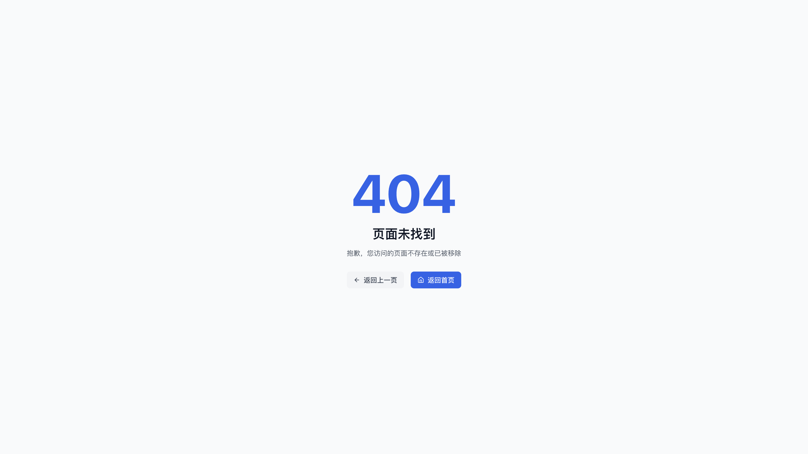

### 5.1 实例列表

**路径：** `/user/instances`

用户的主页面，展示当前用户创建的所有 OpenClaw 实例。

#### 列表功能

- **搜索** — 左上角搜索框，按实例名称搜索
- **创建** — 右上角 **「创建 OpenClaw」** 按钮创建新实例
- **分页** — 每页 10 条记录，底部显示分页导航

#### 表格列说明

| 列名 | 说明 |
|------|------|
| **ID** | Sandbox ID |
| **名称** | 实例名称 |
| **状态** | 运行中 / 已停止 |
| **模型** | 使用的 AI 模型 |
| **Token 用量** | 累计 Token 使用量 |
| **创建时间** | 创建时间 |
| **操作** | 查看详情 / 启动停止 / 删除 |

#### 操作按钮说明（从左到右）

| 图标 | 操作 | 说明 |
|------|------|------|
| 👁 眼睛 | 查看详情 | 进入实例详情页，查看和修改配置 |
| ▶ / ⏹ 播放/停止 | 启动/停止 | 绿色为启动，橙色为停止；操作中会显示旋转加载图标 |
| 🗑 删除 | 删除 | 红色，永久删除实例和关联的 Sandbox，需确认 |

### 5.2 创建 OpenClaw 实例

**路径：** `/user/instances/create`

创建页面顶部有「返回列表」链接，主体为一个表单卡片。

#### 操作步骤

1. 在实例列表页面点击右上角蓝色的 **「创建 OpenClaw」** 按钮
2. 填写以下信息：

| 字段 | 必填 | 说明 |
|------|------|------|
| **OpenClaw 名称** | 是 | 为实例起一个有意义的名称，如"客服助手"、"销售机器人" |
| **选择 AI 模型** | 是 | 下拉选择框，从管理员配置的可用模型列表中选择一个（显示「模型名 - 提供商」格式） |
| **选择消息渠道** | 否 | 下拉选择框，可选择飞书、钉钉等渠道，默认为「暂不配置」 |

3. 如果选择了消息渠道，表单会展开一个「渠道配置」区域，需要填写对应的 Client ID 和 Client Secret
4. 点击右下角 **「创建 OpenClaw」** 按钮提交（创建中按钮会显示加载动画）

创建时系统将自动完成以下操作：

- 创建沙箱环境
- 基于 OpenClaw 配置模板和所选模型生成实例配置
- 如启用了 AI 网关，自动为该用户创建 AI 网关消费者并分配访问凭证
- 启动 OpenClaw 服务

等待实例状态变为「运行中」后即可使用。创建成功后将自动跳转到实例详情页。

#### 使用提示

页面底部有蓝色提示卡片，包含以下建议：
- 为不同的使用场景创建多个实例
- 选择合适的 AI 模型以平衡性能和成本
- 创建后可以在详情页随时修改配置

### 5.3 实例详情与配置

**路径：** `/user/instances/:id`

实例详情页分为三个卡片区域：基本信息、模型配置、渠道配置。页面顶部左侧有「返回列表」链接，右侧有操作按钮。

#### 顶部操作按钮

页面右上角有两个按钮：

| 按钮 | 说明 |
|------|------|
| **启动 / 停止** | 蓝色（启动）或橙色（停止）按钮，控制实例的运行状态 |
| **保存配置** | 蓝色按钮，当模型或渠道配置修改后变为可点击状态 |

#### 基本信息卡片

以两列网格展示实例的核心信息：

| 字段 | 说明 |
|------|------|
| **ID** | Sandbox 唯一标识（格式如 `namespace--podname`） |
| **名称** | 实例名称 |
| **状态** | 绿色「运行中」或灰色「已停止」徽章 |
| **创建时间** | 实例创建时间（中文格式） |
| **最后活跃** | 实例最后活跃时间，如无则显示「暂无」 |
| **归属用户** | 仅管理员视图显示，实例所属用户名 |
| **应用访问链接** | 实例运行后的访问 URL，蓝色可点击链接，在新窗口打开 |
| **/etc/hosts 配置** | 开发模式下显示，黑底绿字的代码块，需要添加到本地 hosts 文件 |
| **查看容器** | 仅管理员视图显示，跳转到阿里云控制台查看 Pod |

#### 模型配置卡片

用于修改实例使用的 AI 模型：

1. 在「选择 AI 模型」下拉菜单中选择新的模型（显示「模型名 (提供商)」格式）
2. 修改后下方会出现橙色提示文字："已修改，点击保存配置生效"
3. 点击页面顶部的 **「保存配置」** 按钮保存更改

#### 渠道配置卡片

用于修改实例的消息渠道：

1. 在「选择渠道」下拉菜单中选择渠道类型（如飞书、钉钉），选择「暂不配置」可清除渠道
2. 选择渠道后展开配置区域，包含 Client ID（文本输入）和 Client Secret（密码输入）
3. Client Secret 输入框的 placeholder 为"留空则保持不变"，**修改密码时才需要填写**
4. 修改后下方会出现橙色提示文字，点击 **「保存配置」** 按钮保存

### 5.4 暂停与重启实例

当不需要使用 OpenClaw 实例时，可将其暂停以释放计算资源。**暂停后实例的数据和记忆均会保留。**

#### 暂停实例

1. 在「实例列表」页面找到目标实例
2. 点击操作列的 **「停止」** 按钮（橙色）
3. 实例状态将变为「停止中」，完成后显示为「已停止」

#### 重新启动实例

暂停的实例可随时重新启动，恢复后实例的配置、数据和历史记忆均完好保留。

1. 在「实例列表」页面找到状态为「已停止」的目标实例
2. 点击操作列的 **「启动」** 按钮（绿色）
3. 实例状态将变为「启动中」，完成后显示为「运行中」

### 5.5 用户侧 Token 用量概览

如启用了 AI 网关，用户实例列表页面顶部会展示 Token 用量概览卡片，包含：

| 指标 | 说明 |
|------|------|
| **实例数量** | 当前用户拥有的实例数 |
| **今日 Token 用量** | 今日已使用的 Token 数量，及每日限额进度条 |
| **近30天 Token 用量** | 近30天已使用的 Token 数量，及30天限额进度条 |


---

## 6. 常见问题 FAQ

### Q1: 用户登录页显示"暂未配置登录方式"？

**A:** 这说明尚未配置任何用户登录方式。管理员需要至少完成以下一项配置：
- **配置 OAuth**：在 Supabase 控制台的 Authentication → Providers 中启用 OAuth 提供商（如阿里云），并在对应平台创建 OAuth 应用，将回调地址设为 `https://<Supabase URL>/auth/v1/callback`。详见 [4.3 OAuth 配置](#43-oauth-配置)。
- **或配置 SAML SSO**：在管理后台的 SAML SSO 页面添加企业 SSO 配置（如阿里云 IDaaS）。详见 [4.4 SAML SSO 配置](#44-saml-sso-配置)。

配置完成后，用户登录页会自动出现对应的登录按钮。

### Q2: 创建实例失败怎么办？

**A:** 请检查以下几点：
1. 是否已达到用户的实例数量上限（默认 5 个），可联系管理员在用户管理中调整
2. 后端 API 服务和 E2B 服务是否正常连接
3. 是否已在「模型配置」中添加并启用了至少一个 AI 模型

### Q3: Token 用量统计不显示？

**A:** Token 用量统计依赖 AI 网关和 SLS 日志服务。需要管理员在「AI 网关」页面正确配置并启用网关，且阿里云 AccessKey 需具有 SLS 的读取权限。未启用 AI 网关时，仪表盘和用户管理中不会显示 Token 相关的指标列。

### Q4: 如何访问运行中的实例？

**A:** 实例启动后，在实例详情页会显示「应用访问链接」。点击链接即可在新窗口打开 OpenClaw Agent 的界面。如果是开发环境，详情页可能会显示 `/etc/hosts` 配置，需要将其添加到本地 hosts 文件后才能正常访问。

### Q5: 支持哪些 AI 模型？

**A:** 平台本身不限制模型类型，管理员可以在「模型配置」页面自由添加模型提供商和模型。常见的模型包括：
- Qwen 系列（通义千问）
- DeepSeek 系列
- 其他兼容 OpenAI API 格式的模型

### Q6: 渠道配置中的 Client ID 和 Client Secret 在哪获取？

**A:** 根据不同的渠道类型，前往对应平台创建机器人应用后获取：
- **飞书** — [飞书开放平台](https://open.feishu.cn/)
- **钉钉** — [钉钉开放平台](https://open.dingtalk.com/)
- **企业微信** — [企业微信管理后台](https://work.weixin.qq.com/)
- **QQ** — [QQ 开放平台](https://q.qq.com/)

### Q7: SAML SSO 登录后跳转到了 Supabase 页面而不是应用？

**A:** 这是因为未设置 Site URL。前往 **管理后台 → 用户管理 → SAML SSO**，在「回调地址配置」区域将 Site URL 设置为你的应用地址（如 `https://your-app.example.com`），保存后重试。

### Q8: OAuth 登录按钮没有出现？

**A:** OAuth 提供商需要在 **Supabase 控制台** 中启用，而不是在 OpenClaw Manager 中配置。请：
1. 登录 Supabase 控制台 → Authentication → Providers
2. 找到对应的提供商（如 AlibabaCloud），开启 Enable 开关
3. 填入对应平台的 Client ID / Client Secret
4. 保存后，回到 OpenClaw Manager 的 OAuth 配置页面点击「刷新」确认状态
5. 再访问用户登录页面（`/login`），对应的登录按钮应该已经出现

### Q9: 阿里云 OAuth 回调地址怎么填？

**A:** 在阿里云 RAM 控制台创建 OAuth 应用时，回调地址（Redirect URI）统一填写：

```
https://<你的Supabase项目URL>/auth/v1/callback
```

例如 `https://abc123.supabase.co/auth/v1/callback`。Supabase 会自动处理所有 OAuth 提供商的回调逻辑，所有提供商使用同一个回调地址。

### Q10: 可以同时配置多种登录方式吗？

**A:** 可以。你可以同时启用多个 OAuth 提供商（如阿里云 + GitHub + Google），也可以同时配置 OAuth 和 SAML SSO。用户登录页面会自动展示所有已启用的登录方式，OAuth 按钮在上方，SSO 按钮在下方，中间用「或」分隔。

---

> 文档版本：v1.3 | 更新日期：2026-04-08
