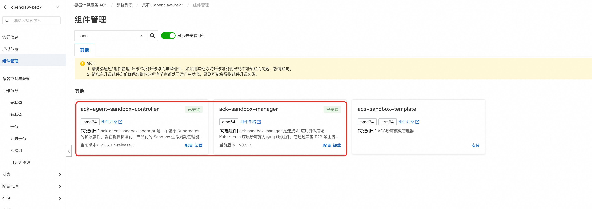
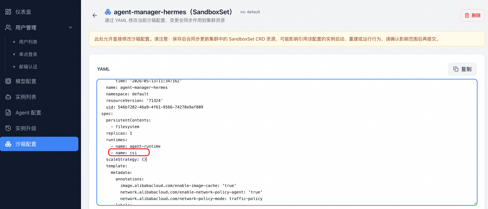

# v1.0.2

- **发布日期**：2025-05-14

## 新增功能

### 新增 QwenPaw 智能体类型

- 平台内置全新 **QwenPaw Agent 类型**，支持一键创建 QwenPaw 实例。
- 用户在创建实例时可在 OpenClaw、Hermes、QwenPaw 等多种 Agent 类型间自由选择。

### 实例升级能力

- **沙箱（Sandbox）升级**：用户可在控制台对运行中的实例执行沙箱镜像升级，升级过程支持保留用户数据（retention）。
- **新增升级界面与按钮**：实例详情页新增「升级」入口与版本面板，提供一目了然的升级体验。
- 升级过程中支持选择默认升级配置，简化操作。

### Skill 挂载

- 实例支持**挂载 Skill**，用户可为 Agent 配置自定义技能包，无需重新创建实例。

### 实例配置在线修改

- 支持对运行中的实例**增量修改 Agent 关联的模型与渠道配置**，配置变更即时生效，无需销毁重建。

### 管理后台增强

- 删除用户前会**判断该用户名下是否存在实例**，避免误删导致资源残留。
- 修复修改密码后实例列表丢失的问题。
- 用户管理 API 新增创建用户/创建实例的接口示例文档。

### 文档完善

- 新增 **E2B 证书与域名变更指南**，指导客户在证书或域名调整后正确更新平台配置。
- 新增**沙箱配置说明**章节，补充官方使用文档。
- 制定并落地**设计文档目录规范**。

### 其他改进

- 修正 SLS 时间戳计算逻辑，监控数据按**东八区（UTC+8）业务口径**展示。
- 修复 LiteLLM 在英文界面下被错误显示为「Proxy」的翻译问题，统一改为「Gateway」。
- 模型配置页面与网关相关多语言遗漏修复。

## 升级步骤

此版本新增的实例升级能力和Skill 挂载能力需要升级集群中的acs-sandbox-manager组件版本，以及更新集群中已有的SandboxSet, 升级参考以下步骤：

步骤一： 
请参考 [Release Notes 通用升级方式](./README.md#通用升级方式)：在**计算巢控制台**对服务实例执行**升级**操作即可，数据库迁移会随升级流程自动完成。

步骤二：
1. 在集群中找到组件"ack-agent-sandbox-controller" 和"ack-sandbox-manager", 分别升级到最新版本。
2. 在Agent Manager 平台，**沙箱配置**中找到SandboxSet “agent-manager-openclaw” 和“agent-manager-hermes”，修改内容如下
   - spec.runtimes中增加'- name: csi', 如下图所示 
   - 更新agent-manager-openclaw 和 agent-manager-hermes 中的镜像，分别为以下两个镜像
   
   `compute-nest-registry.cn-hangzhou.cr.aliyuncs.com/computenest/openclaw-manager-openclaw-test:v0.0.2`
   
   ` compute-nest-registry.cn-hangzhou.cr.aliyuncs.com/computenest/openclaw-manager-hermes-test:v0.0.2`

## 注意事项

- 本版本支持复用已有 OSS Bucket，升级时如需切换为复用模式，请在升级参数中填写已有 Bucket 名称。
- 升级到本版本后，原实例可在控制台直接进行沙箱与 Hermes 升级操作，建议先在测试实例验证后再推广到生产实例。
- 如果有手动修改证书和域名的操作。需要手动将ConfigMap: openclaw-platform-config中的E2B_DOMAIN还原为手动修改的值
